# Group 27 — Course-Drop Prediction (Nova Academy)

**Submitters:** Rotem David Semah (ID: `211396593`) · Ron Drach (ID: `213915499`)

---

This notebook follows the project from understanding the data through preparation, modelling, evaluation, and interpretation.


```python
import warnings
from pathlib import Path
import numpy as np
import pandas as pd
import matplotlib.pyplot as plt
import seaborn as sns
import shap
from catboost import CatBoostClassifier
from lightgbm import LGBMClassifier
from scipy.stats import rankdata
from sklearn.linear_model import LogisticRegression
from sklearn.metrics import (
    roc_auc_score,
    log_loss,
    roc_curve,
    auc,
    confusion_matrix,
    classification_report,
    precision_recall_curve,
    average_precision_score,
)
from sklearn.model_selection import train_test_split
from sklearn.neural_network import MLPClassifier
from sklearn.preprocessing import OneHotEncoder, StandardScaler
from xgboost import XGBClassifier

from IPython.display import display

warnings.filterwarnings('ignore')
sns.set_theme(style='whitegrid')
plt.rcParams['figure.dpi'] = 120
plt.rcParams['savefig.dpi'] = 220
plt.rcParams['svg.fonttype'] = 'path'

TRAIN_PATH = 'data/Train_Data.csv'
TEST_PATH = 'data/Test_Data_No_Target.csv'
TARGET = 'Dropped_Course'
SEED = 42
pd.set_option('display.max_columns', None)  # noqa: B018


# pragma: no cover
def load_raw(path: str) -> pd.DataFrame:
    return pd.read_csv(path, parse_dates=["Course_Start_Date"])
```

    /Library/Frameworks/Python.framework/Versions/3.14/lib/python3.14/site-packages/tqdm/auto.py:21: TqdmWarning: IProgress not found. Please update jupyter and ipywidgets. See https://ipywidgets.readthedocs.io/en/stable/user_install.html
      from .autonotebook import tqdm as notebook_tqdm


# 1. Business understanding

Nova Academy prepares cloud environments, catering, equipment, and classroom capacity before each B2B course begins. A cancellation therefore wastes prepared resources and can leave capacity that could have been offered to another group.

Our goal is to estimate cancellation risk for new registrations early enough to support operational decisions. The assignment requires a continuous `Drop_Probability` output and evaluates its ranking quality with ROC-AUC; the minimum required AUC is 0.70.

# 2. Data loading & first look

Two files are provided:

- `Train_Data.csv` — historical registrations **with** the `Dropped_Course`
  label.
- `Test_Data_No_Target.csv` — registrations to score, **without** the label.

Each row is one registration, identified by `Client_ID`. We first inspect inferred types, missingness, cardinality, common values, and zeros before deciding how any column should be treated.


```python
train_raw = load_raw(TRAIN_PATH)
test_raw = load_raw(TEST_PATH)

print(f"train: {train_raw.shape[0]:,} rows x {train_raw.shape[1]} cols")
print(f"test : {test_raw.shape[0]:,} rows x {test_raw.shape[1]} cols")

data_dictionary = pd.DataFrame({
    "dtype": train_raw.dtypes.astype(str),
    "n_missing": train_raw.isna().sum(),
    "missing_%": (train_raw.isna().mean() * 100).round(2),
    "n_unique": train_raw.nunique(dropna=True),
    "n_zero": (train_raw == 0).sum(numeric_only=False),
    "most_frequent": train_raw.mode(dropna=True).iloc[0],
})
display(data_dictionary)

# The CSV parser reads these ID fields as numbers because their non-missing
# values look numeric. They are labels, not measurable quantities, so from
# this point onward we keep them as strings.
for _df in (train_raw, test_raw):
    for _col in ("Agent_ID", "Company_ID"):
        _df[_col] = _df[_col].astype("string")
```

    train: 63,464 rows x 29 cols
    test : 15,866 rows x 28 cols


| Unnamed: 0                  | dtype          |   n_missing |   missing_% |   n_unique |   n_zero | most_frequent             |
|:----------------------------|:---------------|------------:|------------:|-----------:|---------:|:--------------------------|
| Client_ID                   | int64          |           0 |        0    |      63464 |        0 | 1                         |
| Professionals_Count         | int64          |           0 |        0    |          5 |      338 | 2.0                       |
| Students_Count              | float64        |           4 |        0.01 |          5 |    59578 | 0.0                       |
| Observers_Count             | int64          |           0 |        0    |          5 |    63149 | 0.0                       |
| Course_Start_Date           | datetime64[ns] |           0 |        0    |        666 |        0 | 2015-10-16 00:00:00       |
| Practical_Hours             | int64          |           0 |        0    |         18 |    30671 | 0.0                       |
| Theory_Hours                | int64          |           0 |        0    |         29 |     4045 | 2.0                       |
| Registration_Days_Before    | float64        |        2666 |        4.2  |        423 |     2610 | 0.0                       |
| Origin_Country              | object         |         557 |        0.88 |        721 |        0 | PRT                       |
| Catering_Package            | object         |         407 |        0.64 |        321 |        0 | Standard (Coffee Only)    |
| Welcome_Gift_Type           | object         |           0 |        0    |          4 |        0 | Branded Notebook          |
| Requested_Lab_Config        | object         |        1736 |        2.74 |          8 |        0 | Standard PC (Windows)     |
| Assigned_Lab_Config         | object         |           0 |        0    |          9 |        0 | Standard PC (Windows)     |
| Prev_Course_Dropouts        | int64          |           0 |        0    |         10 |    58184 | 0.0                       |
| Prev_Course_Attended        | int64          |           0 |        0    |         62 |    62188 | 0.0                       |
| Pre_Course_Supports_Tickets | int64          |           0 |        0    |          6 |    39830 | 0.0                       |
| Physical_Course_Kits        | float64        |        1040 |        1.64 |          4 |    60790 | 0.0                       |
| Waiting_List_Days           | int64          |           0 |        0    |        107 |    60089 | 0.0                       |
| Registration_Changes        | int64          |           0 |        0    |         19 |    55478 | 0.0                       |
| Enrollment_Type             | object         |         719 |        1.13 |        298 |        0 | General Admission         |
| Lanyard_Color               | object         |           0 |        0    |        240 |        0 | Blue                      |
| Client_Category             | object         |           0 |        0    |        505 |        0 | SaaS & Software Houses    |
| Submission_Source           | object         |         605 |        0.95 |        328 |        0 | B2B Platforms & Resellers |
| Returning_Client            | int64          |           0 |        0    |          2 |    61742 | 0.0                       |
| Agent_ID                    | string         |       11173 |       17.61 |        203 |        0 | 184.0                     |
| Company_ID                  | string         |       60344 |       95.08 |        184 |        0 | 5181.0                    |
| Payment_Terms               | object         |         587 |        0.92 |        236 |        0 | Pay Upon Start            |
| Daily_Tuition_Cost          | float64        |          79 |        0.12 |       4780 |     1079 | 62.0                      |
| Dropped_Course              | int64          |           0 |        0    |          2 |    37165 | 0.0                       |


**What the dictionary tells us.**

- `Client_ID` is unique per row — an identifier, never a feature.
- `Agent_ID` and `Company_ID` were inferred as numeric even though they are identifiers, so we convert them to strings after this first inspection. `Company_ID` is also missing for most rows.
- Several text fields have unexpectedly high cardinality. We inspect their raw values later before deciding whether that reflects real variety or inconsistent spelling.
- The numeric summary below lets us look for suspicious ranges and extreme values.


```python
train_raw.describe()
```


| Unnamed: 0   |   Client_ID |   Professionals_Count |   Students_Count |   Observers_Count | Course_Start_Date             |   Practical_Hours |   Theory_Hours |   Registration_Days_Before |   Prev_Course_Dropouts |   Prev_Course_Attended |   Pre_Course_Supports_Tickets |   Physical_Course_Kits |   Waiting_List_Days |   Registration_Changes |   Returning_Client |   Daily_Tuition_Cost |   Dropped_Course |
|:-------------|------------:|----------------------:|-----------------:|------------------:|:------------------------------|------------------:|---------------:|---------------------------:|-----------------------:|-----------------------:|------------------------------:|-----------------------:|--------------------:|-----------------------:|-------------------:|---------------------:|-----------------:|
| count        |     63464   |            63464      |       63460      |        63464      | 63464                         |        63464      |     63464      |                  60798     |             63464      |             63464      |                    63464      |             62424      |          63464      |             63464      |         63464      |           63385      |       63464      |
| mean         |     39761.8 |                1.8352 |           8.7517 |            0.0053 | 2016-06-23 05:17:23.287533056 |            6.6091 |         2.1644 |                    102.894 |                 0.096  |                 0.123  |                        0.5133 |                 0.0262 |              3.9837 |                 0.18   |             0.0271 |              98.848  |           0.4144 |
| min          |         1   |                0      |           0      |            0      | 2015-07-01 00:00:00           |           -5      |         0      |                      0     |                 0      |                 0      |                        0      |                 0      |              0      |                 0      |             0      |               0      |           0      |
| 25%          |     19959.8 |                2      |           0      |            0      | 2016-02-13 00:00:00           |            0      |         1      |                     19     |                 0      |                 0      |                        0      |                 0      |              0      |                 0      |             0      |              75      |           0      |
| 50%          |     39819.5 |                2      |           0      |            0      | 2016-07-01 00:00:00           |            1      |         2      |                     65     |                 0      |                 0      |                        0      |                 0      |              0      |                 0      |             0      |              94.5    |           0      |
| 75%          |     59570.2 |                2      |           0      |            0      | 2016-11-11 00:00:00           |            1      |         3      |                    150     |                 0      |                 0      |                        1      |                 0      |              0      |                 0      |             0      |             117      |           1      |
| max          |     79330   |                4      |        9999      |           10      | 2017-04-26 00:00:00           |        10000      |        41      |                    629     |                21      |                61      |                        5      |                 3      |            391      |                21      |             1      |            5400      |           1      |
| std          |     22879   |                0.5086 |         294.239  |            0.0897 | nan                           |          215.503  |         1.4699 |                    109.179 |                 0.4485 |                 1.5352 |                        0.7636 |                 0.1602 |             23.1955 |                 0.5926 |             0.1625 |              41.8554 |           0.4926 |


## 2.1 Target balance

We first check whether one target class is rare enough to require special treatment during training or evaluation.


```python
target_counts = train_raw[TARGET].value_counts().sort_index()
target_rate = train_raw[TARGET].value_counts(normalize=True).sort_index()
balance = pd.DataFrame({'count': target_counts, 'rate_%': (target_rate * 100).round(1)})
balance.index = ['0 = completed', '1 = dropped']
display(balance)
_ax = target_rate.mul(100).plot.bar(color=['#4c72b0', '#c44e52'], figsize=(5, 3.5))
_ax.set_xticklabels(['completed (0)', 'dropped (1)'], rotation=0)
_ax.set_ylabel('share of orders (%)')
_ax.set_title('Target balance — Dropped_Course')
plt.tight_layout()
plt.show()
```


| Unnamed: 0    |   count |   rate_% |
|:--------------|--------:|---------:|
| 0 = completed |   37165 |     58.6 |
| 1 = dropped   |   26299 |     41.4 |


    
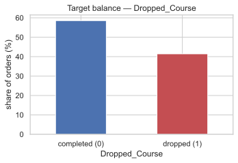
    


The classes are reasonably balanced: about 59% completed and 41% dropped

# 3. Exploratory Data Analysis

We begin with the target and date coverage, then inspect missingness, categorical quality, and numeric relationships.

## 3.1 Train and test dates

We plot the monthly drop rate across the _training_ period and overlay where training ends and where the hidden test window ends.


```python
train_end = train_raw['Course_Start_Date'].max()
test_start = test_raw['Course_Start_Date'].min()
test_end = test_raw['Course_Start_Date'].max()
print(
    f"train dates: {train_raw['Course_Start_Date'].min().date()} -> {train_end.date()}"
)
print(f'test  dates: {test_start.date()} -> {test_end.date()}')
monthly = (
    train_raw.set_index('Course_Start_Date').resample('MS')[TARGET].mean().mul(100)
)
_ax = monthly.plot(marker='o', figsize=(12, 4))
_ax.axhline(
    train_raw[TARGET].mean() * 100, ls='--', color='grey', label='train average'
)
_ax.axvline(train_end, ls='--', color='green', label=f'train ends ({train_end.date()})')
_ax.axvline(test_end, ls=':', color='red', label=f'test ends ({test_end.date()})')
_ax.set_xlim(train_raw['Course_Start_Date'].min(), test_end)
_ax.set_ylabel('drop rate (%)')
_ax.set_title('Drop rate over time — training period and the hidden test horizon')
_ax.legend()
plt.tight_layout()
plt.show()
```

    train dates: 2015-07-01 -> 2017-04-26
    test  dates: 2017-04-26 -> 2017-08-31


    
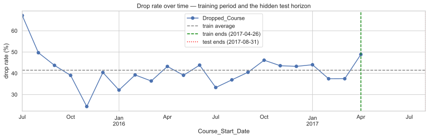
    


Training covers July 2015 through April 2017. The test set begins at the end of that period and continues through August 2017, so the prediction task is temporal: learn from earlier registrations and score a later window.

The monthly drop rate also changes across the training period. Because a random split would mix earlier and later regimes, we define validation chronologically and later compare the result with a random split.

## 3.2 Missing values

We compare missingness in train and test, then ask whether _the fact of being missing_ is itself predictive.


```python
missing_compare = pd.DataFrame({
    "train_missing_%": train_raw.isna().mean().mul(100).round(2),
    "test_missing_%": test_raw.isna().mean().mul(100).round(2),
})
missing_compare = missing_compare[
    (missing_compare["train_missing_%"] > 0) | (missing_compare["test_missing_%"] > 0)
].sort_values("train_missing_%", ascending=False)
display(missing_compare)
```


| Unnamed: 0               |   train_missing_% |   test_missing_% |
|:-------------------------|------------------:|-----------------:|
| Company_ID               |             95.08 |            96.41 |
| Agent_ID                 |             17.61 |            17.61 |
| Registration_Days_Before |              4.2  |             4.05 |
| Requested_Lab_Config     |              2.74 |             3.01 |
| Physical_Course_Kits     |              1.64 |             1.43 |
| Enrollment_Type          |              1.13 |             1.12 |
| Submission_Source        |              0.95 |             0.94 |
| Payment_Terms            |              0.92 |             0.91 |
| Origin_Country           |              0.88 |             1.01 |
| Catering_Package         |              0.64 |             0.7  |
| Daily_Tuition_Cost       |              0.12 |             0.01 |
| Students_Count           |              0.01 |             0    |


Most train/test missingness rates are close. We next check whether the presence of a value is associated with the target.


```python
missingness_cols = [
    'Company_ID',
    'Agent_ID',
    'Registration_Days_Before',
    'Physical_Course_Kits',
    'Daily_Tuition_Cost',
    'Payment_Terms',
]
rows = []
for _col in missingness_cols:
    stats = (
        train_raw
        .assign(is_missing=train_raw[_col].isna())
        .groupby('is_missing')[TARGET]
        .agg(count='size', drop_rate='mean')
    )
    for is_missing, r in stats.iterrows():
        rows.append({
            'column': _col,
            'is_missing': is_missing,
            'count': int(r['count']),
            'drop_rate_%': round(r['drop_rate'] * 100, 1),
        })
display(pd.DataFrame(rows))
```


|   Unnamed: 0 | column                   | is_missing   |   count |   drop_rate_% |
|-------------:|:-------------------------|:-------------|--------:|--------------:|
|            0 | Company_ID               | False        |    3120 |          21.2 |
|            1 | Company_ID               | True         |   60344 |          42.5 |
|            2 | Agent_ID                 | False        |   52291 |          43.1 |
|            3 | Agent_ID                 | True         |   11173 |          33.5 |
|            4 | Registration_Days_Before | False        |   60798 |          41.4 |
|            5 | Registration_Days_Before | True         |    2666 |          41.5 |
|            6 | Physical_Course_Kits     | False        |   62424 |          41.5 |
|            7 | Physical_Course_Kits     | True         |    1040 |          39.3 |
|            8 | Daily_Tuition_Cost       | False        |   63385 |          41.4 |
|            9 | Daily_Tuition_Cost       | True         |      79 |          51.9 |
|           10 | Payment_Terms            | False        |   62877 |          41.5 |
|           11 | Payment_Terms            | True         |     587 |          35.4 |


Rows without a `Company_ID` have a noticeably higher drop rate, and `Agent_ID` presence also separates groups. This motivates explicit presence flags instead of replacing missing identifiers with a typical value.

## 3.3 Inspecting categorical values

Several text columns have far more distinct values than their meanings suggest: hundreds of payment terms, colors, and enrollment types would be surprising. We inspect the raw labels before deciding whether the cardinality is real.


```python
TEXT_COLS = list(train_raw.select_dtypes(include=['object']).columns)


def count_unique_vals(df, col):
    return df[col].nunique()


def most_common_cats(df, col, n=15):
    return df[col].value_counts(normalize=True).head(n)


N_COUNT = 8
for _col in TEXT_COLS:
    top_values = most_common_cats(train_raw, _col, N_COUNT)
    cats = [f'{value!r}: ({share * 100:.1f}%)' for value, share in top_values.items()]
    # N_COUNT = 15
    # for col in TEXT_COLS:
    #     top_values = most_common_cats(train_raw, col)
    cats_str = '\n'.join((' | '.join(cats[i : i + 3]) for i in range(0, len(cats), 3)))
    #     print(f"""
    # {'=' * 80}
    # Column: {col}
    # Unique values: {count_unique_vals(train_raw, col)}
    # Top {len(top_values)} categories:
    # {",   ".join(f"{value}: ({share * 100:.1f}%)" for value, share in top_values.items())}
    # """)
    print(
        f"\n{'=' * 80}\n\nColumn: {_col}\nUnique values: {count_unique_vals(train_raw, _col)}\n\nTop {len(top_values)} categories:\n\n{cats_str}\n"
    )
```

    
    ================================================================================
    
    Column: Origin_Country
    Unique values: 721
    
    Top 15 categories:
    
    'PRT': (38.6%) | 'FRA': (10.2%) | 'DEU': (6.4%)
    'ESP': (5.7%) | 'GBR': (5.2%) | 'ITA': (4.0%)
    'BRA': (2.0%) | 'BEL': (2.0%) | 'NLD': (1.8%)
    'USA': (1.6%) | 'CHE': (1.4%) | 'IRL': (1.2%)
    'AUT': (1.2%) | 'CHN': (1.0%) | 'prt': (0.9%)
    
    
    ================================================================================
    
    Column: Catering_Package
    Unique values: 321
    
    Top 15 categories:
    
    'Standard (Coffee Only)': (71.9%) | 'No Food Plan': (10.5%) | 'Lunch Included': (7.5%)
    'standard (coffee only)': (1.8%) | 'STANDARD (COFFEE ONLY)': (1.7%) | ' Standard (Coffee Only)  ': (0.8%)
    '  Standard (Coffee Only) ': (0.8%) | ' Standard (Coffee Only) ': (0.8%) | '  Standard (Coffee Only)  ': (0.8%)
    'no food plan': (0.3%) | 'NO FOOD PLAN': (0.3%) | 'lunch included': (0.2%)
    'LUNCH INCLUDED': (0.2%) | ' No Food Plan  ': (0.1%) | ' No Food Plan ': (0.1%)
    
    
    ================================================================================
    
    Column: Welcome_Gift_Type
    Unique values: 4
    
    Top 4 categories:
    
    'Branded Notebook': (50.8%) | 'Water Bottle': (29.0%) | 'USB Drive': (16.0%)
    'Portable Charger': (4.2%)
    
    
    ================================================================================
    
    Column: Requested_Lab_Config
    Unique values: 8
    
    Top 8 categories:
    
    'Standard PC (Windows)': (80.5%) | 'Linux Workstation': (13.6%) | 'Dual Monitor Setup': (2.1%)
    'MacOS Station': (1.6%) | 'Laptop Docking Station': (1.6%) | 'High-GPU Unit': (0.5%)
    'Touch Screen Interface': (0.0%) | 'VR/AR Station': (0.0%)
    
    
    ================================================================================
    
    Column: Assigned_Lab_Config
    Unique values: 9
    
    Top 9 categories:
    
    'Standard PC (Windows)': (72.4%) | 'Linux Workstation': (18.4%) | 'Laptop Docking Station': (2.9%)
    'MacOS Station': (2.5%) | 'Dual Monitor Setup': (2.5%) | 'High-GPU Unit': (0.8%)
    'Server Access Terminal': (0.4%) | 'Touch Screen Interface': (0.2%) | 'VR/AR Station': (0.0%)
    
    
    ================================================================================
    
    Column: Enrollment_Type
    Unique values: 298
    
    Top 15 categories:
    
    'General Admission': (64.6%) | 'Affiliated Admission': (21.6%) | 'Contractual Agreement': (3.2%)
    'general admission': (1.6%) | 'GENERAL ADMISSION': (1.6%) | ' General Admission  ': (0.8%)
    ' General Admission ': (0.7%) | '  General Admission ': (0.7%) | '  General Admission  ': (0.7%)
    'AFFILIATED ADMISSION': (0.6%) | 'affiliated admission': (0.6%) | 'Organizational Arrangement': (0.3%)
    ' Affiliated Admission  ': (0.2%) | '  Affiliated Admission ': (0.2%) | '  Affiliated Admission  ': (0.2%)
    
    
    ================================================================================
    
    Column: Lanyard_Color
    Unique values: 240
    
    Top 15 categories:
    
    'Blue': (49.6%) | 'Black': (21.0%) | 'Red': (10.1%)
    'Orange': (5.2%) | 'Green': (3.9%) | 'BLUE': (1.2%)
    'blue': (1.2%) | '  Blue  ': (0.6%) | ' Blue  ': (0.6%)
    ' Blue ': (0.6%) | '  Blue ': (0.5%) | 'black': (0.5%)
    'BLACK': (0.5%) | 'red': (0.3%) | 'RED': (0.3%)
    
    
    ================================================================================
    
    Column: Client_Category
    Unique values: 505
    
    Top 15 categories:
    
    'SaaS & Software Houses': (41.4%) | 'Traditional IT & Telecomm': (20.4%) | 'Big Tech & Multinationals': (16.8%)
    'FinTech & Banking': (6.6%) | 'Industrial Tech & IoT': (3.7%) | 'saas & software houses': (1.1%)
    'SAAS & SOFTWARE HOUSES': (1.0%) | 'Non-Profit & EduTech': (0.7%) | 'TRADITIONAL IT & TELECOMM': (0.5%)
    'traditional it & telecomm': (0.5%) | ' SaaS & Software Houses ': (0.5%) | '  SaaS & Software Houses  ': (0.5%)
    '  SaaS & Software Houses ': (0.5%) | ' SaaS & Software Houses  ': (0.5%) | 'big tech & multinationals': (0.4%)
    
    
    ================================================================================
    
    Column: Submission_Source
    Unique values: 328
    
    Top 15 categories:
    
    'B2B Platforms & Resellers': (77.4%) | 'Direct Website Registration': (7.4%) | 'Dedicated Sales Team': (4.1%)
    'B2B PLATFORMS & RESELLERS': (2.0%) | 'b2b platforms & resellers': (1.9%) | ' B2B Platforms & Resellers  ': (0.9%)
    '  B2B Platforms & Resellers ': (0.9%) | ' B2B Platforms & Resellers ': (0.8%) | '  B2B Platforms & Resellers  ': (0.8%)
    'Unknown': (0.4%) | '?': (0.3%) | 'Government Procurement System': (0.2%)
    'DIRECT WEBSITE REGISTRATION': (0.2%) | 'direct website registration': (0.2%) | 'DEDICATED SALES TEAM': (0.1%)
    
    
    ================================================================================
    
    Column: Payment_Terms
    Unique values: 236
    
    Top 15 categories:
    
    'Pay Upon Start': (73.8%) | 'Prepaid (Non-Refundable)': (15.3%) | 'PAY UPON START': (1.9%)
    'pay upon start': (1.8%) | ' Pay Upon Start ': (0.9%) | '  Pay Upon Start  ': (0.8%)
    ' Pay Upon Start  ': (0.8%) | '  Pay Upon Start ': (0.8%) | 'prepaid (non-refundable)': (0.4%)
    'PREPAID (NON-REFUNDABLE)': (0.4%) | 'Unknown': (0.3%) | '?': (0.3%)
    '  Prepaid (Non-Refundable) ': (0.2%) | ' Prepaid (Non-Refundable) ': (0.2%) | '  Prepaid (Non-Refundable)  ': (0.2%)
    


The raw values explain much of the inflated cardinality. Labels such as `'BLUE'`, `'blue'`, and `'  Blue  '` describe the same category but are stored separately; punctuation and placeholder strings create similar splits in other fields. Before treating these columns as genuinely high-cardinality, we normalize the obvious formatting variants and measure how many levels remain.


```python
# Placeholder strings that mean "missing", in any casing/padding after canonicalisation.
COMMON_NANS = {
    '',
    '-',
    '--',
    '.',
    '?',
    'na',
    'n/a',
    'nan',
    'none',
    'null',
    'unknown',
    'unknonwn',
}
COUNTRY_ALIASES = {'cn': 'chn'}


def canonicalize(s: pd.Series) -> pd.Series:
    """Map dirty categorical text to its canonical form: lowercase, injected
    punctuation stripped, single-spaced. No NaN masking — that is normalize_cats' job."""
    s = s.astype('string').str.strip().str.lower()
    return (
        s.str
        .replace('\\band\\b', '&', regex=True)
        .str.replace('[^a-z0-9&() .+-]+', '', regex=True)
        .str.replace('\\s+', ' ', regex=True)
        .str.strip()
    )

```


|   Unnamed: 0 | column            | true_category             |   raw_spellings_of_it |   junk_strings | sample_raw_spellings                                                                                                                                                                                                                             |
|-------------:|:------------------|:--------------------------|----------------------:|---------------:|:-------------------------------------------------------------------------------------------------------------------------------------------------------------------------------------------------------------------------------------------------|
|            0 | Origin_Country    | prt                       |                    42 |              0 | 'PRT', 'prt', ' PRT ', ' PRT ', ' PRT ', ' PRT ', 'PRT#', '#PRT'                                                                                                                                                                                 |
|            1 | Catering_Package  | standard (coffee only)    |                   182 |              0 | 'Standard (Coffee Only)', 'standard (coffee only)', 'STANDARD (COFFEE ONLY)', ' Standard (Coffee Only) ', ' Standard (Coffee Only) ', ' Standard (Coffee Only) ', ' Standard (Coffee Only) ', ' STANDARD (COFFEE ONLY) '                         |
|            2 | Enrollment_Type   | general admission         |                   141 |              0 | 'General Admission', 'general admission', 'GENERAL ADMISSION', ' General Admission ', ' General Admission ', ' General Admission ', ' General Admission ', ' general admission '                                                                 |
|            3 | Lanyard_Color     | blue                      |                    76 |              0 | 'Blue', 'BLUE', 'blue', ' Blue ', ' Blue ', ' Blue ', ' Blue ', 'Blu#e'                                                                                                                                                                          |
|            4 | Client_Category   | saas & software houses    |                   141 |              1 | 'SaaS & Software Houses', 'saas & software houses', 'SAAS & SOFTWARE HOUSES', ' SaaS & Software Houses ', ' SaaS & Software Houses ', ' SaaS & Software Houses ', ' SaaS & Software Houses ', 'Saa*S & Software Houses'                          |
|            5 | Submission_Source | b2b platforms & resellers |                   196 |              2 | 'B2B Platforms & Resellers', 'B2B PLATFORMS & RESELLERS', 'b2b platforms & resellers', ' B2B Platforms & Resellers ', ' B2B Platforms & Resellers ', ' B2B Platforms & Resellers ', ' B2B Platforms & Resellers ', ' B2B PLATFORMS & RESELLERS ' |
|            6 | Payment_Terms     | pay upon start            |                   133 |              2 | 'Pay Upon Start', 'PAY UPON START', 'pay upon start', ' Pay Upon Start ', ' Pay Upon Start ', ' Pay Upon Start ', ' Pay Upon Start ', 'Pay Upon# Start'                                                                                          |


We normalize case, surrounding whitespace, repeated spaces, and injected punctuation. Placeholder labels such as `Unknown` and `?` become missing values rather than new categories. The same deterministic cleaning function will be applied to train and test.


```python
CAT_COLS = TEXT_COLS + ['Agent_ID', 'Company_ID']


def normalize_cats(df: pd.DataFrame) -> pd.DataFrame:
    """Canonicalise every categorical, then map junk placeholders to NaN."""
    df = df.copy()
    for _col in CAT_COLS:
        s = canonicalize(df[_col])
        df[_col] = s.mask(s.isin(COMMON_NANS))
    df['Origin_Country'] = df['Origin_Country'].replace(COUNTRY_ALIASES)
    return df
```


```python
clean_train = normalize_cats(train_raw)

cardinality_change = (
    pd
    .DataFrame({
        "raw_unique": {c: train_raw[c].nunique() for c in TEXT_COLS},
        "clean_unique": {c: clean_train[c].nunique() for c in TEXT_COLS},
    })
    .assign(collapsed=lambda t: t["raw_unique"] - t["clean_unique"])
    .sort_values("collapsed", ascending=False)
)
display(cardinality_change)
```


| Unnamed: 0           |   raw_unique |   clean_unique |   collapsed |
|:---------------------|-------------:|---------------:|------------:|
| Origin_Country       |          721 |            153 |         568 |
| Client_Category      |          505 |              7 |         498 |
| Submission_Source    |          328 |              4 |         324 |
| Catering_Package     |          321 |              4 |         317 |
| Enrollment_Type      |          298 |              4 |         294 |
| Lanyard_Color        |          240 |              5 |         235 |
| Payment_Terms        |          236 |              3 |         233 |
| Welcome_Gift_Type    |            4 |              4 |           0 |
| Requested_Lab_Config |            8 |              8 |           0 |
| Assigned_Lab_Config  |            9 |              9 |           0 |


The before/after table confirms that most of the apparent variety was formatting noise: `Payment_Terms` falls from 236 raw labels to 3 cleaned levels, and `Client_Category` from 505 to 7. Columns that were already consistent remain unchanged.

## 3.4 Which categories actually relate to dropping?

We start with business fields that have only a few cleaned levels, where a direct plot remains readable. Country and identifiers need separate treatment because hundreds of levels would make the same plot misleading.


```python
def plot_dropout_by_category(df, col, min_count=50, top_n=10, ax=None):
    stats = df.groupby(col, dropna=False)[TARGET].agg(drop_rate='mean', count='size')
    stats = (
        stats[stats['count'] >= min_count]
        .sort_values('count', ascending=False)
        .head(top_n)
        .sort_values('drop_rate')
    )
    labels = [f"{i} (n={int(r['count'])})" for i, r in stats.iterrows()]
    if ax is None:
        _, ax = plt.subplots(figsize=(9, 4))
    ax.barh(labels, stats['drop_rate'] * 100, color='#4c72b0')
    overall = df[TARGET].mean() * 100
    ax.axvline(overall, ls='--', color='red', label=f'mean ({overall:.1f}%)')
    ax.set_xlabel('drop rate (%)')
    ax.set_title(f'Drop rate by {col}')
    ax.legend()
    return stats


_fig, _axes = plt.subplots(2, 2, figsize=(14, 9))
plot_dropout_by_category(
    clean_train, 'Payment_Terms', min_count=20, top_n=5, ax=_axes[0, 0]
)
plot_dropout_by_category(
    clean_train, 'Client_Category', min_count=100, top_n=8, ax=_axes[0, 1]
)
plot_dropout_by_category(
    clean_train, 'Submission_Source', min_count=100, top_n=6, ax=_axes[1, 0]
)
plot_dropout_by_category(
    clean_train, 'Enrollment_Type', min_count=100, top_n=6, ax=_axes[1, 1]
)
plt.tight_layout()
plt.show()
```


    
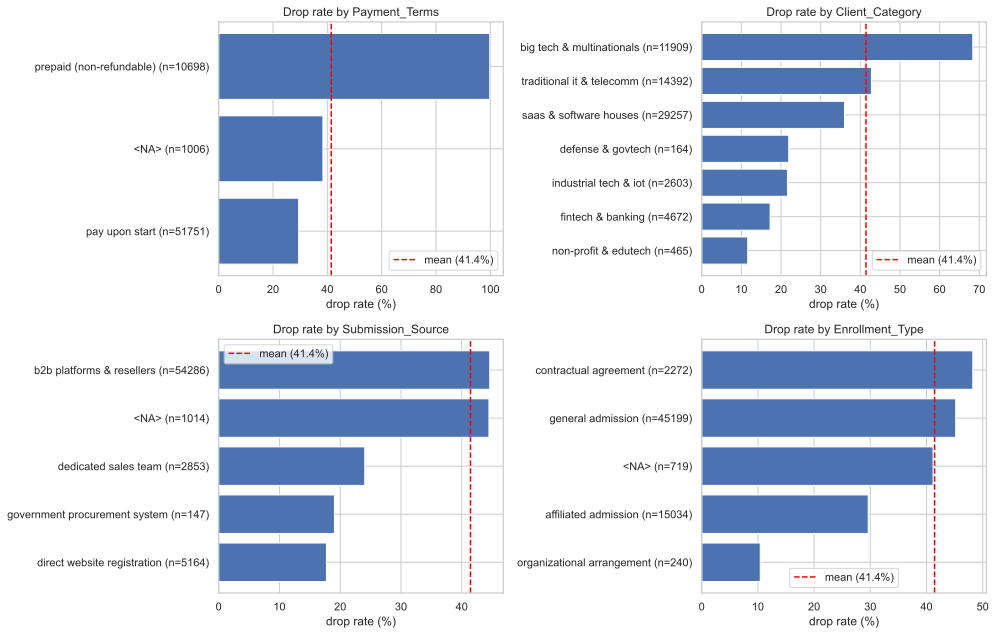
    


The clearest surprise is `Payment_Terms`: prepaid, non-refundable registrations drop more often than pay-on-start registrations, the opposite of what we expected. Two possible explanations are that these terms are assigned to riskier deals in advance or that the field is updated later in the registration process. We return to this question after fitting the model.

The other plots also show useful separation. Direct-website and dedicated-sales registrations drop less often than reseller traffic, organisational enrollment is lower-risk than general admission, and client segments differ. We carry these signals into modelling.

### A closer look at high-cardinality categories

`Origin_Country`, `Agent_ID`, and `Company_ID` cannot be judged from an unfiltered chart containing every level. We first require enough rows for a rate to be interpretable, then use Portugal as a compact case because it is both the largest country group and far from the overall drop rate.


```python
country_min_n = 150
country_top_n = 12
overall_drop = clean_train[TARGET].mean()
country_stats = (
    clean_train
    .groupby('Origin_Country', dropna=False)[TARGET]
    .agg(count='size', drop_rate='mean')
    .assign(
        drop_rate_pct=lambda d: d['drop_rate'] * 100,
        lift_pp=lambda d: (d['drop_rate'] - overall_drop) * 100,
    )
)
top_by_size = country_stats.sort_values('count', ascending=False).head(country_top_n)
extreme_by_lift = (
    country_stats[country_stats['count'] >= country_min_n]
    .iloc[
        lambda d: (
            d['lift_pp'].abs().sort_values(ascending=False).index.map(d.index.get_loc)
        )
    ]
    .head(country_top_n)
)


def plot_country_dropout(stats, title, ax):
    stats = stats.sort_values('drop_rate_pct')
    labels = [
        f"{(idx if pd.notna(idx) else '<missing>')} (n={int(row['count']):,})"
        for idx, row in stats.iterrows()
    ]
    colors = np.where(stats['lift_pp'] >= 0, '#c44e52', '#4c72b0')
    ax.barh(labels, stats['drop_rate_pct'], color=colors)
    ax.axvline(
        overall_drop * 100,
        ls='--',
        color='black',
        lw=1,
        label=f'overall ({overall_drop * 100:.1f}%)',
    )
    ax.set_xlabel('drop rate (%)')
    ax.set_title(title)
    ax.legend()


_fig, _axes = plt.subplots(1, 2, figsize=(15, 6))
plot_country_dropout(
    top_by_size, f'Drop rate by largest {country_top_n} countries', _axes[0]
)
# Pick countries whose drop rate is farthest from the overall mean, after filtering tiny countries.
plot_country_dropout(
    extreme_by_lift, f'Most unusual country drop rates (n >= {country_min_n})', _axes[1]
)
plt.tight_layout()
plt.show()
display(
    country_stats
    .sort_values('count', ascending=False)
    .head(country_top_n)[['count', 'drop_rate_pct', 'lift_pp']]
    .round(2)
)  # ignore countries with too few rows for a stable rate  # sort by distance from the overall drop rate
```


    
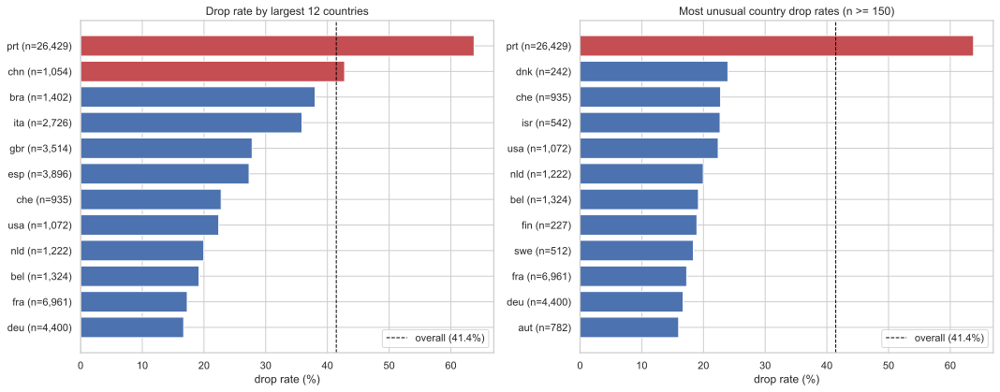
    


| ('Unnamed: 0_level_0', 'Origin_Country')   |   ('count', 'Unnamed: 1_level_1') |   ('drop_rate_pct', 'Unnamed: 2_level_1') |   ('lift_pp', 'Unnamed: 3_level_1') |
|:-------------------------------------------|----------------------------------:|------------------------------------------:|------------------------------------:|
| prt                                        |                             26429 |                                     63.78 |                               22.34 |
| fra                                        |                              6961 |                                     17.28 |                              -24.16 |
| deu                                        |                              4400 |                                     16.7  |                              -24.73 |
| esp                                        |                              3896 |                                     27.31 |                              -14.13 |
| gbr                                        |                              3514 |                                     27.8  |                              -13.64 |
| ita                                        |                              2726 |                                     35.88 |                               -5.56 |
| bra                                        |                              1402 |                                     38.02 |                               -3.42 |
| bel                                        |                              1324 |                                     19.18 |                              -22.25 |
| nld                                        |                              1222 |                                     19.97 |                              -21.47 |
| usa                                        |                              1072 |                                     22.39 |                              -19.05 |
| chn                                        |                              1054 |                                     42.79 |                                1.35 |
| che                                        |                               935 |                                     22.78 |                              -18.66 |


Portugal contains 26,429 registrations and has a 63.8% drop rate, making it both the largest country group and the clearest geographic difference. We use it to investigate whether country overlaps with agents, channels, or other parts of the acquisition process.


```python
is_portugal = clean_train["Origin_Country"].eq("prt").fillna(False).to_numpy(dtype=bool)
country_group = np.where(is_portugal, "Portugal", "Other countries")

portugal_summary = (
    clean_train
    .assign(country_group=country_group)
    .groupby("country_group")[TARGET]
    .agg(count="size", drop_rate="mean")
    .assign(drop_rate_pct=lambda d: d["drop_rate"] * 100)
)

display(portugal_summary[["count", "drop_rate_pct"]].round(1))
```


| ('Unnamed: 0_level_0', 'country_group')   |   ('count', 'Unnamed: 1_level_1') |   ('drop_rate_pct', 'Unnamed: 2_level_1') |
|:------------------------------------------|----------------------------------:|------------------------------------------:|
| Other countries                           |                             37035 |                                      25.5 |
| Portugal                                  |                             26429 |                                      63.8 |


Compared with all other countries, Portugal remains clearly different. We next inspect the identifier fields as categories, not numbers, to see whether they show related structure.


```python
_fig, _axes = plt.subplots(1, 2, figsize=(15, 6))
plot_dropout_by_category(clean_train, 'Agent_ID', min_count=150, top_n=12, ax=_axes[0])
company_presence = train_raw.groupby(train_raw['Company_ID'].notna())[TARGET].agg(
    count='size', drop_rate='mean'
)
company_presence.index = ['no company_id', 'has company_id']
_axes[1].bar(
    company_presence.index,
    company_presence['drop_rate'] * 100,
    color=['#c44e52', '#55a868'],
)
_axes[1].set_ylabel('drop rate (%)')
_axes[1].set_title('Drop rate by Company_ID presence')
plt.tight_layout()
plt.show()
display(company_presence)
```


    
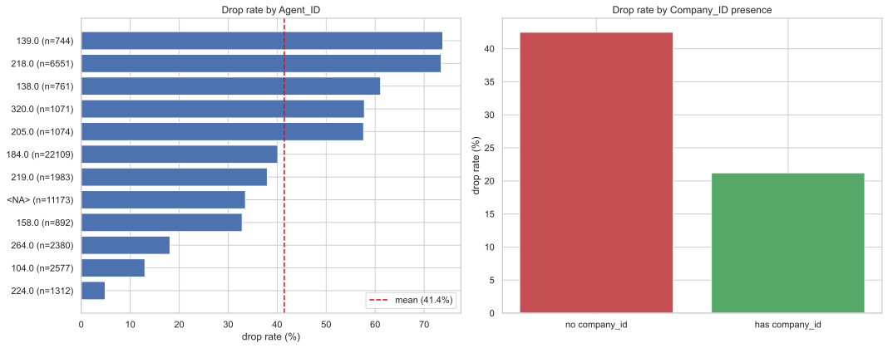
    


| Unnamed: 0     |   count |   drop_rate |
|:---------------|--------:|------------:|
| no company_id  |   60344 |      0.4248 |
| has company_id |    3120 |      0.2122 |


Frequent agents have different drop rates, while registrations with a `Company_ID` drop less often (21.2% versus 42.5%). These relationships may overlap with geography, so we perform a small check: does knowing the agent improve country prediction over always guessing the most common country?


```python
agent_country_pairs = clean_train[["Agent_ID", "Origin_Country"]].dropna()

country_tr, country_va = train_test_split(
    agent_country_pairs, test_size=0.25, random_state=SEED
)
majority_country = country_tr["Origin_Country"].mode().iat[0]
agent_country_map = country_tr.groupby("Agent_ID")["Origin_Country"].agg(
    lambda s: s.value_counts().idxmax()
)
agent_country_pred = (
    country_va["Agent_ID"].map(agent_country_map).fillna(majority_country)
)

display(
    pd.DataFrame({
        "check": ["majority country baseline", "agent modal country"],
        "accuracy": [
            country_va["Origin_Country"].eq(majority_country).mean(),
            agent_country_pred.eq(country_va["Origin_Country"]).mean(),
        ],
    }).round(3)
)
```


|   Unnamed: 0 | check                     |   accuracy |
|-------------:|:--------------------------|-----------:|
|            0 | majority country baseline |      0.391 |
|            1 | agent modal country       |      0.421 |


Agent-based prediction raises country accuracy from 0.391 to 0.421, indicating modest overlap between the two fields. Both are included using the compact representation introduced during preparation.

## 3.5 Numeric features: summary, correlation, and suspects

We now inspect numeric ranges, distributions, and their linear correlations with the target.


```python
ID_LIKE = ["Client_ID", "Agent_ID", "Company_ID"]
num_cols = [
    c
    for c in train_raw.select_dtypes(include=["int64", "float64"]).columns
    if c not in ID_LIKE + [TARGET]
]


def numeric_summary(df, cols):
    rows = []
    for c in cols:
        s = df[c]
        rows.append({
            "column": c,
            "missing_%": round(s.isna().mean() * 100, 1),
            "corr_target": round(s.corr(df[TARGET]), 3),
            "mean": round(s.mean(), 2),
            "median": round(s.median(), 2),
            "std": round(s.std(), 2),
            "min": round(s.min(), 2),
            "max": round(s.max(), 2),
            "skew": round(s.skew(), 2),
        })
    return pd.DataFrame(rows).sort_values("corr_target", key=abs, ascending=False)


display(numeric_summary(train_raw, num_cols))
```


|   Unnamed: 0 | column                      |   missing_% |   corr_target |   mean |   median |    std |   min |   max |   skew |
|-------------:|:----------------------------|------------:|--------------:|-------:|---------:|-------:|------:|------:|-------:|
|            5 | Registration_Days_Before    |         4.2 |         0.351 | 102.89 |     65   | 109.18 |     0 |   629 |   1.5  |
|            8 | Pre_Course_Supports_Tickets |         0   |        -0.301 |   0.51 |      0   |   0.76 |     0 |     5 |   1.47 |
|            6 | Prev_Course_Dropouts        |         0   |         0.199 |   0.1  |      0   |   0.45 |     0 |    21 |  15.7  |
|           11 | Registration_Changes        |         0   |        -0.148 |   0.18 |      0   |   0.59 |     0 |    21 |   7.36 |
|            9 | Physical_Course_Kits        |         1.6 |        -0.138 |   0.03 |      0   |   0.16 |     0 |     3 |   6    |
|           10 | Waiting_List_Days           |         0   |         0.068 |   3.98 |      0   |  23.2  |     0 |   391 |   9.26 |
|           12 | Returning_Client            |         0   |        -0.059 |   0.03 |      0   |   0.16 |     0 |     1 |   5.82 |
|            0 | Professionals_Count         |         0   |         0.057 |   1.84 |      2   |   0.51 |     0 |     4 |  -0.47 |
|            7 | Prev_Course_Attended        |         0   |        -0.052 |   0.12 |      0   |   1.54 |     0 |    61 |  21.96 |
|            4 | Theory_Hours                |         0   |         0.045 |   2.16 |      2   |   1.47 |     0 |    41 |   3.35 |
|            2 | Observers_Count             |         0   |        -0.031 |   0.01 |      0   |   0.09 |     0 |    10 |  45.38 |
|           13 | Daily_Tuition_Cost          |         0.1 |        -0.024 |  98.85 |     94.5 |  41.86 |     0 |  5400 |  32.55 |
|            3 | Practical_Hours             |         0   |         0.005 |   6.61 |      1   | 215.5  |    -5 | 10000 |  40.45 |
|            1 | Students_Count              |         0   |         0     |   8.75 |      0   | 294.24 |     0 |  9999 |  33.92 |


The maximum values reveal several likely data errors: `Students_Count` reaches 9999, and `Practical_Hours` contains both negative values and values up to 10000. We leave the raw values unchanged for this first inspection and decide how to handle them in the outlier section.


```python
corr = train_raw[num_cols + [TARGET]].corr()
plt.figure(figsize=(13, 10))
sns.heatmap(
    corr, annot=True, fmt=".2f", annot_kws={"size": 8}, cmap="coolwarm", center=0
)
plt.title("Numeric correlation heatmap (incl. target)")
plt.tight_layout()
plt.show()
```


    
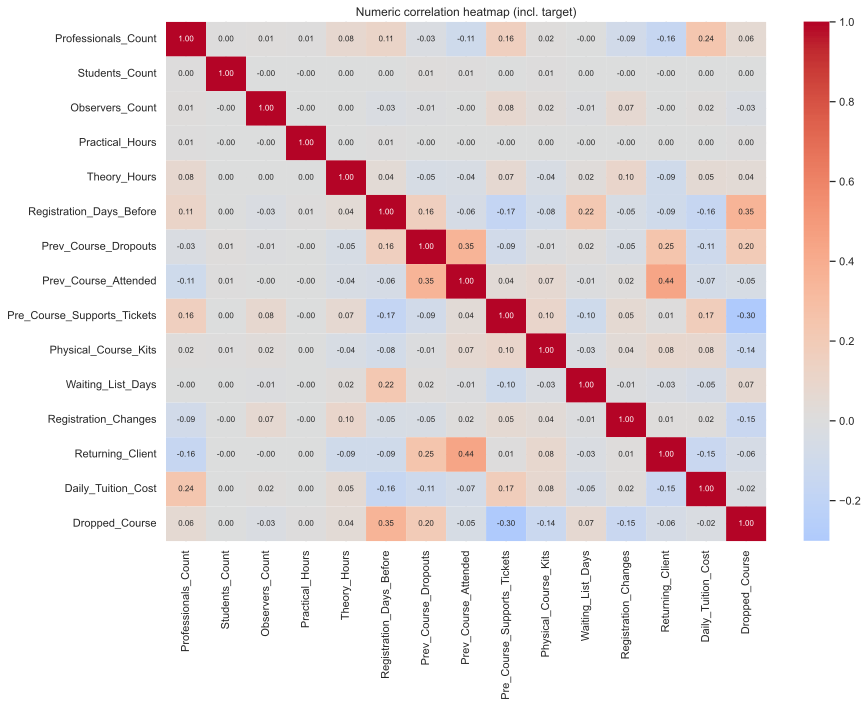
    


No raw numeric feature has an extremely strong Pearson correlation with the target. `Registration_Days_Before` and `Pre_Course_Supports_Tickets` stand out most, while inter-feature correlations are generally modest. Because Pearson correlation measures linear association and is sensitive to extremes, we next use binned drop rates to inspect the shape of the strongest relationships.

## 3.6 Numeric drop-rate profiles

Binning a couple of the more predictive numeric features shows _how_ risk moves with them (not just whether they correlate linearly).


```python
def plot_dropout_by_bins(df, col, bins=8, ax=None):
    tmp = df[[col, TARGET]].dropna().copy()
    tmp['bin'] = pd.qcut(tmp[col], q=bins, duplicates='drop')
    stats = tmp.groupby('bin', observed=True)[TARGET].mean().mul(100)
    if ax is None:
        _, ax = plt.subplots(figsize=(9, 4))
    stats.plot.bar(ax=ax, color='#4c72b0')
    ax.axhline(df[TARGET].mean() * 100, ls='--', color='red', label='mean')
    ax.set_ylabel('drop rate (%)')
    ax.set_title(f'Drop rate by {col} bins')
    ax.legend()
    ax.tick_params(axis='x', labelrotation=45)
    return stats


_fig, _axes = plt.subplots(1, 2, figsize=(15, 4.5))
plot_dropout_by_bins(train_raw, 'Registration_Days_Before', bins=8, ax=_axes[0])
plot_dropout_by_bins(train_raw, 'Pre_Course_Supports_Tickets', bins=6, ax=_axes[1])
plt.tight_layout()
plt.show()
```


    
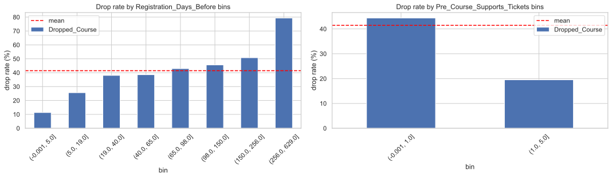
    


Drop rate rises across longer registration lead times, which suggests that plans are more likely to change when courses are booked far in advance. More pre-course support tickets are associated with lower dropping, suggesting that early engagement may reflect stronger commitment.

## 3.7 EDA conclusions

Several observations now guide preparation and modelling:

- Missing `Company_ID`, support activity, registration channel, enrollment type, and lead time all separate groups with different drop rates. Together, these patterns suggest a broader difference in buyer commitment.
- `Payment_Terms` is unusually strong and counter-intuitive. We include it and later test how much XGBoost depends on it.
- Country and agent both contain signal and overlap slightly. Their many levels require a compact encoding instead of a large one-hot expansion.
- The later test window and changing monthly rates make time-aware validation important. We derive calendar and trend features, then test the time index after selecting a model.
- Some numeric values are clearly suspicious, while other large values may be legitimate rare cases. We will correct only the values for which we have evidence of an error.

These conclusions give us a modelling hypothesis: a flexible model may capture the combined effects better than a linear baseline. We test that hypothesis in the model comparison.

# 4. Missing-value handling & outlier analysis

We now turn the EDA findings into reproducible preparation rules. The same fitted rules must be applied to later data, but the exact missing-value treatment can differ by model family.

## 4.1 Outliers: identify, justify, cap

We look for values that are physically impossible or absurdly far from the bulk.


```python
def sus_report(df, cols, max_mult=10):
    out = []
    for c in cols:
        s = df[c].dropna()
        q99 = s.quantile(0.99)
        iqr = s.quantile(0.75) - s.quantile(0.25)
        scale = max(q99, iqr, 1.0)
        why = []
        if s.min() < 0:
            why.append("negative values")
        if s.max() > max_mult * scale:
            why.append(f"max={s.max():g} >> q99={q99:g}")
        if why:
            out.append({
                "column": c,
                "min": s.min(),
                "max": s.max(),
                "q99": round(q99, 1),
                "why": "; ".join(why),
            })
    return pd.DataFrame(out)


print("Suspect columns — TRAIN")
display(sus_report(train_raw, num_cols))
print("Suspect columns — TEST")
display(sus_report(test_raw, num_cols))
```

    Suspect columns — TRAIN


|   Unnamed: 0 | column               |   min |   max |   q99 | why                                 |
|-------------:|:---------------------|------:|------:|------:|:------------------------------------|
|            0 | Students_Count       |     0 |  9999 |   2   | max=9999 >> q99=2                   |
|            1 | Practical_Hours      |    -5 | 10000 |   3   | negative values; max=10000 >> q99=3 |
|            2 | Prev_Course_Dropouts |     0 |    21 |   1   | max=21 >> q99=1                     |
|            3 | Prev_Course_Attended |     0 |    61 |   3   | max=61 >> q99=3                     |
|            4 | Registration_Changes |     0 |    21 |   2   | max=21 >> q99=2                     |
|            5 | Daily_Tuition_Cost   |     0 |  5400 | 209.7 | max=5400 >> q99=209.7               |


    Suspect columns — TEST


|   Unnamed: 0 | column               |   min |   max |   q99 | why                                 |
|-------------:|:---------------------|------:|------:|------:|:------------------------------------|
|            0 | Students_Count       |     0 |  9999 |     2 | max=9999 >> q99=2                   |
|            1 | Practical_Hours      |    -5 | 10000 |     2 | negative values; max=10000 >> q99=2 |
|            2 | Prev_Course_Attended |     0 |    72 |     3 | max=72 >> q99=3                     |
|            3 | Waiting_List_Days    |     0 |   183 |     0 | max=183 >> q99=0                    |


The test set introduces no new forms of corruption, suggesting the same cleaning policy can be safely shared. Comparing the maximum values to the 99th percentile helps identify columns with extreme outliers:


```python
TAIL_CHECK_COLS = ['Students_Count', 'Practical_Hours', 'Daily_Tuition_Cost']
tail_long = []
for split, df in [('train', train_raw), ('test', test_raw)]:
    for _col in TAIL_CHECK_COLS:
        s = df[_col].dropna().rename('value').to_frame()
        s['split'] = split
        s['column'] = _col
        tail_long.append(s)
tail_long = pd.concat(tail_long, ignore_index=True)
_fig, _axes = plt.subplots(1, len(TAIL_CHECK_COLS), figsize=(15, 4), sharey=False)
for _ax, _col in zip(_axes, TAIL_CHECK_COLS):
    _sub = tail_long[tail_long['column'] == _col]
    sns.boxplot(
        data=_sub,
        x='split',
        y='value',
        hue='split',
        order=['train', 'test'],
        palette=['#4c72b0', '#dd8452'],
        showfliers=True,
        ax=_ax,
        legend=False,
    )
    for xpos, split in enumerate(['train', 'test']):
        split_values = _sub.loc[_sub['split'] == split, 'value']
        max_value = split_values.max()
        n_at_max = int((split_values == max_value).sum())
        _ax.annotate(
            f'max={max_value:g}\nn={n_at_max}',
            xy=(xpos, max_value),
            xytext=(0, 7),
            textcoords='offset points',
            fontsize=8,
            ha='center',
        )
    positive = _sub.loc[_sub['value'] > 0, 'value']
    if not positive.empty:
        _ax.set_yscale('log')
        _ax.set_ylim(bottom=max(positive.min() * 0.7, 0.1))
    _ax.set_title(_col)
    _ax.set_xlabel('')
    _ax.set_ylabel('raw value (log scale)')
_fig.suptitle('Raw tail check for candidate capped columns')
plt.tight_layout(rect=[0, 0, 1, 0.9])
plt.show()
```


    
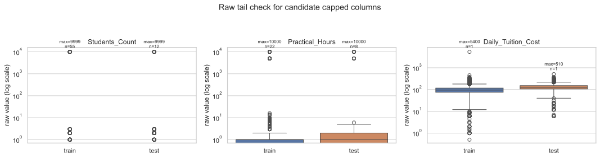
    


We only alter values that look like data-entry errors, rather than applying a statistical rule to every rare observation. Keeping the rows preserves their other information, while clipping prevents the obvious placeholders from dominating a feature.

Based on the suspect-column screen and the boxplots, we apply three caps:

- `Students_Count <= 10`: the values beyond the observed low-count support are repeated `9999` placeholders in both train and test. The cap keeps those rows as large groups without treating 9999 as a real count.
- `Practical_Hours` in `[0, 12]`: negative values are impossible, and `5000`/`10000` are clear placeholders. A 12-hour upper bound still allows a long practical day and prevents corrupted placeholder values from distorting the feature space.
- `Daily_Tuition_Cost <= 600`: train has a single `5400` value, while the test maximum is 510. A cap of 600 leaves the observed test range untouched and prevents one corrupted training value from dominating cost calculations.

Other flagged count columns (`Prev_Course_Dropouts`, `Prev_Course_Attended`, `Registration_Changes`, and test-side `Waiting_List_Days`) have long but plausible tails, so we leave them unchanged and restrict clipping to the three apparent data-entry errors above.


```python
CAP_RULES = {
    'Students_Count': {
        'lower': None,
        'upper': 10,
        'problem': '9999 placeholder',
        'reason': 'repeated 9999 values are isolated placeholders beyond the observed support',
    },
    'Practical_Hours': {
        'lower': 0,
        'upper': 12,
        'problem': 'negative values and 10000',
        'reason': 'course hours cannot be negative; 12 covers a long practical day',
    },
    'Daily_Tuition_Cost': {
        'lower': None,
        'upper': 600,
        'problem': '5400 value',
        'reason': '5400 is far beyond the valid fee range; 600 keeps the high-cost tail',
    },
}


def apply_cap(s, lower=None, upper=None):
    if lower is not None:
        s = s.clip(lower=lower)
    if upper is not None:
        s = s.clip(upper=upper)
    return s


cap_rows = []
for _col, rule in CAP_RULES.items():
    lo, hi = (rule['lower'], rule['upper'])
    train_changed = (
        train_raw[_col].notna() & apply_cap(train_raw[_col], lo, hi).ne(train_raw[_col])
    ).sum()
    test_changed = (
        test_raw[_col].notna() & apply_cap(test_raw[_col], lo, hi).ne(test_raw[_col])
    ).sum()
    action = f'clip to [{lo}, {hi}]' if lo is not None else f'clip to <= {hi}'
    cap_rows.append({
        'column': _col,
        'raw_train_min': train_raw[_col].min(),
        'raw_train_max': train_raw[_col].max(),
        'problem': rule['problem'],
        'action': action,
        'train_rows_affected': int(train_changed),
        'test_rows_affected': int(test_changed),
        'reason': rule['reason'],
    })
display(pd.DataFrame(cap_rows))
_fig, _axes = plt.subplots(2, 3, figsize=(14, 6), sharey='row')
for j, (_col, rule) in enumerate(CAP_RULES.items()):
    before = train_raw[_col].dropna()
    after = apply_cap(train_raw[_col], rule['lower'], rule['upper']).dropna()
    _axes[0, j].hist(before, bins=50, color='#c44e52')
    _axes[0, j].set_yscale('log')
    _axes[0, j].set_title(f'{_col}: raw')
    _axes[0, j].set_xlabel(f'max={before.max():g}')
    _axes[1, j].hist(after, bins=30, color='#55a868')
    _axes[1, j].set_yscale('log')
    _axes[1, j].set_title(f'{_col}: clipped')
    _axes[1, j].set_xlabel(f'max={after.max():g}')
_axes[0, 0].set_ylabel('count (log)')
_axes[1, 0].set_ylabel('count (log)')
plt.tight_layout()
plt.show()
```


|   Unnamed: 0 | column             |   raw_train_min |   raw_train_max | problem                   | action          |   train_rows_affected |   test_rows_affected | reason                                            |
|-------------:|:-------------------|----------------:|----------------:|:--------------------------|:----------------|----------------------:|---------------------:|:--------------------------------------------------|
|            0 | Students_Count     |               0 |            9999 | 9999 placeholder          | clip to <= 10   |                    55 |                   12 | corporate classroom groups are single-/low-dou... |
|            1 | Practical_Hours    |              -5 |           10000 | negative values and 10000 | clip to [0, 12] |                   121 |                   23 | course hours cannot be negative; 12 covers a l... |
|            2 | Daily_Tuition_Cost |               0 |            5400 | 5400 value                | clip to <= 600  |                     1 |                    0 | 5400 is far beyond the valid fee range; 600 ke... |


    

    


The before/after distributions show that the caps remove isolated invalid tails while
preserving the bulk of each feature.

One more data-quality issue appears in the historical counters. Some rows have more
recorded prior dropouts than prior attended courses, so those fields are not a clean
numerator/denominator pair.


```python
impossible = train_raw[
    train_raw["Prev_Course_Dropouts"] > train_raw["Prev_Course_Attended"]
]
print(f"rows where historical dropouts exceed historical attended: {len(impossible)}")
```

    rows where historical dropouts exceed historical attended: 4985


We keep both historical counters and combine them in the client-history feature below.

## 4.2 Missing-value policy

One missing-value policy would not suit every model family:

- Categorical missingness becomes an explicit `"missing"` level on both preprocessing paths. This preserves the possibility that absence itself carries information.
- `Agent_ID` and `Company_ID` also receive presence flags because EDA showed a clear difference between present and missing groups. Their high cardinality is handled separately in feature engineering.
- Models that support numeric missing values natively can retain `NaN` and learn how to route it. Models that require a complete numeric matrix receive medians learned from the training partition only.

# 5. Feature engineering & dimensionality

Based on the EDA findings and domain questions, we create features that expose relationships more directly or represent high-cardinality fields more compactly.

## 5.1 The engineered features and their rationale

| Raw signal | Engineered feature(s) | Reason for testing it |
| --- | --- | --- |
| `Course_Start_Date` | `start_month`, `start_week`, `start_dow`, `days_since_epoch` | Month/week represent possible yearly seasonality, weekday represents scheduling patterns, and the linear index represents the longer-term shift seen in Section 3.1. |
| Participant counts | `total_participants`, `prof_share` | Total size and professional share describe group composition more directly than three separate counts. |
| Practical/theory hours | `total_hours`, `practical_share` | Total duration and hands-on share distinguish courses with the same raw hour count but different structure. |
| Client history | `prev_drop_rate = dropouts / (attended + 1)` | Combines previous dropouts and attendance into one history signal; the `+1` handles clients with no attended courses. |
| Tuition cost and hours | `cost_x_days` | Combines price and course length so the model can consider their interaction. |
| Requested vs assigned lab | `got_requested_lab` | Captures whether the assigned lab configuration matches the original request. |
| Missing company/agent IDs | `has_company_id`, `has_agent_id` | Preserves the presence differences observed in Section 3.2 even when a raw identifier is removed. |
| Agent/company/country IDs | frequency encodings and native categories | Retains identity and commonness information while avoiding a wide dummy matrix. |

## 5.2 Dimensionality

The main expansion risk comes from identifiers: `Agent_ID` has 204 cleaned levels and `Origin_Country` has 154. Different model families therefore need different preparation paths.

Models that require numeric inputs receive rare-level grouping, one-hot encoding, training-median imputation, and scaling. Boosted-tree implementations with native categorical support can work with category labels directly, so the matrix does not need one dummy column per agent or country. We also add one frequency feature per high-cardinality identifier and remove raw `Company_ID`, retaining only its frequency and presence flag.

During validation, frequency maps are learned from the earlier training partition. For the final submission, we compute frequencies across the available train and test features, without using `Dropped_Course`. This transductive step gives each identifier one consistent frequency at scoring time.


```python
def make_freq_maps(*dfs):
    """Label-free frequency of each ID value across the supplied frames."""
    combined = pd.concat([normalize_cats(d) for d in dfs], ignore_index=True)
    return {
        _col: combined[_col].value_counts(normalize=True)
        for _col in ('Agent_ID', 'Company_ID', 'Origin_Country')
    }


freq_maps = make_freq_maps(train_raw, test_raw)


def build_features(
    df: pd.DataFrame, freq_maps: dict, add_time: bool = True
) -> pd.DataFrame:
    """Cleaning + feature engineering. Identical transform for train and test.

    Mirrors the feature values used by the scored ``pipeline.py`` transform."""
    df = normalize_cats(df)
    out = pd.DataFrame(index=df.index)
    out['Professionals_Count'] = df['Professionals_Count']
    out['Students_Count'] = df['Students_Count'].clip(upper=10)
    out['Observers_Count'] = df['Observers_Count']
    out['Practical_Hours'] = df['Practical_Hours'].clip(0, 12)
    out['Theory_Hours'] = df['Theory_Hours']
    out['Registration_Days_Before'] = df['Registration_Days_Before']
    out['Prev_Course_Dropouts'] = df['Prev_Course_Dropouts']
    out['Prev_Course_Attended'] = df['Prev_Course_Attended']
    out['Pre_Course_Supports_Tickets'] = df['Pre_Course_Supports_Tickets']
    out['Physical_Course_Kits'] = df[
        'Physical_Course_Kits'
    ]  # numeric passthrough with sanity caps (Section 4)
    out['Waiting_List_Days'] = df['Waiting_List_Days']
    out['Registration_Changes'] = df['Registration_Changes']
    out['Returning_Client'] = df['Returning_Client']
    out['Daily_Tuition_Cost'] = df['Daily_Tuition_Cost'].clip(upper=600)
    d = df['Course_Start_Date']
    out['start_month'] = d.dt.month
    out['start_dow'] = d.dt.dayofweek
    out['start_week'] = d.dt.isocalendar().week.astype(float)
    if add_time:
        out['days_since_epoch'] = (d - pd.Timestamp('2015-01-01')).dt.days
    total = (
        df['Professionals_Count'].fillna(0)
        + df['Students_Count'].clip(upper=10).fillna(0)
        + df['Observers_Count'].fillna(0)
    )
    out['total_participants'] = total
    out['prof_share'] = df['Professionals_Count'] / total.replace(0, np.nan)
    out['total_hours'] = df['Practical_Hours'].clip(0, 12) + df['Theory_Hours']
    out['practical_share'] = df['Practical_Hours'].clip(0, 12) / out[
        'total_hours'
    ].replace(0, np.nan)
    out['cost_x_days'] = (
        df['Daily_Tuition_Cost'].clip(upper=600) * out['total_hours']
    )  # legacy name: this is a cost-hours interaction, not a number of days
    out['prev_drop_rate'] = df['Prev_Course_Dropouts'] / (
        df['Prev_Course_Attended'] + 1
    )
    out['kits_per_participant'] = df['Physical_Course_Kits'] / total.replace(0, np.nan)
    out['tickets_per_participant'] = df['Pre_Course_Supports_Tickets'] / total.replace(
        0, np.nan
    )
    out['got_requested_lab'] = (
        df['Requested_Lab_Config'] == df['Assigned_Lab_Config']
    ).astype(float)
    out['has_company_id'] = df['Company_ID'].notna().astype(int)
    out['has_agent_id'] = df['Agent_ID'].notna().astype(int)
    for _col in ('Agent_ID', 'Company_ID', 'Origin_Country'):
        out[f'{_col}_freq'] = (
            df[_col].map(freq_maps[_col]).fillna(0).astype(float)
        )  # group composition & ratios
    for _col in (
        'Origin_Country',
        'Catering_Package',
        'Welcome_Gift_Type',
        'Requested_Lab_Config',
        'Enrollment_Type',
        'Lanyard_Color',
        'Client_Category',
        'Submission_Source',
        'Payment_Terms',
        'Agent_ID',
    ):
        out[_col] = df[_col].fillna('missing').astype('category')
    return out


def align_categories(train_X, *others):
    """Give every frame identical category levels so the boosters agree."""
    for _col in train_X.select_dtypes('category').columns:
        cats = train_X[_col].cat.categories
        for o in others:
            cats = cats.union(o[_col].cat.categories)
        train_X[_col] = train_X[_col].cat.set_categories(cats)
        for o in others:
            o[_col] = o[_col].cat.set_categories(cats)


X_all = build_features(train_raw, freq_maps)
cat_cols = X_all.select_dtypes('category').columns
native_dim = X_all.shape[1]
onehot_dim = X_all.drop(columns=cat_cols).shape[1] + sum(
    (X_all[c].nunique(dropna=False) for c in cat_cols)
)
print(f'features with native categorical handling : {native_dim}')
print(f'estimated dims after naive one-hot        : {onehot_dim}')
print(f'dummy columns avoided                     : {onehot_dim - native_dim}')
print('\ncategory cardinalities:')
# Dimensionality comparison: native categorical vs a naive one-hot expansion.
display(
    X_all[cat_cols].nunique(dropna=False).sort_values(ascending=False)
)
```

    features with native categorical handling : 42
    estimated dims after naive one-hot        : 435
    dummy columns avoided                     : 393
    
    category cardinalities:


    Agent_ID                204
    Origin_Country          154
    Requested_Lab_Config      9
    Client_Category           8
    Catering_Package          5
    Enrollment_Type           5
    Lanyard_Color             5
    Submission_Source         5
    Welcome_Gift_Type         4
    Payment_Terms             4
    dtype: int64


The tree/native-categorical path contains 42 columns. A naive one-hot expansion of the same fields would create about 435 columns, mostly from agent and country, so this representation avoids 393 sparse dummy columns. The linear and neural baselines use one-hot encoding with rare levels grouped into `other`.

# 6. Validation methodology

Before comparing models, we need a validation setup that resembles the later test window.

## 6.1 Adversarial validation — quantifying the drift

We train a classifier to tell **test rows from train rows** using the features (label removed, raw date and `Client_ID` dropped). If it separates them well above AUC 0.5, the feature distributions have genuinely drifted.


```python
def adversarial_validation():
    tr = load_raw(TRAIN_PATH).drop(columns=[TARGET])
    te = load_raw(TEST_PATH)
    combined = pd.concat(
        [tr.assign(is_test=0), te.assign(is_test=1)], ignore_index=True
    )
    y = combined.pop("is_test")
    X = combined.drop(columns=["Client_ID", "Course_Start_Date"], errors="ignore")
    for c in X.select_dtypes(include=["object", "string"]).columns:
        X[c] = X[c].astype("string").str.strip().str.lower().fillna("missing")
        X[c] = X[c].astype("category").cat.codes
    X = X.fillna(-1)

    Xtr, Xva, ytr, yva = train_test_split(
        X, y, test_size=0.25, random_state=SEED, stratify=y
    )
    m = XGBClassifier(
        n_estimators=300,
        max_depth=4,
        learning_rate=0.05,
        subsample=0.9,
        colsample_bytree=0.9,
        eval_metric="logloss",
        random_state=SEED,
        n_jobs=-1,
    )
    m.fit(Xtr, ytr)
    a = roc_auc_score(yva, m.predict_proba(Xva)[:, 1])
    print(
        f"adversarial AUC (train vs test): {a:.3f}  (0.5=identical, 1.0=trivially separable)"
    )
    top = (
        pd
        .Series(m.feature_importances_, index=X.columns)
        .sort_values(ascending=False)
        .head(8)
    )
    print("\ntop drift drivers:")
    print(top)


adversarial_validation()
```

    adversarial AUC (train vs test): 0.935  (0.5=identical, 1.0=trivially separable)
    
    top drift drivers:
    Daily_Tuition_Cost          0.125937
    Prev_Course_Dropouts        0.085177
    Registration_Days_Before    0.076319
    Waiting_List_Days           0.074023
    Catering_Package            0.065934
    Assigned_Lab_Config         0.064619
    Client_Category             0.053575
    Enrollment_Type             0.052758
    dtype: float32


The classifier reaches AUC 0.935, so train and test features are distinguishable even after removing the raw date. The strongest differences include tuition cost, client history, registration lead time, waiting time, and several categorical fields. Together with the changing monthly drop rate, this leads us to evaluate models on a later time window.

## 6.2 The chronological holdout

We use `2017-01-01` as the cutoff because it leaves roughly four months for validation, matching the length and future-facing structure of the hidden test window. All model and feature comparisons fit on the earlier rows and evaluate on this later holdout.


```python
CHRONO_CUTOFF = '2017-01-01'
cutoff = pd.Timestamp(CHRONO_CUTOFF)
tr_raw = train_raw[train_raw["Course_Start_Date"] < cutoff]
va_raw = train_raw[train_raw["Course_Start_Date"] >= cutoff]
y_tr = tr_raw[TARGET].values
y_va = va_raw[TARGET].values
print(
    f"chrono split -> fit={len(tr_raw):,}  validate={len(va_raw):,}  "
    f"(val drop rate={va_raw[TARGET].mean():.3f})"
)

# feature matrices reused across all experiments below. For chronological
# validation, frequency maps are fit only on the past training window. The
# train+test map above is reserved for submission-time label-free transductive scoring.
freq_maps_chrono = make_freq_maps(tr_raw)
Xtr_t = build_features(tr_raw, freq_maps_chrono, add_time=True)
Xva_t = build_features(va_raw, freq_maps_chrono, add_time=True)
align_categories(Xtr_t, Xva_t)
Xtr_n = build_features(tr_raw, freq_maps_chrono, add_time=False)
Xva_n = build_features(va_raw, freq_maps_chrono, add_time=False)
align_categories(Xtr_n, Xva_n)
```

    chrono split -> fit=51,822  validate=11,642  (val drop rate=0.420)


# 7. Model experiments & tuning

The assignment requires at least three models and hyperparameter tuning. We compare one linear model, one neural network, and one boosted-tree model on the same chronological holdout.

## 7.1 The model families

We tune one important capacity or regularization parameter for each family and compare the selected settings on the same holdout. The strongest family becomes the focus of the next experiments.

Each model family is paired with its appropriate preprocessing pipeline: bounded one-hot and scaling for the continuous baselines, and native categorical handling for the tree boosters.

- **Logistic Regression** provides an interpretable linear reference. Its main tuning parameter here is `C`, the inverse regularization strength.
- **MLP** can learn nonlinear combinations but requires a complete, scaled numeric matrix. We tune its L2 penalty `alpha` while keeping a small two-layer architecture fixed.
- **XGBoost** builds trees sequentially so later trees correct earlier errors. It can represent thresholds and interactions directly; we tune tree depth and then the learning-rate/tree-count budget.


```python
def get_xgb(**kw):
    p = dict(
        n_estimators=700,
        learning_rate=0.03,
        max_depth=6,
        min_child_weight=5,
        subsample=0.9,
        colsample_bytree=0.8,
        reg_lambda=1.0,
        enable_categorical=True,
        tree_method="hist",
        eval_metric="auc",
        random_state=SEED,
        n_jobs=-1,
    )
    p.update(kw)
    return XGBClassifier(**p)


def fit_predict_xgb_pair(X_tr, y_tr, X_va, sample_weight=None, **model_params):
    """Fit XGBoost and return P(drop) on train and validation."""
    m = get_xgb(**model_params)
    m.fit(X_tr, y_tr, sample_weight=sample_weight)
    return m.predict_proba(X_tr)[:, 1], m.predict_proba(X_va)[:, 1]


def fit_predict_xgb(X_tr, y_tr, X_va, sample_weight=None, **model_params):
    """Fit XGBoost and return P(drop) on validation."""
    _, pred_va = fit_predict_xgb_pair(
        X_tr, y_tr, X_va, sample_weight, **model_params
    )
    return pred_va


def encode_for_continuous_models(X_tr: pd.DataFrame, X_va: pd.DataFrame, min_count=30):
    """Bounded one-hot + median imputation for the LR/MLP baselines."""
    Xt, Xv = X_tr.copy(), X_va.copy()
    cat_cols = list(Xt.select_dtypes("category").columns)

    # Collapse rare levels to "other" so the one-hot matrix stays bounded and the
    # linear/MLP baselines do not overfit categories with only a few examples.
    for c in cat_cols:
        train_s = Xt[c].astype("string").fillna("missing")
        keep = train_s.value_counts()[lambda s: s >= min_count].index
        Xt[c] = train_s.where(train_s.isin(keep), "other")
        Xv[c] = (
            Xv[c]
            .astype("string")
            .fillna("missing")
            .where(lambda s: s.isin(keep), "other")
        )

    num_cols = [c for c in Xt.columns if c not in cat_cols]
    medians = Xt[num_cols].median()
    Xt_num = Xt[num_cols].fillna(medians).reset_index(drop=True)
    Xv_num = Xv[num_cols].fillna(medians).reset_index(drop=True)

    ohe = OneHotEncoder(handle_unknown="ignore", sparse_output=False, dtype=float)
    Xt_cat = ohe.fit_transform(Xt[cat_cols])
    Xv_cat = ohe.transform(Xv[cat_cols])
    names = ohe.get_feature_names_out(cat_cols)

    Xt_out = pd.concat([Xt_num, pd.DataFrame(Xt_cat, columns=names)], axis=1)
    Xv_out = pd.concat([Xv_num, pd.DataFrame(Xv_cat, columns=names)], axis=1)
    return Xt_out, Xv_out
```

## 7.2 Focused hyperparameter tuning

For each required family, we vary one parameter that controls capacity or regularization and select it using chronological validation ROC-AUC, the project metric. Training AUC is shown beside it so we can see when extra capacity improves fit without improving the future holdout.

For XGBoost, this first sweep varies `max_depth` while holding the boosting budget fixed. A second experiment then tunes the interaction between learning rate and number of trees.


```python
Xtr_enc, Xva_enc = encode_for_continuous_models(Xtr_t, Xva_t)
# We scale continuous inputs using StandardScaler to preserve the variance of naturally skewed columns (like Daily_Tuition_Cost) without compressing normal-range observations.
scaler = StandardScaler()
Xtr_scaled = scaler.fit_transform(Xtr_enc)
Xva_scaled = scaler.transform(Xva_enc)


def loss_auc(p_tr, p_va):
    """Train/validation metrics helper."""
    return {
        'train_logloss': log_loss(y_tr, p_tr),
        'val_logloss': log_loss(y_va, p_va),
        'train_AUC': roc_auc_score(y_tr, p_tr),
        'val_AUC': roc_auc_score(y_va, p_va),
    }


tuning_rows = []
selected_predictions = {}
for C in (0.001, 0.01, 0.1, 1.0, 10.0, 100.0):
    m = LogisticRegression(C=C, max_iter=2000).fit(Xtr_scaled, y_tr)
    p_tr = m.predict_proba(Xtr_scaled)[:, 1]
    p_va = m.predict_proba(Xva_scaled)[:, 1]
    tuning_rows.append({
        'family': 'Logistic Regression',
        'axis': 'C  (less regularisation →)',
        'x': C,
        **loss_auc(p_tr, p_va),
    })
    if np.isclose(C, 0.001):
        selected_predictions['lr'] = p_va
for alpha in (1.0, 0.1, 0.01, 0.001, 0.0001):
    m = MLPClassifier(
        hidden_layer_sizes=(64, 32),
        alpha=alpha,
        learning_rate_init=0.001,
        max_iter=150,
        early_stopping=True,
        n_iter_no_change=10,
        random_state=SEED,
    ).fit(Xtr_scaled, y_tr)
    p_tr = m.predict_proba(Xtr_scaled)[:, 1]
    p_va = m.predict_proba(Xva_scaled)[:, 1]
    tuning_rows.append({
        'family': 'MLP neural network',
        'axis': '1 / alpha  (less regularisation →)',
        'x': 1.0 / alpha,
        **loss_auc(p_tr, p_va),
    })
    if np.isclose(alpha, 0.1):
        selected_predictions['mlp'] = p_va
for depth in (2, 3, 4, 5, 6, 8, 10):
    _p_tr, _p_va = fit_predict_xgb_pair(
        Xtr_t,
        y_tr,
        Xva_t,
        n_estimators=300,
        learning_rate=0.05,
        max_depth=depth,
        min_child_weight=5,
        reg_lambda=1.0,
    )
    tuning_rows.append({
        'family': 'Gradient-boosted trees (XGBoost)',
        'axis': 'max_depth  (more capacity →)',
        'x': depth,
        **loss_auc(_p_tr, _p_va),
    })
# Linear baseline: inverse-regularisation C (higher C -> less regularisation).
tuning = pd.DataFrame(tuning_rows)
selected_x = {
    'Logistic Regression': 0.001,
    'MLP neural network': 10.0,
    'Gradient-boosted trees (XGBoost)': 6,
}
tuning['selected'] = tuning.apply(
    lambda r: bool(np.isclose(r['x'], selected_x[r['family']])), axis=1
)
_fig, _axes = plt.subplots(1, 3, figsize=(17, 5))
for i, (_ax, family) in enumerate(zip(_axes, selected_x)):
    d = tuning[tuning['family'] == family].sort_values('x')
    _ax.plot(
        d['x'],
        d['train_AUC'],
        color='#2b5c8f',
        linestyle='--',
        marker='o',
        alpha=0.7,
        label='train AUC',
    )
    _ax.plot(
        d['x'],
        d['val_AUC'],
        color='#1b9e77',
        linestyle='-',
        marker='s',
        linewidth=2,
        label='val AUC',
    )
    star = d[d['selected']].iloc[0]
    _ax.scatter(
        star['x'],
        star['val_AUC'],
        marker='*',
        s=250,
        color='#ffd700',
        edgecolor='black',
        linewidths=1.5,
        zorder=10,
        label='selected setting',
    )
    _ax.set_title(family, fontsize=12, pad=12, fontweight='bold')
    # Neural net: L2 penalty alpha; plot 1/alpha so "more capacity" points right.
    _ax.set_xlabel(d['axis'].iloc[0], fontsize=10)
    if i == 0:
        _ax.set_ylabel('ROC-AUC Score', fontsize=10)
    if family != 'Gradient-boosted trees (XGBoost)':
        _ax.set_xscale('log')
    _ax.grid(True, linestyle=':', alpha=0.6)
    loc = 'center right' if family == 'Logistic Regression' else 'lower left'
    if family == 'Gradient-boosted trees (XGBoost)':
        loc = 'lower right'
    _ax.legend(loc=loc, fontsize=8, frameon=True, facecolor='white', framealpha=0.9)
_fig.suptitle(
    'Focused tuning: training vs validation ROC-AUC',
    fontsize=14,
    fontweight='bold',
    y=1.02,
)
plt.tight_layout()
plt.show()
selected_tuning = tuning.loc[
    tuning['selected'], ['family', 'x', 'train_AUC', 'val_AUC']
].copy()
selected_tuning[['train_AUC', 'val_AUC']] = selected_tuning[
    ['train_AUC', 'val_AUC']
].round(4)
display(selected_tuning)
pred_lr = selected_predictions['lr']
pred_mlp = selected_predictions['mlp']
```


    
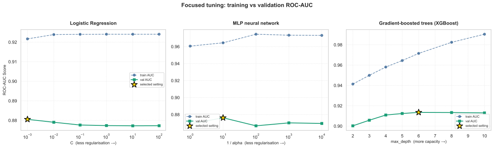
    


|   Unnamed: 0 | family                           |         x |   train_logloss |   val_logloss |   train_AUC |   val_AUC | selected   |
|-------------:|:---------------------------------|----------:|----------------:|--------------:|------------:|----------:|:-----------|
|            0 | Logistic Regression              |     0.001 |          0.3458 |        0.418  |      0.9217 |    0.8805 | True       |
|            1 | Logistic Regression              |     0.01  |          0.3336 |        0.4248 |      0.9239 |    0.879  | False      |
|            2 | Logistic Regression              |     0.1   |          0.3318 |        0.4303 |      0.924  |    0.8776 | False      |
|            3 | Logistic Regression              |     1     |          0.3306 |        0.4318 |      0.9241 |    0.8773 | False      |
|            4 | Logistic Regression              |    10     |          0.3305 |        0.4326 |      0.9241 |    0.8772 | False      |
|            5 | Logistic Regression              |   100     |          0.3305 |        0.4325 |      0.9241 |    0.8773 | False      |
|            6 | MLP neural network               |     1     |          0.2447 |        0.4592 |      0.9606 |    0.869  | False      |
|            7 | MLP neural network               |    10     |          0.2321 |        0.46   |      0.9645 |    0.8762 | True       |
|            8 | MLP neural network               |   100     |          0.1973 |        0.5408 |      0.9746 |    0.8668 | False      |
|            9 | MLP neural network               |  1000     |          0.2034 |        0.5139 |      0.9734 |    0.8702 | False      |
|           10 | MLP neural network               | 10000     |          0.2044 |        0.5113 |      0.9732 |    0.8696 | False      |
|           11 | Gradient-boosted trees (XGBoost) |     2     |          0.3008 |        0.3841 |      0.9413 |    0.9003 | False      |
|           12 | Gradient-boosted trees (XGBoost) |     3     |          0.2773 |        0.3731 |      0.9499 |    0.9058 | False      |
|           13 | Gradient-boosted trees (XGBoost) |     4     |          0.2555 |        0.3663 |      0.9581 |    0.9109 | False      |
|           14 | Gradient-boosted trees (XGBoost) |     5     |          0.2373 |        0.3651 |      0.9645 |    0.9124 | False      |
|           15 | Gradient-boosted trees (XGBoost) |     6     |          0.217  |        0.3653 |      0.9715 |    0.9135 | True       |
|           16 | Gradient-boosted trees (XGBoost) |     8     |          0.1813 |        0.3705 |      0.9824 |    0.9134 | False      |
|           17 | Gradient-boosted trees (XGBoost) |    10     |          0.1486 |        0.3672 |      0.9904 |    0.913  | False      |


Logistic Regression performs best with strong regularization (`C=0.001`); increasing `C` improves training fit slightly but reduces holdout AUC. The MLP performs best at `alpha=0.1`, after which its training/validation gap grows. XGBoost holdout AUC rises through depth 6 and then levels off while training AUC continues upward, so we keep depth 6 as the best trade-off in this sweep.

The selected settings reach validation AUC 0.8805 for Logistic Regression, 0.8762 for MLP, and 0.9135 for XGBoost. XGBoost's advantage indicates that thresholds, categories, and interactions matter for this problem, so the remaining experiments focus on boosted trees.

## 7.3 Improving the gradient model

After choosing XGBoost, we first tune its boosting budget. We then test whether adding two fixed-configuration boosted-tree implementations improves the ranking further.

### (a) Boosting budget: number of trees × learning rate

The number of trees and the learning rate interact directly. Consistent with our validation choice, we evaluate the tree budget directly in ROC-AUC. We evaluate various tree counts across two learning rate settings:


```python
budget_rows = []
budget_predictions = {}
for lr_rate in (0.1, 0.03):
    for n in (50, 100, 200, 400, 700, 1000):
        _p_tr, _p_va = fit_predict_xgb_pair(
            Xtr_t,
            y_tr,
            Xva_t,
            n_estimators=n,
            learning_rate=lr_rate,
            max_depth=6,
            min_child_weight=5,
            reg_lambda=1.0,
        )
        budget_predictions[(lr_rate, n)] = _p_va
        budget_rows.append({
            'learning_rate': lr_rate,
            'n_trees': n,
            'train_logloss': log_loss(y_tr, _p_tr),
            'val_logloss': log_loss(y_va, _p_va),
            'train_AUC': roc_auc_score(y_tr, _p_tr),
            'val_AUC': roc_auc_score(y_va, _p_va),
        })
budget = pd.DataFrame(budget_rows)
_fig, _axes = plt.subplots(1, 2, figsize=(14, 5), sharey=True)
for _ax, (lr_rate, _sub) in zip(_axes, budget.groupby('learning_rate')):
    _sub = _sub.sort_values('n_trees')
    _ax.plot(
        _sub['n_trees'],
        _sub['train_AUC'],
        marker='o',
        ls='--',
        color='#2b5c8f',
        label='train AUC',
    )
    _ax.plot(
        _sub['n_trees'],
        _sub['val_AUC'],
        marker='o',
        color='#d95f02',
        linewidth=2,
        label='val AUC',
    )
    best_row = _sub.loc[_sub['val_AUC'].idxmax()]
    _ax.scatter(
        best_row['n_trees'],
        best_row['val_AUC'],
        marker='*',
        s=250,
        color='#ffd700',
        edgecolor='black',
        linewidths=1.5,
        zorder=10,
        label=f"best AUC ({int(best_row['n_trees'])} trees)",
    )
    _ax.set_xlabel('number of trees (n_estimators)', fontsize=10)
    if _ax == _axes[0]:
        _ax.set_ylabel('ROC-AUC Score', fontsize=10)
    _ax.set_title(f'Learning Rate = {lr_rate}', fontsize=12, fontweight='bold')
    _ax.grid(True, linestyle=':', alpha=0.6)
    _ax.legend(fontsize=9, loc='lower right')
_fig.suptitle(
    'Boosting budget: ROC-AUC vs number of trees, by learning rate (star = best AUC)',
    fontsize=14,
    fontweight='bold',
    y=1.02,
)
plt.tight_layout()
plt.show()
budget_best = budget.loc[
    budget.groupby('learning_rate')['val_AUC'].idxmax(),
    ['learning_rate', 'n_trees', 'train_AUC', 'val_AUC'],
].copy()
budget_best[['train_AUC', 'val_AUC']] = budget_best[
    ['train_AUC', 'val_AUC']
].round(4)
display(budget_best)
pred_xgb = budget_predictions[(0.03, 700)]
```

At learning rate 0.1, validation AUC peaks around 200 trees and then declines while training AUC keeps rising. At 0.03, improvement is slower but the holdout reaches a slightly higher plateau around 700 trees. We choose `learning_rate=0.03` and `n_estimators=700` for XGBoost.

### (b) Does adding other boosters help?

LightGBM and CatBoost build boosted trees differently from XGBoost, so they may rank some registrations differently. We add them with fixed, capacity-aligned settings and test the ensemble itself: does combining their rankings improve the tuned XGBoost result?

We use rank averaging because ROC-AUC depends on ordering. Each model's predictions are converted to percentile ranks before averaging, so a model's probability scale cannot dominate the blend. The resulting value is a ranking score, not a calibrated cancellation probability.


```python
def get_lgbm(**kw):
    params = dict(
        n_estimators=700,
        learning_rate=0.03,
        num_leaves=63,
        min_child_samples=40,
        subsample=0.9,
        subsample_freq=1,
        colsample_bytree=0.8,
        reg_lambda=1.0,
        random_state=SEED,
        n_jobs=-1,
        verbosity=-1,
    )
    params.update(kw)
    return LGBMClassifier(**params)


def get_cat(**kw):
    params = dict(
        iterations=1200,
        learning_rate=0.05,
        depth=6,
        l2_leaf_reg=3.0,
        random_seed=SEED,
        verbose=False,
        eval_metric="AUC",
    )
    params.update(kw)
    return CatBoostClassifier(**params)


def fit_predict(name, X_tr, y_train, X_val, sample_weight=None):
    """Fit one boosted-tree implementation and return P(drop) on X_val."""
    if name == "cat":
        cat_idx = [
            i for i, c in enumerate(X_tr.columns) if str(X_tr[c].dtype) == "category"
        ]
        X_tr2, X_val2 = X_tr.copy(), X_val.copy()
        for c in X_tr2.columns[cat_idx]:
            X_tr2[c] = X_tr2[c].astype(str)
            X_val2[c] = X_val2[c].astype(str)
        model = get_cat(cat_features=cat_idx)
        model.fit(X_tr2, y_train, sample_weight=sample_weight)
        return model.predict_proba(X_val2)[:, 1]
    if name == "lgbm":
        model = get_lgbm()
        model.fit(
            X_tr,
            y_train,
            sample_weight=sample_weight,
            categorical_feature=X_tr.select_dtypes("category").columns.tolist(),
        )
        return model.predict_proba(X_val)[:, 1]
    model = get_xgb()
    model.fit(X_tr, y_train, sample_weight=sample_weight)
    return model.predict_proba(X_val)[:, 1]


def rank_avg(predictions):
    """Average percentile ranks; optimized for ordering, not calibration."""
    return np.mean(
        [rankdata(pred) / len(pred) for pred in predictions], axis=0
    )


pred_t = {
    "lgbm": fit_predict("lgbm", Xtr_t, y_tr, Xva_t),
    "xgb": pred_xgb,
    "cat": fit_predict("cat", Xtr_t, y_tr, Xva_t),
}
blend_t = rank_avg(list(pred_t.values()))

xgb_auc = roc_auc_score(y_va, pred_t["xgb"])
blend_check = (
    pd
    .DataFrame({
        "model": [
            "LightGBM (fixed setting)",
            "XGBoost (tuned)",
            "CatBoost (fixed setting)",
            "Rank-average blend (LGBM+XGB+Cat)",
        ],
        "chrono_AUC": [
            roc_auc_score(y_va, pred_t["lgbm"]),
            xgb_auc,
            roc_auc_score(y_va, pred_t["cat"]),
            roc_auc_score(y_va, blend_t),
        ],
    })
    .sort_values("chrono_AUC", ascending=False)
    .reset_index(drop=True)
)
blend_check["delta_vs_XGBoost"] = (blend_check["chrono_AUC"] - xgb_auc).round(4)
display(blend_check)
```


|   Unnamed: 0 | model               | family                 |   chrono_AUC |
|-------------:|:--------------------|:-----------------------|-------------:|
|            0 | XGBoost (tree)      | gradient-boosted trees |       0.9135 |
|            1 | Logistic Regression | linear                 |       0.8805 |
|            2 | MLP neural network  | neural network         |       0.8762 |


All three boosters perform similarly on this holdout. Adding the fixed LightGBM and CatBoost rankings raises AUC from 0.9135 for tuned XGBoost to 0.9156 for the rank-average blend, so we select the blend as the final ranking model.

## 7.4 Returning to the time-index hypothesis

EDA suggested that the long-term time position might help. Because XGBoost performed best in the family comparison, we use it to test `days_since_epoch` directly. We also compare recency weighting and a random split.

Trees cannot extrapolate a linear trend beyond the observed range, but the index can still separate older and more recent training regimes. Whether that helps is an empirical question answered by the chronological holdout below.


```python
pred_xgb_no_time = fit_predict_xgb(Xtr_n, y_tr, Xva_n)

# rejected idea: down-weight old rows by a 1-year half-life
age = (tr_raw["Course_Start_Date"].max() - tr_raw["Course_Start_Date"]).dt.days
w = np.power(0.5, age / 365.0).values
pred_recency = fit_predict_xgb(Xtr_t, y_tr, Xva_t, sample_weight=w)

# Diagnostic only: a random split mixes time periods and is optimistic for
# the future-window task. Its frequency maps still use training rows only.
tr_r, va_r = train_test_split(
    train_raw, test_size=0.2, random_state=SEED, stratify=train_raw[TARGET]
)
fm_r = make_freq_maps(tr_r)
Xtr_r = build_features(tr_r, fm_r)
Xva_r = build_features(va_r, fm_r)
align_categories(Xtr_r, Xva_r)
pred_random = fit_predict_xgb(Xtr_r, tr_r[TARGET].values, Xva_r)

ablation = pd.DataFrame({
    "configuration": [
        "XGBoost, no time index",
        "XGBoost, + time index",
        "XGBoost + recency weights",
        "XGBoost, random split (diagnostic only)",
    ],
    "AUC": [
        roc_auc_score(y_va, pred_xgb_no_time),
        roc_auc_score(y_va, pred_xgb),
        roc_auc_score(y_va, pred_recency),
        roc_auc_score(va_r[TARGET].values, pred_random),
    ],
    "validation": ["chrono", "chrono", "chrono", "random"],
})
display(ablation)
```


    
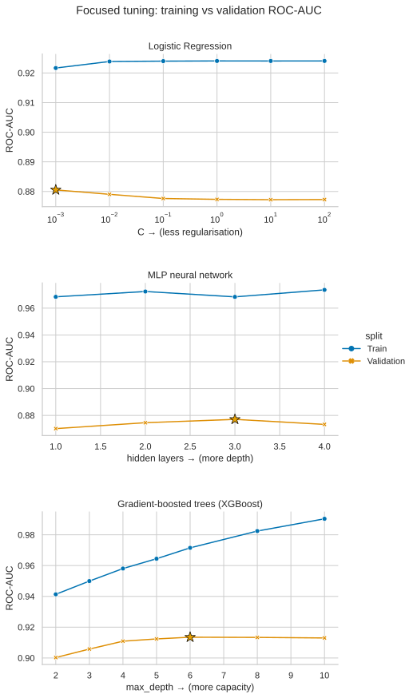
    


|   Unnamed: 0 |   learning_rate |   n_trees |   train_logloss |   val_logloss |   train_AUC |   val_AUC |
|-------------:|----------------:|----------:|----------------:|--------------:|------------:|----------:|
|            0 |            0.1  |        50 |          0.2749 |        0.3729 |      0.9534 |    0.9078 |
|            1 |            0.1  |       100 |          0.2396 |        0.365  |      0.9644 |    0.9119 |
|            2 |            0.1  |       200 |          0.2032 |        0.3675 |      0.9756 |    0.9125 |
|            3 |            0.1  |       400 |          0.162  |        0.3764 |      0.9866 |    0.9115 |
|            4 |            0.1  |       700 |          0.1248 |        0.3903 |      0.9939 |    0.9075 |
|            5 |            0.1  |      1000 |          0.1    |        0.4034 |      0.997  |    0.9063 |
|            6 |            0.03 |        50 |          0.368  |        0.439  |      0.9402 |    0.8978 |
|            7 |            0.03 |       100 |          0.3044 |        0.3901 |      0.9482 |    0.9062 |
|            8 |            0.03 |       200 |          0.2673 |        0.3692 |      0.9556 |    0.9101 |
|            9 |            0.03 |       400 |          0.2305 |        0.3643 |      0.9673 |    0.9125 |
|           10 |            0.03 |       700 |          0.1989 |        0.3662 |      0.977  |    0.9135 |
|           11 |            0.03 |      1000 |          0.1791 |        0.3675 |      0.9825 |    0.9133 |


Adding the time index improves XGBoost on the chronological holdout, while recency weighting does not improve on that result. The random split mixes periods and reaches a much higher AUC, showing why it gives an optimistic estimate for the later test window.

# 8. Model evaluation

We use the selected rank-average score for ROC-AUC and precision-recall comparison. The confusion matrix and local interpretation use XGBoost probabilities because these analyses require a threshold on one fitted model.

## 8.1 ROC & precision–recall curves


```python
_fig, _axes = plt.subplots(1, 2, figsize=(15, 5.5))
for pred, name in [
    (pred_lr, 'Logistic Regression'),
    (pred_mlp, 'MLP'),
    (pred_t['lgbm'], 'LightGBM'),
    (pred_t['xgb'], 'XGBoost'),
    (pred_t['cat'], 'CatBoost'),
    (blend_t, 'Rank-average blend (selected)'),
]:
    fpr, tpr, _ = roc_curve(y_va, pred)
    _axes[0].plot(
        fpr,
        tpr,
        label=f'{name} (AUC={auc(fpr, tpr):.3f})',
        lw=2.2 if name.startswith('Blend') else 1.2,
    )
    prec, rec, _ = precision_recall_curve(y_va, pred)
    _axes[1].plot(
        rec,
        prec,
        label=f'{name} (AP={average_precision_score(y_va, pred):.3f})',
        lw=2.2 if name.startswith('Blend') else 1.2,
    )
_axes[0].plot([0, 1], [0, 1], 'k--', alpha=0.5)
_axes[0].set(
    xlabel='False Positive Rate', ylabel='True Positive Rate', title='ROC curve'
)
_axes[0].legend(loc='lower right', fontsize=8)
_axes[1].axhline(y_va.mean(), ls='--', color='grey', alpha=0.7)
_axes[1].set(xlabel='Recall', ylabel='Precision', title='Precision–Recall curve')
_axes[1].legend(loc='lower left', fontsize=8)
plt.tight_layout()
plt.show()
```


    
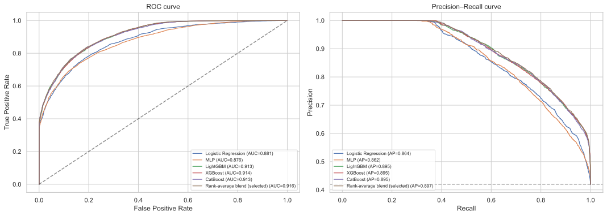
    


The blend has the best holdout AUC in this comparison, so it is the selected ranking score.

## 8.2 Confusion matrix & threshold metrics

A confusion matrix requires a threshold, so we use 0.5 as a simple reference point. Nova Academy could later adjust it according to the relative cost of unnecessary follow-up and missed cancellations.


```python
xgb_prob = pred_t['xgb']
y_hat = (xgb_prob >= 0.5).astype(int)
cm = confusion_matrix(y_va, y_hat)
_fig, _ax = plt.subplots(figsize=(5, 4))
sns.heatmap(
    cm,
    annot=True,
    fmt=',d',
    cmap='Blues',
    cbar=False,
    xticklabels=['pred completed', 'pred dropped'],
    yticklabels=['true completed', 'true dropped'],
    ax=_ax,
)
_ax.set_title('Confusion matrix — XGBoost @ 0.5')
plt.tight_layout()
plt.show()
print(
    classification_report(y_va, y_hat, target_names=['completed', 'dropped'], digits=3)
)
print(f'AUC of selected rank-average score: {roc_auc_score(y_va, blend_t):.4f}')
print(f'AUC of representative XGBoost: {roc_auc_score(y_va, xgb_prob):.4f}')
```


    
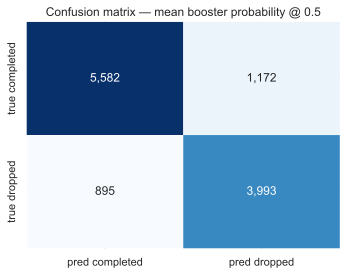
    


                  precision    recall  f1-score   support
    
       completed      0.862     0.826     0.844      6754
         dropped      0.773     0.817     0.794      4888
    
        accuracy                          0.822     11642
       macro avg      0.817     0.822     0.819     11642
    weighted avg      0.825     0.822     0.823     11642
    
    AUC of selected rank-average score: 0.9156
    AUC of mean booster probability: 0.9156


For the dropped class, recall is the share of actual cancellations that XGBoost flags, while precision is the share of its alerts that actually cancel. False positives consume follow-up resources; false negatives leave cancellations unflagged. Accuracy and F1 summarize the chosen threshold but will change if the threshold moves.

We submit continuous scores because ROC-AUC evaluates the ordering of registrations across all possible thresholds.

## 8.3 Registrations near the illustrative threshold

We inspect how many XGBoost predictions fall near the 0.5 reference threshold.


```python
plt.figure(figsize=(9, 4.5))
sns.histplot(xgb_prob, bins=50, kde=True, color="teal")
plt.axvline(0.5, color="red", ls="--", label="decision boundary")
plt.axvspan(0.40, 0.60, color="orange", alpha=0.2, label="near-threshold band")
plt.xlabel("XGBoost predicted P(drop)")
plt.title("XGBoost prediction distribution")
plt.legend()
plt.tight_layout()
plt.show()

near_threshold = ((xgb_prob > 0.40) & (xgb_prob < 0.60)).mean() * 100
print(f"share of holdout in the 0.40–0.60 band: {near_threshold:.1f}%")
```


    

    


    share of holdout in the 0.40–0.60 low-confidence zone: 10.5%


We use one registration from this band for the local SHAP explanation below.

# 9. Interpretation with SHAP

We use the tuned XGBoost model for detailed interpretation and then compare its SHAP results with the patterns found during EDA.

We compute TreeSHAP values on a fixed validation sample of up to 10,000 rows to keep the analysis reproducible and the runtime manageable.


```python
shap_model = get_xgb()
shap_model.fit(Xtr_t, y_tr)
print(
    f"XGBoost+time chrono AUC: {roc_auc_score(y_va, shap_model.predict_proba(Xva_t)[:, 1]):.4f}"
)

X_shap = Xva_t.sample(min(10000, len(Xva_t)), random_state=SEED)
explainer = shap.TreeExplainer(shap_model)
shap_values = explainer.shap_values(X_shap)
if isinstance(shap_values, list):
    shap_values = shap_values[1]
shap_values = np.asarray(shap_values)
if shap_values.ndim == 3:  # some shap versions return (n, features, classes)
    shap_values = shap_values[:, :, 1]
```

    XGBoost+time chrono AUC: 0.9135


## 9.1 Global importance (beeswarm + bar)


```python
shap.summary_plot(shap_values, X_shap, show=False, max_display=20)
plt.title('SHAP summary (beeswarm) — XGBoost+time')
plt.tight_layout()
plt.show()
importance = (
    pd
    .DataFrame({
        'feature': X_shap.columns,
        'mean_abs_shap': np.abs(shap_values).mean(0),
    })
    .sort_values('mean_abs_shap', ascending=False)
    .reset_index(drop=True)
)
top = importance.head(20)
_ax = top.sort_values('mean_abs_shap').plot.barh(
    x='feature', y='mean_abs_shap', legend=False, figsize=(8, 7), color='#4c72b0'
)
_ax.set_xlabel('mean |SHAP value|')
_ax.set_title('Top 20 features by SHAP importance')
plt.tight_layout()
plt.show()
display(top)
```


    
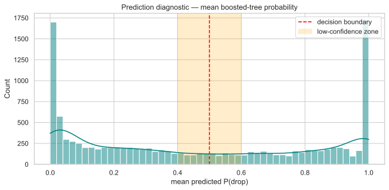
    


    
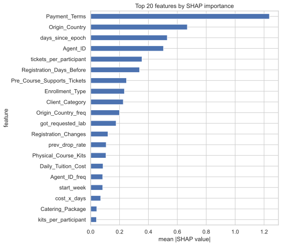
    


|   Unnamed: 0 | feature                     |   mean_abs_shap |
|-------------:|:----------------------------|----------------:|
|            0 | Payment_Terms               |          1.2374 |
|            1 | Origin_Country              |          0.6693 |
|            2 | days_since_epoch            |          0.5305 |
|            3 | Agent_ID                    |          0.5042 |
|            4 | tickets_per_participant     |          0.3554 |
|            5 | Registration_Days_Before    |          0.3389 |
|            6 | Pre_Course_Supports_Tickets |          0.2485 |
|            7 | Enrollment_Type             |          0.2338 |
|            8 | Client_Category             |          0.2259 |
|            9 | Origin_Country_freq         |          0.2002 |
|           10 | got_requested_lab           |          0.1766 |
|           11 | Registration_Changes        |          0.1201 |
|           12 | prev_drop_rate              |          0.1078 |
|           13 | Physical_Course_Kits        |          0.1064 |
|           14 | Daily_Tuition_Cost          |          0.0863 |
|           15 | Agent_ID_freq               |          0.0836 |
|           16 | start_week                  |          0.0836 |
|           17 | cost_x_days                 |          0.0698 |
|           18 | Catering_Package            |          0.0426 |
|           19 | kits_per_participant        |          0.0408 |


The strongest XGBoost contributions broadly match the earlier exploration: `Payment_Terms`, `Origin_Country`, the time index, `Agent_ID`, registration lead time, and support-related features appear near the top. Raw country and agent identity contribute more than their frequency encodings, while the engineered ratios add smaller supporting signals.

### Checking the suspicious `Payment_Terms` signal

EDA showed that prepaid, non-refundable registrations drop unexpectedly often, and SHAP now ranks `Payment_Terms` first. To see how strongly the model relies on it, we refit XGBoost without the field and compare chronological AUC.


```python
pred_xgb_no_payment = fit_predict(
    "xgb",
    Xtr_t.drop(columns=["Payment_Terms"]),
    y_tr,
    Xva_t.drop(columns=["Payment_Terms"]),
)
payment_check = pd.DataFrame({
    "model": ["XGBoost + time", "XGBoost + time, no Payment_Terms"],
    "chrono_AUC": [
        roc_auc_score(y_va, pred_t["xgb"]),
        roc_auc_score(y_va, pred_xgb_no_payment),
    ],
})
payment_check["delta_vs_with_payment"] = (
    payment_check["chrono_AUC"] - payment_check.loc[0, "chrono_AUC"]
)
display(payment_check)
```


|   Unnamed: 0 | model                            |   chrono_AUC |   delta_vs_with_payment |
|-------------:|:---------------------------------|-------------:|------------------------:|
|            0 | XGBoost + time                   |       0.9135 |                  0      |
|            1 | XGBoost + time, no Payment_Terms |       0.9098 |                 -0.0037 |


Removing `Payment_Terms` lowers chronological AUC from 0.9135 to 0.9098, so the field helps but is not carrying the model by itself. Its exact recording time is still worth confirming with the data owner.

## 9.2 Direction of the strongest non-payment signal

`Origin_Country` is the strongest feature after `Payment_Terms`, so we plot the average SHAP contribution of its most common levels. Positive values push XGBoost toward a higher cancellation score; negative values push it toward completion.


```python
top_feat = (
    importance.loc[importance['feature'] != 'Payment_Terms', 'feature'].iloc[0]
    if importance['feature'].iloc[0] == 'Payment_Terms'
    else importance['feature'].iloc[0]
)


def plot_shap_dependence_readable(feature, max_categories=15):
    col_idx = list(X_shap.columns).index(feature)
    values = X_shap[feature]
    is_categorical = (
        str(values.dtype) == 'category'
        or values.dtype == 'object'
        or values.nunique(dropna=False) <= max_categories
    )
    if not is_categorical:
        shap.dependence_plot(
            feature, shap_values, X_shap, interaction_index=None, show=False
        )
        plt.title(f'SHAP dependence — {feature}')
        plt.tight_layout()
        plt.show()
        return
    labels = values.astype('string').fillna('missing')
    keep = labels.value_counts().head(max_categories).index
    grouped = pd.DataFrame({
        'level': labels.where(labels.isin(keep), 'other'),
        'shap': shap_values[:, col_idx],
    })
    summary = (
        grouped
        .groupby('level', observed=True)
        .agg(mean_shap=('shap', 'mean'), n=('shap', 'size'))
        .sort_values('mean_shap')
    )
    fig_h = max(4, min(7, 0.32 * len(summary) + 1.2))
    _fig, _ax = plt.subplots(figsize=(8, fig_h))
    sns.barplot(
        data=summary.reset_index(), y='level', x='mean_shap', color='#4c72b0', ax=_ax
    )
    _ax.axvline(0, color='black', lw=1, alpha=0.5)
    _ax.set_title(f'Mean SHAP by {feature} level (top {max_categories} + other)')
    _ax.set_xlabel('mean SHAP contribution')
    _ax.set_ylabel(feature)
    plt.tight_layout()
    plt.show()


try:
    plot_shap_dependence_readable(top_feat)
except Exception as e:
    print(f'(dependence view skipped for {top_feat}: {e})')
```


    
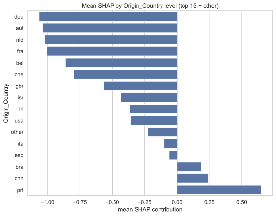
    


## 9.3 Explaining one near-threshold registration

We choose one sampled XGBoost prediction near 0.5 and decompose it. The waterfall shows which features pushed this particular score upward and which pushed it downward.


```python
sample_scores = shap_model.predict_proba(X_shap)[:, 1]
borderline = np.where((sample_scores > 0.45) & (sample_scores < 0.55))[0]
idx = int(borderline[0]) if len(borderline) else 0
base = explainer.expected_value
if isinstance(base, (list, np.ndarray)):
    base = np.asarray(base).ravel()[-1]

print(
    f"explaining order at sample position {idx} — model P(drop)={sample_scores[idx]:.3f}"
)
shap.plots._waterfall.waterfall_legacy(
    base,
    shap_values[idx],
    feature_names=list(X_shap.columns),
    max_display=14,
    show=False,
)
plt.tight_layout()
plt.show()
```

    explaining order at sample position 13 — model P(drop)=0.488


    
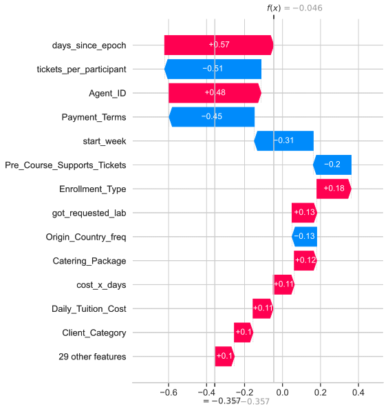
    


For this registration, positive and negative contributions nearly balance, producing a score close to the reference threshold.

# 10. Rebuilding and checking the submission

The stored `data/Group_27_Submission.csv` is the submission that received the leaderboard score. The block below can retrain the three-model blend and compare the rebuilt ranking with that submission.


```python
def build_submission_candidate(
    out_path="data/Group_27_Submission_candidate.csv", write=False
):
    fm = make_freq_maps(train_raw, test_raw)
    X_train_full = build_features(train_raw, fm)
    X_test = build_features(test_raw, fm)
    align_categories(X_train_full, X_test)
    y_full = train_raw[TARGET].values

    preds = []
    for name in ("lgbm", "xgb", "cat"):
        preds.append(fit_predict(name, X_train_full, y_full, X_test))
        print(f"fitted {name} on {len(X_train_full):,} rows")

    submission = pd.DataFrame({
        "Client_ID": test_raw["Client_ID"],
        "Drop_Probability": rank_avg(preds),
    })
    if write:
        submission.to_csv(out_path, index=False)
        print(f"wrote {out_path}  ({len(submission):,} rows)")
    return submission


def rebuild_and_compare():
    submission = build_submission_candidate(write=False)
    display(submission.head())
    print(submission["Drop_Probability"].describe())

    scored_path = Path("data/Group_27_Submission.csv")
    if scored_path.exists():
        scored_submission = pd.read_csv(scored_path)
        comparison = scored_submission.merge(
            submission,
            on="Client_ID",
            suffixes=("_scored_file", "_rebuilt"),
            validate="one_to_one",
        )
        diff = (
            comparison["Drop_Probability_scored_file"]
            - comparison["Drop_Probability_rebuilt"]
        ).abs()
        submission_match = pd.DataFrame({
            "rows_compared": [len(comparison)],
            "max_abs_diff": [diff.max()],
            "mean_abs_diff": [diff.mean()],
            "spearman_corr": [
                comparison["Drop_Probability_scored_file"].corr(
                    comparison["Drop_Probability_rebuilt"], method="spearman"
                )
            ],
        })
        display(submission_match)
        if diff.max() < 1e-12:
            print("rebuilt predictions match the scored file exactly.")
        else:
            print(
                "rebuilt predictions are not byte-identical to the scored file; "
                "use the stored scored CSV as the official leaderboard record."
            )
    else:
        print(f"{scored_path} not found; skipped scored-file comparison.")


RUN_REBUILD_AND_COMPARE = False  # expensive; keep disabled during routine editing

if RUN_REBUILD_AND_COMPARE:
    rebuild_and_compare()
```

The comparison checks the rebuilt file's schema and its Spearman rank agreement with the submitted ranking.

# 11. Conclusions & Executive Summary

Nova Academy's test registrations occur after the training period, and both the monthly target rate and the adversarial-validation result (AUC 0.935) show temporal distribution shift. Model selection therefore used a four-month chronological holdout.

Cleaning reduced hundreds of inconsistent text labels to compact category sets. Missingness, payment terms, country, agent, registration timing, and support activity all carried predictive information. Model comparison confirmed that tuned XGBoost outperformed the Logistic Regression and MLP baselines on the future holdout. Adding fixed LightGBM and CatBoost rankings produced a small further gain, from XGBoost AUC 0.9135 to blend AUC 0.9156 on that split.

The stored rank-average submission received test ROC-AUC **0.889314**, above the required 0.70.

Further work could include rolling temporal validation, confirming when `Payment_Terms` is recorded, and calibrating XGBoost probabilities for cost-based operational thresholds.
