# Group 27 — Course-Drop Prediction (Nova Academy)

**Submitters:** Rotem David Semah (ID: `211396593`) · Ron Drach (ID: `213915499`)

---

This is the **current integrated CRISP-DM-style analysis notebook** for the project. It tells the story end to end: business understanding → data exploration → cleaning → feature engineering → modelling → evaluation → interpretation → conclusions.

It combines two exploratory lines of work (`notebook_v1.py` and `Project_Ron_V3.ipynb`) around the selected chronological pipeline, whose clean runnable form lives in `pipelines/pipeline_v2.py`. Running this notebook top to bottom rebuilds the current submission logic.

**The one idea that shaped the modelling choices:** the hidden test set is the **future** — it begins exactly where training ends and runs four months further. So the task is _forecasting_, not interpolating, and any validation that mixes past and future rows (a random split) is measuring the wrong thing. Respecting time in validation helped explain the improvement from the first submission's **0.886** leaderboard AUC to the current **0.889314 — 1st of 32 groups**.


```python
import warnings
from pathlib import Path

import numpy as np
import pandas as pd
import matplotlib.pyplot as plt
import seaborn as sns
import shap
from catboost import CatBoostClassifier
from lightgbm import LGBMClassifier
from scipy.stats import rankdata
from sklearn.linear_model import LogisticRegression
from sklearn.metrics import (
    roc_auc_score,
    log_loss,
    roc_curve,
    auc,
    confusion_matrix,
    classification_report,
    precision_recall_curve,
    average_precision_score,
)
from sklearn.model_selection import train_test_split
from sklearn.neural_network import MLPClassifier
from sklearn.preprocessing import OneHotEncoder, StandardScaler
from xgboost import XGBClassifier

warnings.filterwarnings("ignore")
sns.set_theme(style="whitegrid")
plt.rcParams["figure.dpi"] = 120
plt.rcParams["savefig.dpi"] = 220
plt.rcParams["svg.fonttype"] = "path"
try:
    get_ipython().run_line_magic("config", "InlineBackend.figure_format = 'retina'")
except Exception:
    pass

# `display` is injected by Jupyter. Define a fallback so the notebook also runs
# as a plain script (e.g. for CI / reproducibility checks).
try:
    display  # noqa: B018
except NameError:  # pragma: no cover

    def display(*objs, **_):
        for o in objs:
            print(o)


TRAIN_PATH = "data/Train_Data.csv"
TEST_PATH = "data/Test_Data_No_Target.csv"
TARGET = "Dropped_Course"
CHRONO_CUTOFF = "2017-01-01"  # validation window ~ 4 months, matching the test window
SEED = 42
GITHUB_RAW_BASES = [
    "https://raw.githubusercontent.com/manemajef/ml-proj/main",
]

pd.set_option("display.max_columns", None)


def load_raw(path: str) -> pd.DataFrame:
    local_path = Path(path)
    read_errors = []

    if local_path.exists():
        source = local_path
    else:
        source = None
        for base_url in GITHUB_RAW_BASES:
            url = f"{base_url}/{path}"
            try:
                df = pd.read_csv(url, parse_dates=["Course_Start_Date"])
                print(f"{path} not found locally; loaded from {url}")
                break
            except Exception as exc:
                read_errors.append(f"{url}: {exc}")
        else:
            tried = "\n".join(read_errors) or "No GitHub fallback URL configured."
            raise FileNotFoundError(
                f"Could not find {path} locally and could not fetch it from GitHub.\n{tried}"
            )

    if source is not None:
        df = pd.read_csv(source, parse_dates=["Course_Start_Date"])

    # Agent/Company IDs are categorical labels, not quantities.
    for col in ("Agent_ID", "Company_ID"):
        df[col] = df[col].astype("string")
    return df
```

# 1. Business understanding

Nova Academy runs paid, in-person B2B technical trainings. Preparing a course is expensive and largely **sunk before it starts** — cloud environments, catering, physical equipment kits, room capacity. When a registered group cancels (`Dropped_Course = 1`), the company loses that spend _and_ the empty seats block other groups from being scheduled.

**Goal.** Given a new registration, predict the **probability** that it will be cancelled, so operations can manage risk (overbook cautiously, follow up with high-risk groups, hold back irreversible spend).

**Why probability-like scores, not hard labels.** Operations needs to _rank_ and _size_ risk, not receive a yes/no. The grading metric is **AUC** — a threshold-free measure of how well a score ranks droppers above non-droppers. The selected CSV uses a rank-average boosted-tree score optimized for this ranking task; threshold diagnostics below use mean model probabilities separately because the rank score is not calibrated. The passing bar is AUC ≥ 0.70.

**CRISP-DM framing.** The rest of the notebook follows the standard cycle: understand the data, prepare it, model, evaluate, and translate results back into business insight.


# 2. Data loading & first look

Two files are provided:

- `Train_Data.csv` — historical registrations **with** the `Dropped_Course`
  label.
- `Test_Data_No_Target.csv` — registrations to score, **without** the label.

If the local `data/` files are missing, `load_raw` falls back to the raw CSVs in the GitHub repository. This keeps the notebook runnable when shared as a single `.ipynb`, as long as the machine has internet access and the repository data files are reachable.

Each row is one order (`Client_ID`). We load both and immediately build a data dictionary: dtype, missingness, cardinality, mode, and a zero-count (some "zeros" are really missing-in-disguise).


```python
train_raw = load_raw(TRAIN_PATH)
test_raw = load_raw(TEST_PATH)

print(f"train: {train_raw.shape[0]:,} rows x {train_raw.shape[1]} cols")
print(f"test : {test_raw.shape[0]:,} rows x {test_raw.shape[1]} cols")

data_dictionary = pd.DataFrame({
    "dtype": train_raw.dtypes.astype(str),
    "n_missing": train_raw.isna().sum(),
    "missing_%": (train_raw.isna().mean() * 100).round(2),
    "n_unique": train_raw.nunique(dropna=True),
    "n_zero": (train_raw == 0).sum(numeric_only=False),
    "most_frequent": train_raw.mode(dropna=True).iloc[0],
})
display(data_dictionary)
```

    train: 63,464 rows x 29 cols
    test : 15,866 rows x 28 cols


| Unnamed: 0                  | dtype          |   n_missing |   missing_% |   n_unique |   n_zero | most_frequent             |
|:----------------------------|:---------------|------------:|------------:|-----------:|---------:|:--------------------------|
| Client_ID                   | int64          |           0 |        0    |      63464 |        0 | 1                         |
| Professionals_Count         | int64          |           0 |        0    |          5 |      338 | 2.0                       |
| Students_Count              | float64        |           4 |        0.01 |          5 |    59578 | 0.0                       |
| Observers_Count             | int64          |           0 |        0    |          5 |    63149 | 0.0                       |
| Course_Start_Date           | datetime64[ns] |           0 |        0    |        666 |        0 | 2015-10-16 00:00:00       |
| Practical_Hours             | int64          |           0 |        0    |         18 |    30671 | 0.0                       |
| Theory_Hours                | int64          |           0 |        0    |         29 |     4045 | 2.0                       |
| Registration_Days_Before    | float64        |        2666 |        4.2  |        423 |     2610 | 0.0                       |
| Origin_Country              | object         |         557 |        0.88 |        721 |        0 | PRT                       |
| Catering_Package            | object         |         407 |        0.64 |        321 |        0 | Standard (Coffee Only)    |
| Welcome_Gift_Type           | object         |           0 |        0    |          4 |        0 | Branded Notebook          |
| Requested_Lab_Config        | object         |        1736 |        2.74 |          8 |        0 | Standard PC (Windows)     |
| Assigned_Lab_Config         | object         |           0 |        0    |          9 |        0 | Standard PC (Windows)     |
| Prev_Course_Dropouts        | int64          |           0 |        0    |         10 |    58184 | 0.0                       |
| Prev_Course_Attended        | int64          |           0 |        0    |         62 |    62188 | 0.0                       |
| Pre_Course_Supports_Tickets | int64          |           0 |        0    |          6 |    39830 | 0.0                       |
| Physical_Course_Kits        | float64        |        1040 |        1.64 |          4 |    60790 | 0.0                       |
| Waiting_List_Days           | int64          |           0 |        0    |        107 |    60089 | 0.0                       |
| Registration_Changes        | int64          |           0 |        0    |         19 |    55478 | 0.0                       |
| Enrollment_Type             | object         |         719 |        1.13 |        298 |        0 | General Admission         |
| Lanyard_Color               | object         |           0 |        0    |        240 |        0 | Blue                      |
| Client_Category             | object         |           0 |        0    |        505 |        0 | SaaS & Software Houses    |
| Submission_Source           | object         |         605 |        0.95 |        328 |        0 | B2B Platforms & Resellers |
| Returning_Client            | int64          |           0 |        0    |          2 |    61742 | 0.0                       |
| Agent_ID                    | string         |       11173 |       17.61 |        203 |        0 | 184.0                     |
| Company_ID                  | string         |       60344 |       95.08 |        184 |        0 | 5181.0                    |
| Payment_Terms               | object         |         587 |        0.92 |        236 |        0 | Pay Upon Start            |
| Daily_Tuition_Cost          | float64        |          79 |        0.12 |       4780 |     1079 | 62.0                      |
| Dropped_Course              | int64          |           0 |        0    |          2 |    37165 | 0.0                       |


**What the dictionary tells us.**

- `Client_ID` is unique per row — an identifier, never a feature.
- `Agent_ID`, `Company_ID`, `Origin_Country` are **high-cardinality**
  identifiers (many distinct values). `Company_ID` is missing for most rows.
- A handful of numeric columns show impossible extremes in `describe()` below
  (e.g. `Students_Count = 9999`, `Practical_Hours = 10000`) — flagged for the
  outlier section.
- The categorical text columns are visibly _dirty_ (casing, punctuation,
  placeholder strings) — handled in cleaning.


```python
display(train_raw.describe())
```


| Unnamed: 0   |   Client_ID |   Professionals_Count |   Students_Count |   Observers_Count | Course_Start_Date             |   Practical_Hours |   Theory_Hours |   Registration_Days_Before |   Prev_Course_Dropouts |   Prev_Course_Attended |   Pre_Course_Supports_Tickets |   Physical_Course_Kits |   Waiting_List_Days |   Registration_Changes |   Returning_Client |   Daily_Tuition_Cost |   Dropped_Course |
|:-------------|------------:|----------------------:|-----------------:|------------------:|:------------------------------|------------------:|---------------:|---------------------------:|-----------------------:|-----------------------:|------------------------------:|-----------------------:|--------------------:|-----------------------:|-------------------:|---------------------:|-----------------:|
| count        |     63464   |          63464        |      63460       |      63464        | 63464                         |       63464       |    63464       |                  60798     |           63464        |           63464        |                  63464        |           62424        |         63464       |           63464        |       63464        |           63385      |     63464        |
| mean         |     39761.8 |              1.83521  |          8.75172 |          0.005326 | 2016-06-23 05:17:23.287533056 |           6.60905 |        2.16439 |                    102.894 |               0.095991 |               0.122967 |                      0.51333  |               0.026224 |             3.98368 |               0.180039 |           0.027133 |              98.848  |         0.414392 |
| min          |         1   |              0        |          0       |          0        | 2015-07-01 00:00:00           |          -5       |        0       |                      0     |               0        |               0        |                      0        |               0        |             0       |               0        |           0        |               0      |         0        |
| 25%          |     19959.8 |              2        |          0       |          0        | 2016-02-13 00:00:00           |           0       |        1       |                     19     |               0        |               0        |                      0        |               0        |             0       |               0        |           0        |              75      |         0        |
| 50%          |     39819.5 |              2        |          0       |          0        | 2016-07-01 00:00:00           |           1       |        2       |                     65     |               0        |               0        |                      0        |               0        |             0       |               0        |           0        |              94.5    |         0        |
| 75%          |     59570.2 |              2        |          0       |          0        | 2016-11-11 00:00:00           |           1       |        3       |                    150     |               0        |               0        |                      1        |               0        |             0       |               0        |           0        |             117      |         1        |
| max          |     79330   |              4        |       9999       |         10        | 2017-04-26 00:00:00           |       10000       |       41       |                    629     |              21        |              61        |                      5        |               3        |           391       |              21        |           1        |            5400      |         1        |
| std          |     22879   |              0.508607 |        294.239   |          0.089662 | nan                           |         215.503   |        1.46985 |                    109.179 |               0.448526 |               1.5352   |                      0.763563 |               0.160202 |            23.1955  |               0.592577 |           0.162474 |              41.8554 |         0.492621 |


```python

```

## 2.1 Target balance

Before anything else: how (im)balanced is the target? A heavily skewed target would change how we read metrics.


```python
target_counts = train_raw[TARGET].value_counts().sort_index()
target_rate = train_raw[TARGET].value_counts(normalize=True).sort_index()
balance = pd.DataFrame({
    "count": target_counts,
    "rate_%": (target_rate * 100).round(1),
})
balance.index = ["0 = completed", "1 = dropped"]
display(balance)

ax = target_rate.mul(100).plot.bar(color=["#4c72b0", "#c44e52"], figsize=(5, 3.5))
ax.set_xticklabels(["completed (0)", "dropped (1)"], rotation=0)
ax.set_ylabel("share of orders (%)")
ax.set_title("Target balance — Dropped_Course")
plt.tight_layout()
plt.show()
```


| Unnamed: 0    |   count |   rate_% |
|:--------------|--------:|---------:|
| 0 = completed |   37165 |     58.6 |
| 1 = dropped   |   26299 |     41.4 |


    
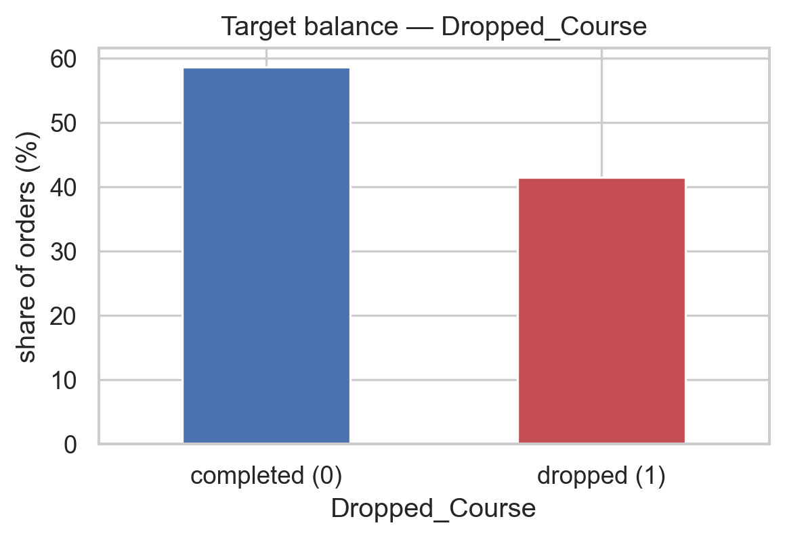
    


The classes are **roughly balanced** (~59% completed / ~41% dropped). No resampling is needed, and AUC is a sensible, stable choice of metric.


# 3. Exploratory Data Analysis

The EDA has one headline finding that reorganises the whole project (the time structure), plus the usual per-feature analysis. We lead with the headline.


## 3.1 The headline: **the test set is the future**

We plot the monthly drop rate across the _training_ period and overlay where training ends and where the hidden test window ends.


```python
train_end = train_raw["Course_Start_Date"].max()
test_start = test_raw["Course_Start_Date"].min()
test_end = test_raw["Course_Start_Date"].max()

print(
    f"train dates: {train_raw['Course_Start_Date'].min().date()} -> {train_end.date()}"
)
print(f"test  dates: {test_start.date()} -> {test_end.date()}")

monthly = (
    train_raw.set_index("Course_Start_Date").resample("MS")[TARGET].mean().mul(100)
)
ax = monthly.plot(marker="o", figsize=(12, 4))
ax.axhline(train_raw[TARGET].mean() * 100, ls="--", color="grey", label="train average")
ax.axvline(train_end, ls="--", color="green", label=f"train ends ({train_end.date()})")
ax.axvline(test_end, ls=":", color="red", label=f"test ends ({test_end.date()})")
ax.set_xlim(train_raw["Course_Start_Date"].min(), test_end)
ax.set_ylabel("drop rate (%)")
ax.set_title("Drop rate over time — training period and the hidden test horizon")
ax.legend()
plt.tight_layout()
plt.show()
```

    train dates: 2015-07-01 -> 2017-04-26
    test  dates: 2017-04-26 -> 2017-08-31


    
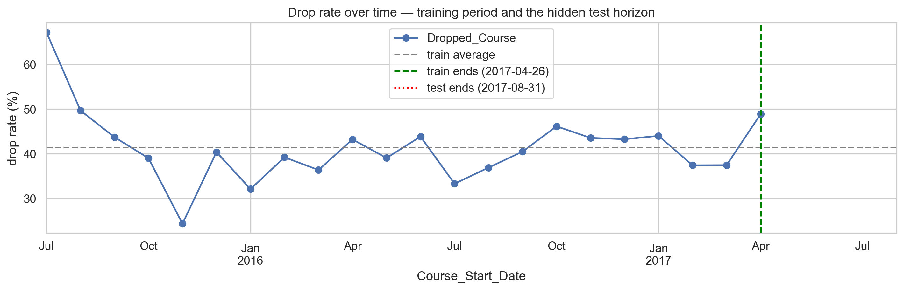
    


**Reading the plot.** Training runs `2015-07 → 2017-04`; the test window starts exactly where training ends and continues to `2017-08`, with essentially **zero overlap in time**. The drop rate also **drifts year to year** — it is not a stationary process.

**Consequence.** The real task is "train on the past, predict the future". A random train/validation split leaks future rows into training and produces an _optimistic_ score that does not transfer to the leaderboard. This time structure drives our validation strategy (Section 6) and motivates a feature choice (the time index, Section 5). It likely explains much of the gap between random-split validation and leaderboard behavior, while other feature and model changes also contributed.


## 3.2 Missing values

We compare missingness in train vs the official test file (the pipeline must handle both identically), then ask whether _the fact of being missing_ is itself predictive.


```python
missing_compare = pd.DataFrame({
    "train_missing_%": train_raw.isna().mean().mul(100).round(2),
    "test_missing_%": test_raw.isna().mean().mul(100).round(2),
})
missing_compare = missing_compare[
    (missing_compare["train_missing_%"] > 0) | (missing_compare["test_missing_%"] > 0)
].sort_values("train_missing_%", ascending=False)
display(missing_compare)
```


| Unnamed: 0               |   train_missing_% |   test_missing_% |
|:-------------------------|------------------:|-----------------:|
| Company_ID               |             95.08 |            96.41 |
| Agent_ID                 |             17.61 |            17.61 |
| Registration_Days_Before |              4.2  |             4.05 |
| Requested_Lab_Config     |              2.74 |             3.01 |
| Physical_Course_Kits     |              1.64 |             1.43 |
| Enrollment_Type          |              1.13 |             1.12 |
| Submission_Source        |              0.95 |             0.94 |
| Payment_Terms            |              0.92 |             0.91 |
| Origin_Country           |              0.88 |             1.01 |
| Catering_Package         |              0.64 |             0.7  |
| Daily_Tuition_Cost       |              0.12 |             0.01 |
| Students_Count           |              0.01 |             0    |


Missingness patterns are **consistent between train and test**, so a single imputation policy is safe to reuse for scoring.

**Next**: is missingness itself a signal?


```python
missingness_cols = [
    "Company_ID",
    "Agent_ID",
    "Registration_Days_Before",
    "Physical_Course_Kits",
    "Daily_Tuition_Cost",
    "Payment_Terms",
]
rows = []
for col in missingness_cols:
    stats = (
        train_raw
        .assign(is_missing=train_raw[col].isna())
        .groupby("is_missing")[TARGET]
        .agg(count="size", drop_rate="mean")
    )
    for is_missing, r in stats.iterrows():
        rows.append({
            "column": col,
            "is_missing": is_missing,
            "count": int(r["count"]),
            "drop_rate_%": round(r["drop_rate"] * 100, 1),
        })
display(pd.DataFrame(rows))
```


|   Unnamed: 0 | column                   | is_missing   |   count |   drop_rate_% |
|-------------:|:-------------------------|:-------------|--------:|--------------:|
|            0 | Company_ID               | False        |    3120 |          21.2 |
|            1 | Company_ID               | True         |   60344 |          42.5 |
|            2 | Agent_ID                 | False        |   52291 |          43.1 |
|            3 | Agent_ID                 | True         |   11173 |          33.5 |
|            4 | Registration_Days_Before | False        |   60798 |          41.4 |
|            5 | Registration_Days_Before | True         |    2666 |          41.5 |
|            6 | Physical_Course_Kits     | False        |   62424 |          41.5 |
|            7 | Physical_Course_Kits     | True         |    1040 |          39.3 |
|            8 | Daily_Tuition_Cost       | False        |   63385 |          41.4 |
|            9 | Daily_Tuition_Cost       | True         |      79 |          51.9 |
|           10 | Payment_Terms            | False        |   62877 |          41.5 |
|           11 | Payment_Terms            | True         |     587 |          35.4 |


**Missingness is informative.**

- Rows _without_ a `Company_ID` drop at a noticeably higher rate than rows with one — a registration made through a known company is a more committed order.
- `Agent_ID` missingness shows a different profile too. This justifies explicit **presence flags** (`has_company_id`, `has_agent_id`) rather than silently imputing these away.


## 3.3 Categorical data quality (and why cleaning is mandatory)

By its business meaning, every text column here should hold a handful of levels (a catering package, a lanyard colour, a payment term). So before changing anything, we scan the raw vocabulary of each text column: its distinct-string count and its six most frequent values, printed through `repr` so that padded whitespace stays visible inside the quotes. A column whose meaning allows only a few levels but shows hundreds of raw strings is corrupted.


```python
TEXT_COLS = list(train_raw.select_dtypes(include=["object"]).columns)


def count_unique_vals(df, col):
    return df[col].nunique()


def most_common_cats(df, col, n=15):
    return df[col].value_counts(normalize=True).head(n)


N_COUNT = 15
for col in TEXT_COLS:
    top_values = most_common_cats(train_raw, col)

    print(f"""
{'=' * 80}
Column: {col}
Unique values: {count_unique_vals(train_raw, col)}

Top {len(top_values)} categories:
{
        chr(10).join(
            f"- {value!r}: {share * 100:.1f}%" for value, share in top_values.items()
        )
    }
""")
```

    
    ================================================================================
    Column: Origin_Country
    Unique values: 721
    
    Top 15 categories:
    - 'PRT': 38.6%
    - 'FRA': 10.2%
    - 'DEU': 6.4%
    - 'ESP': 5.7%
    - 'GBR': 5.2%
    - 'ITA': 4.0%
    - 'BRA': 2.0%
    - 'BEL': 2.0%
    - 'NLD': 1.8%
    - 'USA': 1.6%
    - 'CHE': 1.4%
    - 'IRL': 1.2%
    - 'AUT': 1.2%
    - 'CHN': 1.0%
    - 'prt': 0.9%
    
    
    ================================================================================
    Column: Catering_Package
    Unique values: 321
    
    Top 15 categories:
    - 'Standard (Coffee Only)': 71.9%
    - 'No Food Plan': 10.5%
    - 'Lunch Included': 7.5%
    - 'standard (coffee only)': 1.8%
    - 'STANDARD (COFFEE ONLY)': 1.7%
    - ' Standard (Coffee Only)  ': 0.8%
    - '  Standard (Coffee Only) ': 0.8%
    - ' Standard (Coffee Only) ': 0.8%
    - '  Standard (Coffee Only)  ': 0.8%
    - 'no food plan': 0.3%
    - 'NO FOOD PLAN': 0.3%
    - 'lunch included': 0.2%
    - 'LUNCH INCLUDED': 0.2%
    - ' No Food Plan  ': 0.1%
    - ' No Food Plan ': 0.1%
    
    
    ================================================================================
    Column: Welcome_Gift_Type
    Unique values: 4
    
    Top 4 categories:
    - 'Branded Notebook': 50.8%
    - 'Water Bottle': 29.0%
    - 'USB Drive': 16.0%
    - 'Portable Charger': 4.2%
    
    
    ================================================================================
    Column: Requested_Lab_Config
    Unique values: 8
    
    Top 8 categories:
    - 'Standard PC (Windows)': 80.5%
    - 'Linux Workstation': 13.6%
    - 'Dual Monitor Setup': 2.1%
    - 'MacOS Station': 1.6%
    - 'Laptop Docking Station': 1.6%
    - 'High-GPU Unit': 0.5%
    - 'Touch Screen Interface': 0.0%
    - 'VR/AR Station': 0.0%
    
    
    ================================================================================
    Column: Assigned_Lab_Config
    Unique values: 9
    
    Top 9 categories:
    - 'Standard PC (Windows)': 72.4%
    - 'Linux Workstation': 18.4%
    - 'Laptop Docking Station': 2.9%
    - 'MacOS Station': 2.5%
    - 'Dual Monitor Setup': 2.5%
    - 'High-GPU Unit': 0.8%
    - 'Server Access Terminal': 0.4%
    - 'Touch Screen Interface': 0.2%
    - 'VR/AR Station': 0.0%
    
    
    ================================================================================
    Column: Enrollment_Type
    Unique values: 298
    
    Top 15 categories:
    - 'General Admission': 64.6%
    - 'Affiliated Admission': 21.6%
    - 'Contractual Agreement': 3.2%
    - 'general admission': 1.6%
    - 'GENERAL ADMISSION': 1.6%
    - ' General Admission  ': 0.8%
    - ' General Admission ': 0.7%
    - '  General Admission ': 0.7%
    - '  General Admission  ': 0.7%
    - 'AFFILIATED ADMISSION': 0.6%
    - 'affiliated admission': 0.6%
    - 'Organizational Arrangement': 0.3%
    - ' Affiliated Admission  ': 0.2%
    - '  Affiliated Admission ': 0.2%
    - '  Affiliated Admission  ': 0.2%
    
    
    ================================================================================
    Column: Lanyard_Color
    Unique values: 240
    
    Top 15 categories:
    - 'Blue': 49.6%
    - 'Black': 21.0%
    - 'Red': 10.1%
    - 'Orange': 5.2%
    - 'Green': 3.9%
    - 'BLUE': 1.2%
    - 'blue': 1.2%
    - '  Blue  ': 0.6%
    - ' Blue  ': 0.6%
    - ' Blue ': 0.6%
    - '  Blue ': 0.5%
    - 'black': 0.5%
    - 'BLACK': 0.5%
    - 'red': 0.3%
    - 'RED': 0.3%
    
    
    ================================================================================
    Column: Client_Category
    Unique values: 505
    
    Top 15 categories:
    - 'SaaS & Software Houses': 41.4%
    - 'Traditional IT & Telecomm': 20.4%
    - 'Big Tech & Multinationals': 16.8%
    - 'FinTech & Banking': 6.6%
    - 'Industrial Tech & IoT': 3.7%
    - 'saas & software houses': 1.1%
    - 'SAAS & SOFTWARE HOUSES': 1.0%
    - 'Non-Profit & EduTech': 0.7%
    - 'TRADITIONAL IT & TELECOMM': 0.5%
    - 'traditional it & telecomm': 0.5%
    - ' SaaS & Software Houses ': 0.5%
    - '  SaaS & Software Houses  ': 0.5%
    - '  SaaS & Software Houses ': 0.5%
    - ' SaaS & Software Houses  ': 0.5%
    - 'big tech & multinationals': 0.4%
    
    
    ================================================================================
    Column: Submission_Source
    Unique values: 328
    
    Top 15 categories:
    - 'B2B Platforms & Resellers': 77.4%
    - 'Direct Website Registration': 7.4%
    - 'Dedicated Sales Team': 4.1%
    - 'B2B PLATFORMS & RESELLERS': 2.0%
    - 'b2b platforms & resellers': 1.9%
    - ' B2B Platforms & Resellers  ': 0.9%
    - '  B2B Platforms & Resellers ': 0.9%
    - ' B2B Platforms & Resellers ': 0.8%
    - '  B2B Platforms & Resellers  ': 0.8%
    - 'Unknown': 0.4%
    - '?': 0.3%
    - 'Government Procurement System': 0.2%
    - 'DIRECT WEBSITE REGISTRATION': 0.2%
    - 'direct website registration': 0.2%
    - 'DEDICATED SALES TEAM': 0.1%
    
    
    ================================================================================
    Column: Payment_Terms
    Unique values: 236
    
    Top 15 categories:
    - 'Pay Upon Start': 73.8%
    - 'Prepaid (Non-Refundable)': 15.3%
    - 'PAY UPON START': 1.9%
    - 'pay upon start': 1.8%
    - ' Pay Upon Start ': 0.9%
    - '  Pay Upon Start  ': 0.8%
    - ' Pay Upon Start  ': 0.8%
    - '  Pay Upon Start ': 0.8%
    - 'prepaid (non-refundable)': 0.4%
    - 'PREPAID (NON-REFUNDABLE)': 0.4%
    - 'Unknown': 0.3%
    - '?': 0.3%
    - '  Prepaid (Non-Refundable) ': 0.2%
    - ' Prepaid (Non-Refundable) ': 0.2%
    - '  Prepaid (Non-Refundable)  ': 0.2%
    


Two regimes: `Welcome_Gift_Type`, `Requested_Lab_Config`, `Assigned_Lab_Config` are
clean (a few levels); the other seven carry hundreds of uniques — `'BLUE'`, `'blue'`,
`'  Blue  '` are one value typed three ways. To confirm these are spelling variants,
not real categories, we collapse each string to a canonical form and group by it.


```python
# Placeholder strings that mean "missing", in any casing/padding after canonicalisation.
COMMON_NANS = {
    "",
    "-",
    "--",
    ".",
    "?",
    "na",
    "n/a",
    "nan",
    "none",
    "null",
    "unknown",
    "unknonwn",
}
# Both codes denote China (found in EDA); fold the rarer one into the common one.
COUNTRY_ALIASES = {"cn": "chn"}


def canonicalize(s: pd.Series) -> pd.Series:
    """Map dirty categorical text to its canonical form: lowercase, injected
    punctuation stripped, single-spaced. No NaN masking — that is normalize_cats' job."""
    s = s.astype("string").str.strip().str.lower()
    return (
        s.str
        .replace(r"\band\b", "&", regex=True)
        .str.replace(r"[^a-z0-9&() .+-]+", "", regex=True)  # strip # ! * ? etc.
        .str.replace(r"\s+", " ", regex=True)
        .str.strip()
    )


def variant_collapse(df, cols):
    """For each column: the single real category that the most raw spellings collapse into,
    plus how many raw strings are pure junk (mapped to missing, not to a category)."""
    rows = []
    for col in cols:
        raw = df[col]
        key = canonicalize(raw)
        real_key = key.mask(
            key.isin(COMMON_NANS)
        )  # ignore junk when grouping categories
        variants = (
            pd
            .DataFrame({"raw": raw, "key": real_key})
            .dropna(subset=["key"])
            .groupby("key")["raw"]
            .nunique()
            .sort_values(ascending=False)
        )
        top = variants.index[0]
        sample = raw[real_key == top].value_counts().index[:8].tolist()
        rows.append({
            "column": col,
            "true_category": top,
            "raw_spellings_of_it": int(variants.iloc[0]),
            "junk_strings": int(raw[key.isin(COMMON_NANS)].nunique()),
            "sample_raw_spellings": ", ".join(map(repr, sample)),
        })
    return pd.DataFrame(rows)


inflated_cols = [c for c in TEXT_COLS if train_raw[c].nunique() > 20]
with pd.option_context("display.max_colwidth", None):
    display(variant_collapse(train_raw, inflated_cols))
```


|   Unnamed: 0 | column            | true_category             |   raw_spellings_of_it |   junk_strings | sample_raw_spellings                                                                                                                                                                                                                             |
|-------------:|:------------------|:--------------------------|----------------------:|---------------:|:-------------------------------------------------------------------------------------------------------------------------------------------------------------------------------------------------------------------------------------------------|
|            0 | Origin_Country    | prt                       |                    42 |              0 | 'PRT', 'prt', ' PRT ', ' PRT ', ' PRT ', ' PRT ', 'PRT#', '#PRT'                                                                                                                                                                                 |
|            1 | Catering_Package  | standard (coffee only)    |                   182 |              0 | 'Standard (Coffee Only)', 'standard (coffee only)', 'STANDARD (COFFEE ONLY)', ' Standard (Coffee Only) ', ' Standard (Coffee Only) ', ' Standard (Coffee Only) ', ' Standard (Coffee Only) ', ' STANDARD (COFFEE ONLY) '                         |
|            2 | Enrollment_Type   | general admission         |                   141 |              0 | 'General Admission', 'general admission', 'GENERAL ADMISSION', ' General Admission ', ' General Admission ', ' General Admission ', ' General Admission ', ' general admission '                                                                 |
|            3 | Lanyard_Color     | blue                      |                    76 |              0 | 'Blue', 'BLUE', 'blue', ' Blue ', ' Blue ', ' Blue ', ' Blue ', 'Blu#e'                                                                                                                                                                          |
|            4 | Client_Category   | saas & software houses    |                   141 |              1 | 'SaaS & Software Houses', 'saas & software houses', 'SAAS & SOFTWARE HOUSES', ' SaaS & Software Houses ', ' SaaS & Software Houses ', ' SaaS & Software Houses ', ' SaaS & Software Houses ', 'Saa*S & Software Houses'                          |
|            5 | Submission_Source | b2b platforms & resellers |                   196 |              2 | 'B2B Platforms & Resellers', 'B2B PLATFORMS & RESELLERS', 'b2b platforms & resellers', ' B2B Platforms & Resellers ', ' B2B Platforms & Resellers ', ' B2B Platforms & Resellers ', ' B2B Platforms & Resellers ', ' B2B PLATFORMS & RESELLERS ' |
|            6 | Payment_Terms     | pay upon start            |                   133 |              2 | 'Pay Upon Start', 'PAY UPON START', 'pay upon start', ' Pay Upon Start ', ' Pay Upon Start ', ' Pay Upon Start ', ' Pay Upon Start ', 'Pay Upon# Start'                                                                                          |


Each inflated column collapses to one category absorbing up to ~200 spellings
(`pay upon start` = 133); `Origin_Country` collapses least because its codes are
genuinely distinct. A rarer issue is placeholder junk (`'Unknown'`, `'?'`), which
must become **missing**, not a level. `normalize_cats` does both — canonicalise
variants, null junk — purely, so train and test share one vocabulary.


```python
CAT_COLS = TEXT_COLS + ["Agent_ID", "Company_ID"]


def normalize_cats(df: pd.DataFrame) -> pd.DataFrame:
    """Canonicalise every categorical, then map junk placeholders to NaN."""
    df = df.copy()
    for col in CAT_COLS:
        s = canonicalize(df[col])
        df[col] = s.mask(s.isin(COMMON_NANS))
    df["Origin_Country"] = df["Origin_Country"].replace(COUNTRY_ALIASES)
    return df
```


```python
clean_train = normalize_cats(train_raw)

cardinality_change = (
    pd
    .DataFrame({
        "raw_unique": {c: train_raw[c].nunique() for c in TEXT_COLS},
        "clean_unique": {c: clean_train[c].nunique() for c in TEXT_COLS},
    })
    .assign(collapsed=lambda t: t["raw_unique"] - t["clean_unique"])
    .sort_values("collapsed", ascending=False)
)
display(cardinality_change)
```


| Unnamed: 0           |   raw_unique |   clean_unique |   collapsed |
|:---------------------|-------------:|---------------:|------------:|
| Origin_Country       |          721 |            153 |         568 |
| Client_Category      |          505 |              7 |         498 |
| Submission_Source    |          328 |              4 |         324 |
| Catering_Package     |          321 |              4 |         317 |
| Enrollment_Type      |          298 |              4 |         294 |
| Lanyard_Color        |          240 |              5 |         235 |
| Payment_Terms        |          236 |              3 |         233 |
| Welcome_Gift_Type    |            4 |              4 |           0 |
| Requested_Lab_Config |            8 |              8 |           0 |
| Assigned_Lab_Config  |            9 |              9 |           0 |


Inflated columns collapse to their true counts (`Payment_Terms` 236 → 3,
`Client_Category` 505 → 7), controls untouched. This is cleaning, not feature
engineering.


## 3.4 Which categories actually relate to dropping?

For the cleaned categoricals we plot the drop rate of the most frequent levels against the dataset mean. A level far from the dashed mean line carries signal.


```python
def plot_dropout_by_category(df, col, min_count=50, top_n=10, ax=None):
    stats = df.groupby(col, dropna=False)[TARGET].agg(drop_rate="mean", count="size")
    stats = (
        stats[stats["count"] >= min_count]
        .sort_values("count", ascending=False)
        .head(top_n)
        .sort_values("drop_rate")
    )
    labels = [f"{i} (n={int(r['count'])})" for i, r in stats.iterrows()]
    if ax is None:
        _, ax = plt.subplots(figsize=(9, 4))
    ax.barh(labels, stats["drop_rate"] * 100, color="#4c72b0")
    overall = df[TARGET].mean() * 100
    ax.axvline(overall, ls="--", color="red", label=f"mean ({overall:.1f}%)")
    ax.set_xlabel("drop rate (%)")
    ax.set_title(f"Drop rate by {col}")
    ax.legend()
    return stats


fig, axes = plt.subplots(2, 2, figsize=(14, 9))
plot_dropout_by_category(
    clean_train, "Payment_Terms", min_count=20, top_n=5, ax=axes[0, 0]
)
plot_dropout_by_category(
    clean_train, "Client_Category", min_count=100, top_n=8, ax=axes[0, 1]
)
plot_dropout_by_category(
    clean_train, "Submission_Source", min_count=100, top_n=6, ax=axes[1, 0]
)
plot_dropout_by_category(
    clean_train, "Enrollment_Type", min_count=100, top_n=6, ax=axes[1, 1]
)
plt.tight_layout()
plt.show()
```


    

    


**Findings.**

- **`Payment_Terms` is the single strongest categorical signal.** _Prepaid (non-refundable)_ orders drop far more often than _pay-on-start_ ones.
  - This is counter-intuitive (why cancel something you can't refund?) and strong enough that we flag it for a leakage plausibility assessment during interpretation (Section 9). We keep it, but watch it.
- **`Client_Category`**: big-tech / multinational segments drop above average; fintech/banking and industrial/IoT below.
- **`Submission_Source`**: direct-website and dedicated-sales orders are lower risk than B2B-platform / reseller traffic.
- **`Enrollment_Type`**: organisational / affiliated arrangements are lower risk than general or one-off contractual admissions.

By contrast, `Lanyard_Color` and `Welcome_Gift_Type` show no stable pattern and have no business reason to matter — candidates to drop as noise.


### Country, agent, and acquisition context

The categorical EDA suggests that dropout risk is not only attached to course logistics. Several business-context fields move together: country, agent, company presence, payment terms, and registration source.


```python
country_min_n = 150
country_top_n = 12


overall_drop = clean_train[TARGET].mean()

country_stats = (
    clean_train
    .groupby("Origin_Country", dropna=False)[TARGET]
    .agg(count="size", drop_rate="mean")
    .assign(
        drop_rate_pct=lambda d: d["drop_rate"] * 100,
        lift_pp=lambda d: (d["drop_rate"] - overall_drop) * 100,
    )
)

top_by_size = country_stats.sort_values("count", ascending=False).head(country_top_n)

# Pick countries whose drop rate is farthest from the overall mean, after filtering tiny countries.
extreme_by_lift = (
    country_stats[
        country_stats["count"] >= country_min_n
    ]  # ignore countries with too few rows for a stable rate
    .iloc[
        lambda d: (
            d["lift_pp"].abs().sort_values(ascending=False).index.map(d.index.get_loc)
        )
    ]  # sort by distance from the overall drop rate
    .head(country_top_n)
)


def plot_country_dropout(stats, title, ax):
    stats = stats.sort_values("drop_rate_pct")
    labels = [
        f"{idx if pd.notna(idx) else '<missing>'} (n={int(row['count']):,})"
        for idx, row in stats.iterrows()
    ]
    colors = np.where(stats["lift_pp"] >= 0, "#c44e52", "#4c72b0")

    ax.barh(labels, stats["drop_rate_pct"], color=colors)
    ax.axvline(
        overall_drop * 100,
        ls="--",
        color="black",
        lw=1,
        label=f"overall ({overall_drop * 100:.1f}%)",
    )
    ax.set_xlabel("drop rate (%)")
    ax.set_title(title)
    ax.legend()


fig, axes = plt.subplots(1, 2, figsize=(15, 6))

plot_country_dropout(
    top_by_size,
    f"Drop rate by largest {country_top_n} countries",
    axes[0],
)

plot_country_dropout(
    extreme_by_lift,
    f"Most unusual country drop rates (n >= {country_min_n})",
    axes[1],
)

plt.tight_layout()
plt.show()

display(
    country_stats
    .sort_values("count", ascending=False)
    .head(country_top_n)[["count", "drop_rate_pct", "lift_pp"]]
    .round(2)
)
```


    
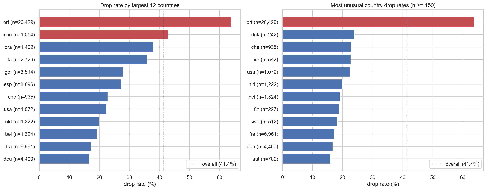
    


| ('Unnamed: 0_level_0', 'Origin_Country')   |   ('count', 'Unnamed: 1_level_1') |   ('drop_rate_pct', 'Unnamed: 2_level_1') |   ('lift_pp', 'Unnamed: 3_level_1') |
|:-------------------------------------------|----------------------------------:|------------------------------------------:|------------------------------------:|
| prt                                        |                             26429 |                                     63.78 |                               22.34 |
| fra                                        |                              6961 |                                     17.28 |                              -24.16 |
| deu                                        |                              4400 |                                     16.7  |                              -24.73 |
| esp                                        |                              3896 |                                     27.31 |                              -14.13 |
| gbr                                        |                              3514 |                                     27.8  |                              -13.64 |
| ita                                        |                              2726 |                                     35.88 |                               -5.56 |
| bra                                        |                              1402 |                                     38.02 |                               -3.42 |
| bel                                        |                              1324 |                                     19.18 |                              -22.25 |
| nld                                        |                              1222 |                                     19.97 |                              -21.47 |
| usa                                        |                              1072 |                                     22.39 |                              -19.05 |
| chn                                        |                              1054 |                                     42.79 |                                1.35 |
| che                                        |                               935 |                                     22.78 |                              -18.66 |


`Origin_Country` is a strong signal, and Portugal is the clearest case — common _and_
far above the base rate in both plots, so not a rare-country fluke. But country alone
isn't the whole story: a risky country can concentrate certain payment terms,
channels, or agents, so we read it as context, not cause.


```python
is_portugal = clean_train["Origin_Country"].eq("prt").fillna(False).to_numpy(dtype=bool)
country_group = np.where(is_portugal, "Portugal", "Other countries")

portugal_summary = (
    clean_train
    .assign(country_group=country_group)
    .groupby("country_group")[TARGET]
    .agg(count="size", drop_rate="mean")
    .assign(drop_rate_pct=lambda d: d["drop_rate"] * 100)
)

display(portugal_summary[["count", "drop_rate_pct"]].round(1))
```


| ('Unnamed: 0_level_0', 'country_group')   |   ('count', 'Unnamed: 1_level_1') |   ('drop_rate_pct', 'Unnamed: 2_level_1') |
|:------------------------------------------|----------------------------------:|------------------------------------------:|
| Other countries                           |                             37035 |                                      25.5 |
| Portugal                                  |                             26429 |                                      63.8 |


The split confirms the gap is real, not a plotting artifact. Next, the identifier
fields: `Agent_ID` and `Company_ID` are labels, not numbers, and may carry related
signal.


```python
fig, axes = plt.subplots(1, 2, figsize=(15, 6))
plot_dropout_by_category(clean_train, "Agent_ID", min_count=150, top_n=12, ax=axes[0])
company_presence = train_raw.groupby(train_raw["Company_ID"].notna())[TARGET].agg(
    count="size", drop_rate="mean"
)
company_presence.index = ["no company_id", "has company_id"]
axes[1].bar(
    company_presence.index,
    company_presence["drop_rate"] * 100,
    color=["#c44e52", "#55a868"],
)
axes[1].set_ylabel("drop rate (%)")
axes[1].set_title("Drop rate by Company_ID presence")
plt.tight_layout()
plt.show()
display(company_presence)
```


    
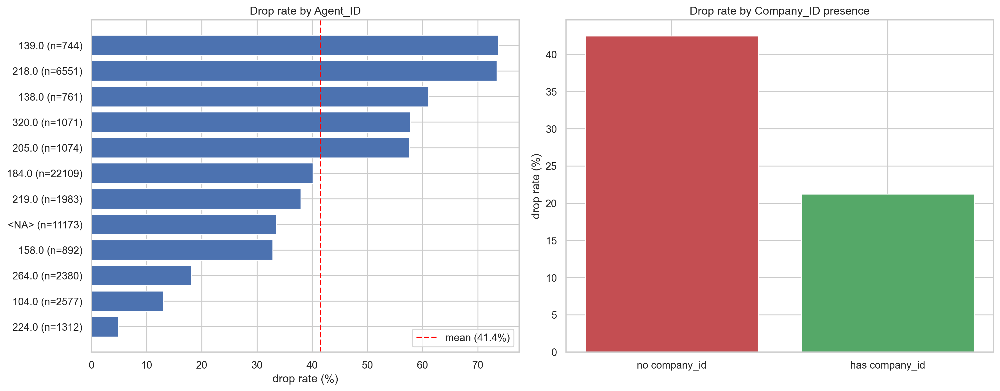
    


| Unnamed: 0     |   count |   drop_rate |
|:---------------|--------:|------------:|
| no company_id  |   60344 |    0.424848 |
| has company_id |    3120 |    0.212179 |


Both identifiers separate risk: frequent agents drop at very different rates, and
_having_ a `Company_ID` nearly halves risk (42.5% → 21.2%). But risky agents may just
be the ones assigned to risky countries — overlapping categorical signal, not numeric
multicollinearity — so we test it directly: how well does `Agent_ID` predict
`Origin_Country`?


```python
agent_country_pairs = clean_train[["Agent_ID", "Origin_Country"]].dropna()

country_tr, country_va = train_test_split(
    agent_country_pairs, test_size=0.25, random_state=SEED
)
majority_country = country_tr["Origin_Country"].mode().iat[0]
agent_country_map = country_tr.groupby("Agent_ID")["Origin_Country"].agg(
    lambda s: s.value_counts().idxmax()
)
agent_country_pred = (
    country_va["Agent_ID"].map(agent_country_map).fillna(majority_country)
)

display(
    pd.DataFrame({
        "check": ["majority country baseline", "agent modal country"],
        "accuracy": [
            country_va["Origin_Country"].eq(majority_country).mean(),
            agent_country_pred.eq(country_va["Origin_Country"]).mean(),
        ],
    }).round(3)
)
```


|   Unnamed: 0 | check                     |   accuracy |
|-------------:|:--------------------------|-----------:|
|            0 | majority country baseline |      0.391 |
|            1 | agent modal country       |      0.421 |


The modal-country check performs much better than the majority-country baseline, so agent and country contain overlapping information. The match is still not perfect, so neither field fully explains the other. We keep both signals, but encode them compactly later instead of one-hotting hundreds of levels.


## 3.5 Numeric features: summary, correlation, and suspects

For the numeric columns we tabulate central tendency, spread, skew, and correlation with the target, then look at the correlation structure between features.


```python
ID_LIKE = ["Client_ID", "Agent_ID", "Company_ID"]
num_cols = [
    c
    for c in train_raw.select_dtypes(include=["int64", "float64"]).columns
    if c not in ID_LIKE + [TARGET]
]


def numeric_summary(df, cols):
    rows = []
    for c in cols:
        s = df[c]
        rows.append({
            "column": c,
            "missing_%": round(s.isna().mean() * 100, 1),
            "corr_target": round(s.corr(df[TARGET]), 3),
            "mean": round(s.mean(), 2),
            "median": round(s.median(), 2),
            "std": round(s.std(), 2),
            "min": round(s.min(), 2),
            "max": round(s.max(), 2),
            "skew": round(s.skew(), 2),
        })
    return pd.DataFrame(rows).sort_values("corr_target", key=abs, ascending=False)


display(numeric_summary(train_raw, num_cols))
```


|   Unnamed: 0 | column                      |   missing_% |   corr_target |   mean |   median |    std |   min |   max |   skew |
|-------------:|:----------------------------|------------:|--------------:|-------:|---------:|-------:|------:|------:|-------:|
|            5 | Registration_Days_Before    |         4.2 |         0.351 | 102.89 |     65   | 109.18 |     0 |   629 |   1.5  |
|            8 | Pre_Course_Supports_Tickets |         0   |        -0.301 |   0.51 |      0   |   0.76 |     0 |     5 |   1.47 |
|            6 | Prev_Course_Dropouts        |         0   |         0.199 |   0.1  |      0   |   0.45 |     0 |    21 |  15.7  |
|           11 | Registration_Changes        |         0   |        -0.148 |   0.18 |      0   |   0.59 |     0 |    21 |   7.36 |
|            9 | Physical_Course_Kits        |         1.6 |        -0.138 |   0.03 |      0   |   0.16 |     0 |     3 |   6    |
|           10 | Waiting_List_Days           |         0   |         0.068 |   3.98 |      0   |  23.2  |     0 |   391 |   9.26 |
|           12 | Returning_Client            |         0   |        -0.059 |   0.03 |      0   |   0.16 |     0 |     1 |   5.82 |
|            0 | Professionals_Count         |         0   |         0.057 |   1.84 |      2   |   0.51 |     0 |     4 |  -0.47 |
|            7 | Prev_Course_Attended        |         0   |        -0.052 |   0.12 |      0   |   1.54 |     0 |    61 |  21.96 |
|            4 | Theory_Hours                |         0   |         0.045 |   2.16 |      2   |   1.47 |     0 |    41 |   3.35 |
|            2 | Observers_Count             |         0   |        -0.031 |   0.01 |      0   |   0.09 |     0 |    10 |  45.38 |
|           13 | Daily_Tuition_Cost          |         0.1 |        -0.024 |  98.85 |     94.5 |  41.86 |     0 |  5400 |  32.55 |
|            3 | Practical_Hours             |         0   |         0.005 |   6.61 |      1   | 215.5  |    -5 | 10000 |  40.45 |
|            1 | Students_Count              |         0   |         0     |   8.75 |      0   | 294.24 |     0 |  9999 |  33.92 |


The `max` column already exposes the corrupted values: `Students_Count` maxes at 9999 and `Practical_Hours` at 10000, with a negative minimum. We handle these in Section 4. First, the correlation picture.


```python
corr = train_raw[num_cols + [TARGET]].corr()
plt.figure(figsize=(13, 10))
sns.heatmap(
    corr, annot=True, fmt=".2f", annot_kws={"size": 8}, cmap="coolwarm", center=0
)
plt.title("Numeric correlation heatmap (incl. target)")
plt.tight_layout()
plt.show()
```


    

    


**Reading the heatmap.** No single raw numeric feature correlates strongly with the target. That is consistent with **non-linear / interaction-driven** signal, which we test later by comparing linear baselines with gradient-boosted trees. Inter-feature correlations are mild, so there is no severe multicollinearity forcing us to drop columns; the dimensionality problem lives in the _categoricals_, not here (Section 5.2).


## 3.6 Numeric drop-rate profiles

Binning a couple of the more predictive numeric features shows _how_ risk moves with them (not just whether they correlate linearly).


```python
def plot_dropout_by_bins(df, col, bins=8, ax=None):
    tmp = df[[col, TARGET]].dropna().copy()
    tmp["bin"] = pd.qcut(tmp[col], q=bins, duplicates="drop")
    stats = tmp.groupby("bin", observed=True)[TARGET].mean().mul(100)
    if ax is None:
        _, ax = plt.subplots(figsize=(9, 4))
    stats.plot.bar(ax=ax, color="#4c72b0")
    ax.axhline(df[TARGET].mean() * 100, ls="--", color="red", label="mean")
    ax.set_ylabel("drop rate (%)")
    ax.set_title(f"Drop rate by {col} bins")
    ax.legend()
    ax.tick_params(axis="x", labelrotation=45)
    return stats


fig, axes = plt.subplots(1, 2, figsize=(15, 4.5))
plot_dropout_by_bins(train_raw, "Registration_Days_Before", bins=8, ax=axes[0])
plot_dropout_by_bins(train_raw, "Pre_Course_Supports_Tickets", bins=6, ax=axes[1])
plt.tight_layout()
plt.show()
```


    
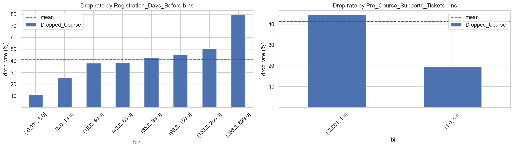
    


- **`Registration_Days_Before`**: the earlier a group registers relative to the
  course, the more likely it is to drop — plausibly because plans change over a
  longer horizon.
- **`Pre_Course_Supports_Tickets`**: more pre-course engagement is associated
  with _lower_ dropping — a group that is actively preparing is committed.


## 3.7 EDA synthesis — from numbers to a business story

Stepping back, the individual signals are not independent curiosities; most of them
collapse into a few coherent themes about _who cancels and why_.

**1. One latent driver: buyer commitment.** The most stable signals all proxy how
committed a group is at registration.

- _More committed → drops less:_ a known `Company_ID` (a vetted corporate buyer with
  procurement accountability), pre-course support tickets (a group already investing
  effort), high-touch acquisition (direct sales, organisational enrollment), and
  compliance-driven sectors such as fintech/banking where training is closer to
  mandatory.
- _Less committed → drops more:_ registrations with no company attached, low-friction
  reseller/platform channels, and large multinational buyers whose bureaucracies
  reprioritise and cut training budgets more readily.

This is exactly why _missingness itself_ is predictive — a missing `Company_ID` is a
commitment signal, not merely a gap to impute.

**2. `Payment_Terms` looks endogenous.** Prepaid, non-refundable orders drop _more_,
not less — the opposite of the naive "money is locked in" intuition. The most
plausible reading is selection: the company likely demands prepayment precisely from
deals it already judges risky, so the variable is a _symptom_ of risk rather than a
cause. We keep its strong predictive power but flag it for an explicit leakage
plausibility check (Section 9).

**3. Geography is a proxy, not a cause.** Portugal's 63.8% drop rate is real but
confounded — `Agent_ID` predicts country well above chance, so "risky country" and
"risky agent/channel" are entangled. We therefore treat country as _context_ and
encode high-cardinality identity compactly (Section 5.2) instead of trusting the raw
geographic label.

**4. The environment is non-stationary.** The drop rate drifts year to year and the
test window is strictly the future, so we are modelling a moving target, not a fixed
law — which is what forces chronological validation (Section 6) and earns the time
index its place as a feature (Section 5).

**Modelling implication.** No single feature dominates linearly; the signal lives in
the _interactions_ between commitment, channel, and timing — which is the case for
gradient-boosted trees over a linear baseline (Section 7).


# 4. Missing-value handling & outlier analysis

Guided by the EDA, we now fix the corrupted values and decide the imputation policy. Both are applied _inside_ the feature builder (Section 5) so train and test are transformed identically.


## 4.1 Outliers: identify, justify, cap

We look for values that are physically impossible or absurdly far from the bulk.


```python
def sus_report(df, cols, max_mult=10):
    out = []
    for c in cols:
        s = df[c].dropna()
        q99 = s.quantile(0.99)
        iqr = s.quantile(0.75) - s.quantile(0.25)
        scale = max(q99, iqr, 1.0)
        why = []
        if s.min() < 0:
            why.append("negative values")
        if s.max() > max_mult * scale:
            why.append(f"max={s.max():g} >> q99={q99:g}")
        if why:
            out.append({
                "column": c,
                "min": s.min(),
                "max": s.max(),
                "q99": round(q99, 1),
                "why": "; ".join(why),
            })
    return pd.DataFrame(out)


print("Suspect columns — TRAIN")
display(sus_report(train_raw, num_cols))
print("Suspect columns — TEST")
display(sus_report(test_raw, num_cols))
```

    Suspect columns — TRAIN


|   Unnamed: 0 | column               |   min |   max |   q99 | why                                 |
|-------------:|:---------------------|------:|------:|------:|:------------------------------------|
|            0 | Students_Count       |     0 |  9999 |   2   | max=9999 >> q99=2                   |
|            1 | Practical_Hours      |    -5 | 10000 |   3   | negative values; max=10000 >> q99=3 |
|            2 | Prev_Course_Dropouts |     0 |    21 |   1   | max=21 >> q99=1                     |
|            3 | Prev_Course_Attended |     0 |    61 |   3   | max=61 >> q99=3                     |
|            4 | Registration_Changes |     0 |    21 |   2   | max=21 >> q99=2                     |
|            5 | Daily_Tuition_Cost   |     0 |  5400 | 209.7 | max=5400 >> q99=209.7               |


    Suspect columns — TEST


|   Unnamed: 0 | column               |   min |   max |   q99 | why                                 |
|-------------:|:---------------------|------:|------:|------:|:------------------------------------|
|            0 | Students_Count       |     0 |  9999 |     2 | max=9999 >> q99=2                   |
|            1 | Practical_Hours      |    -5 | 10000 |     2 | negative values; max=10000 >> q99=2 |
|            2 | Prev_Course_Attended |     0 |    72 |     3 | max=72 >> q99=3                     |
|            3 | Waiting_List_Days    |     0 |   183 |     0 | max=183 >> q99=0                    |


The test set introduces **no new kinds** of corruption, so caps learned from domain reasoning on train transfer safely. We also inspect the relationship between two historical counters:


```python
impossible = train_raw[
    train_raw["Prev_Course_Dropouts"] > train_raw["Prev_Course_Attended"]
]
print(f"rows where historical dropouts exceed historical attended: {len(impossible)}")
```

    rows where historical dropouts exceed historical attended: 4985


**Decisions and justification.**
We **clip (winsorize) rather than drop rows** for fields with clear placeholder or physically impossible values: the _other_ fields in those rows are still valid and informative, and clipping keeps train and test aligned.

The 4,985 rows where historical dropouts exceed historical attended require a different interpretation. Section 5 uses these columns to build `prev_drop_rate`, so this check means we should not present that engineered value as a literal probability. Instead, we treat it as a smoothed **dropout-intensity** signal: high values indicate heavier prior dropout history relative to prior attendance, but values above 1 can occur if the two counters describe different historical windows or independent aggregates.

For that reason, we keep both raw counters and the ratio-like signal, but we do **not** force the ratio into `[0, 1]` and do **not** drop the affected rows. Other flagged count columns (`Prev_Course_Dropouts`, `Prev_Course_Attended`, `Registration_Changes`, and test-side `Waiting_List_Days`) are heavy-tailed but plausible, so we leave them uncapped unless a concrete domain rule gives a cap. The table quantifies the clipped rows; the figure shows the distribution before and after each cap.


```python
CAP_RULES = {
    "Students_Count": {
        "lower": None,
        "upper": 10,
        "problem": "9999 placeholder",
        "reason": "course groups are single-/low-double-digit",
    },
    "Practical_Hours": {
        "lower": 0,
        "upper": 12,
        "problem": "negative values and 10000",
        "reason": "course hours cannot be negative or five-digit",
    },
    "Daily_Tuition_Cost": {
        "lower": None,
        "upper": 600,
        "problem": "5400 value",
        "reason": "about 30x the typical daily rate",
    },
}


def apply_cap(s, lower=None, upper=None):
    if lower is not None:
        s = s.clip(lower=lower)
    if upper is not None:
        s = s.clip(upper=upper)
    return s


cap_rows = []
for col, rule in CAP_RULES.items():
    lo, hi = rule["lower"], rule["upper"]
    train_changed = (
        train_raw[col].notna() & apply_cap(train_raw[col], lo, hi).ne(train_raw[col])
    ).sum()
    test_changed = (
        test_raw[col].notna() & apply_cap(test_raw[col], lo, hi).ne(test_raw[col])
    ).sum()
    action = f"clip to [{lo}, {hi}]" if lo is not None else f"clip to <= {hi}"
    cap_rows.append({
        "column": col,
        "raw_train_min": train_raw[col].min(),
        "raw_train_max": train_raw[col].max(),
        "problem": rule["problem"],
        "action": action,
        "train_rows_affected": int(train_changed),
        "test_rows_affected": int(test_changed),
        "reason": rule["reason"],
    })

display(pd.DataFrame(cap_rows))

fig, axes = plt.subplots(2, 3, figsize=(14, 6), sharey="row")
for j, (col, rule) in enumerate(CAP_RULES.items()):
    before = train_raw[col].dropna()
    after = apply_cap(train_raw[col], rule["lower"], rule["upper"]).dropna()

    axes[0, j].hist(before, bins=50, color="#c44e52")
    axes[0, j].set_yscale("log")
    axes[0, j].set_title(f"{col}: raw")
    axes[0, j].set_xlabel(f"max={before.max():g}")

    axes[1, j].hist(after, bins=30, color="#55a868")
    axes[1, j].set_yscale("log")
    axes[1, j].set_title(f"{col}: clipped")
    axes[1, j].set_xlabel(f"max={after.max():g}")

axes[0, 0].set_ylabel("count (log)")
axes[1, 0].set_ylabel("count (log)")
plt.tight_layout()
plt.show()
```


|   Unnamed: 0 | column             |   raw_train_min |   raw_train_max | problem                   | action          |   train_rows_affected |   test_rows_affected | reason                                        |
|-------------:|:-------------------|----------------:|----------------:|:--------------------------|:----------------|----------------------:|---------------------:|:----------------------------------------------|
|            0 | Students_Count     |               0 |            9999 | 9999 placeholder          | clip to <= 10   |                    55 |                   12 | course groups are single-/low-double-digit    |
|            1 | Practical_Hours    |              -5 |           10000 | negative values and 10000 | clip to [0, 12] |                   121 |                   23 | course hours cannot be negative or five-digit |
|            2 | Daily_Tuition_Cost |               0 |            5400 | 5400 value                | clip to <= 600  |                     1 |                    0 | about 30x the typical daily rate              |


    
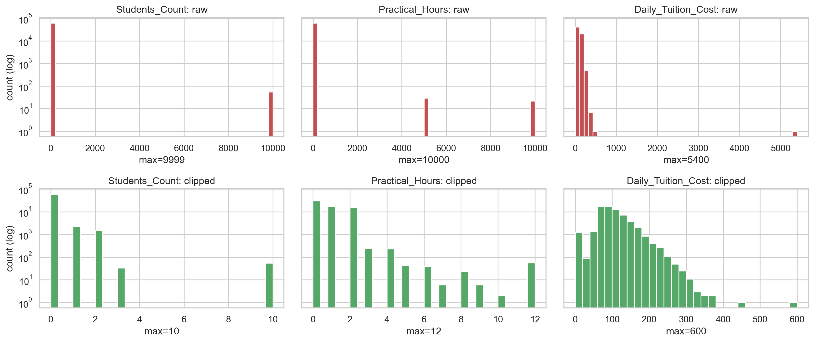
    


## 4.2 Missing-value policy

Different column types get different treatment, each justified:

- **Categoricals** → keep an explicit `"missing"` level. For tree models,
  "missing" is just another category the model can split on; the EDA showed
  missingness is itself predictive, so we must not erase it.
- **High-cardinality IDs** (`Agent_ID`, `Company_ID`) → represented via
  **presence flags** and **frequency encoding** (Section 5.2), not imputed.
- **Numerics** → the gradient-boosting libraries we use (LightGBM, XGBoost,
  CatBoost) handle `NaN` natively by learning a default split direction, which
  is strictly more informative than median-filling. We therefore **pass numeric
  NaNs through** to the models rather than imputing them, and only compute
  fill-values inside engineered _ratios_ to avoid divide-by-zero.

This is a deliberate change from the first modeling attempt, which median-imputed everything for a one-hot + linear/tree pipeline. With native-NaN boosters, imputation throws away the "was it missing?" signal for no benefit.


# 5. Feature engineering & dimensionality

Every feature below is justified by the EDA or by domain logic. This notebook mirrors the selected feature transform implemented in `pipelines/pipeline_v2.py`.


## 5.1 The engineered features and their rationale

Each engineered feature either preserves useful raw information in a more model-friendly form, or compresses a noisy/high-cardinality signal without using the target label.

| Raw signal                | Engineered feature(s)                                        | Why it helps                                                                                                                                 |
| ------------------------- | ------------------------------------------------------------ | -------------------------------------------------------------------------------------------------------------------------------------------- |
| `Course_Start_Date`       | `start_month`, `start_dow`, `start_week`, `days_since_epoch` | Keeps seasonality and the time trend visible in the future test window.                                                                      |
| Participant counts        | `total_participants`, `prof_share`                           | Converts raw counts into comparable group composition.                                                                                       |
| Practical/theory hours    | `total_hours`, `practical_share`                             | Represents course intensity and hands-on share directly.                                                                                     |
| Client history            | `prev_drop_rate = dropouts / (attended + 1)`                 | Adds a smoothed dropout-intensity signal; not treated as a bounded probability because the historical counters are not perfectly consistent. |
| Tuition cost + hours      | `cost_x_days`                                                | Approximates the contract value at risk.                                                                                                     |
| Requested vs assigned lab | `got_requested_lab`                                          | Captures whether the requested setup was honored.                                                                                            |
| Missing company/agent IDs | `has_company_id`, `has_agent_id`                             | Preserves missingness signals seen in Section 3.2.                                                                                           |
| Agent/company/country IDs | frequency encodings + native categoricals                    | Keeps identity/frequency signal without one-hot explosion.                                                                                   |


## 5.2 Dimensionality

The curse of dimensionality here comes from the **identifiers**, not the numerics.
`Agent_ID` alone has 204 distinct levels and `Origin_Country` 154, so naive one-hot
encoding would turn each into hundreds of sparse binary columns.

**What "native categorical" means.** We keep these columns in pandas' `category`
dtype: a list of levels plus one integer _code_ per row (`["blue","red","blue"]` →
codes `[0,1,0]`), like an R `factor`. This is a storage format, not an encoding — the
leverage is in how the boosters read it. A gradient-boosted tree treats the codes as
**unordered labels** and, at each split, partitions the _set_ of levels into two
groups (`level ∈ {A, C, F}?`) in a single node — expressing what one-hot needs many
stacked one-vs-rest splits to approximate, and without ever materialising the extra
columns. (LightGBM finds this partition with the Fisher (1958) sorted-gradient
heuristic; XGBoost does a similar subset split, and CatBoost uses ordered target
statistics.)


```python
def make_freq_maps(*dfs):
    """Label-free frequency of each ID value across the supplied frames."""
    combined = pd.concat([normalize_cats(d) for d in dfs], ignore_index=True)
    return {
        col: combined[col].value_counts(normalize=True)
        for col in ("Agent_ID", "Company_ID", "Origin_Country")
    }


freq_maps = make_freq_maps(train_raw, test_raw)


def build_features(
    df: pd.DataFrame, freq_maps: dict, add_time: bool = True
) -> pd.DataFrame:
    """Cleaning + feature engineering. Identical transform for train and test.

    Mirrors the selected ``pipelines/pipeline_v2.build_features`` transform."""
    df = normalize_cats(df)
    out = pd.DataFrame(index=df.index)

    # numeric passthrough with sanity caps (Section 4)
    out["Professionals_Count"] = df["Professionals_Count"]
    out["Students_Count"] = df["Students_Count"].clip(upper=10)
    out["Observers_Count"] = df["Observers_Count"]
    out["Practical_Hours"] = df["Practical_Hours"].clip(0, 12)
    out["Theory_Hours"] = df["Theory_Hours"]
    out["Registration_Days_Before"] = df["Registration_Days_Before"]
    out["Prev_Course_Dropouts"] = df["Prev_Course_Dropouts"]
    out["Prev_Course_Attended"] = df["Prev_Course_Attended"]
    out["Pre_Course_Supports_Tickets"] = df["Pre_Course_Supports_Tickets"]
    out["Physical_Course_Kits"] = df["Physical_Course_Kits"]
    out["Waiting_List_Days"] = df["Waiting_List_Days"]
    out["Registration_Changes"] = df["Registration_Changes"]
    out["Returning_Client"] = df["Returning_Client"]
    out["Daily_Tuition_Cost"] = df["Daily_Tuition_Cost"].clip(upper=600)

    # date: seasonality + linear time index (validated in Section 6.2)
    d = df["Course_Start_Date"]
    out["start_month"] = d.dt.month
    out["start_dow"] = d.dt.dayofweek
    out["start_week"] = d.dt.isocalendar().week.astype(float)
    if add_time:
        out["days_since_epoch"] = (d - pd.Timestamp("2015-01-01")).dt.days

    # group composition & ratios
    total = (
        df["Professionals_Count"].fillna(0)
        + df["Students_Count"].clip(upper=10).fillna(0)
        + df["Observers_Count"].fillna(0)
    )
    out["total_participants"] = total
    out["prof_share"] = df["Professionals_Count"] / total.replace(0, np.nan)
    out["total_hours"] = df["Practical_Hours"].clip(0, 12) + df["Theory_Hours"]
    out["practical_share"] = df["Practical_Hours"].clip(0, 12) / out[
        "total_hours"
    ].replace(0, np.nan)
    out["cost_x_days"] = df["Daily_Tuition_Cost"].clip(upper=600) * out["total_hours"]
    out["prev_drop_rate"] = df["Prev_Course_Dropouts"] / (
        df["Prev_Course_Attended"] + 1
    )
    out["kits_per_participant"] = df["Physical_Course_Kits"] / total.replace(0, np.nan)
    out["tickets_per_participant"] = df["Pre_Course_Supports_Tickets"] / total.replace(
        0, np.nan
    )

    # lab config: only "was the request honoured?" matters
    out["got_requested_lab"] = (
        df["Requested_Lab_Config"] == df["Assigned_Lab_Config"]
    ).astype(float)

    # predictive missingness of the IDs
    out["has_company_id"] = df["Company_ID"].notna().astype(int)
    out["has_agent_id"] = df["Agent_ID"].notna().astype(int)

    # frequency encodings for high-cardinality IDs (compact, label-free)
    for col in ("Agent_ID", "Company_ID", "Origin_Country"):
        out[f"{col}_freq"] = df[col].map(freq_maps[col]).fillna(0).astype(float)

    # native categoricals for the boosters (no one-hot expansion).
    # Note: Company_ID (highest cardinality) is intentionally NOT kept raw —
    # only its frequency + presence flag survive.
    for col in (
        "Origin_Country",
        "Catering_Package",
        "Welcome_Gift_Type",
        "Requested_Lab_Config",
        "Enrollment_Type",
        "Lanyard_Color",
        "Client_Category",
        "Submission_Source",
        "Payment_Terms",
        "Agent_ID",
    ):
        out[col] = df[col].fillna("missing").astype("category")
    return out


def align_categories(train_X, *others):
    """Give every frame identical category levels so the boosters agree."""
    for col in train_X.select_dtypes("category").columns:
        cats = train_X[col].cat.categories
        for o in others:
            cats = cats.union(o[col].cat.categories)
        train_X[col] = train_X[col].cat.set_categories(cats)
        for o in others:
            o[col] = o[col].cat.set_categories(cats)


# Dimensionality comparison: native categorical vs a naive one-hot expansion.
X_all = build_features(train_raw, freq_maps)
cat_cols = X_all.select_dtypes("category").columns
native_dim = X_all.shape[1]
onehot_dim = X_all.drop(columns=cat_cols).shape[1] + sum(
    X_all[c].nunique(dropna=False) for c in cat_cols
)
print(f"features with native categorical handling : {native_dim}")
print(f"estimated dims after naive one-hot        : {onehot_dim}")
print(f"dummy columns avoided                     : {onehot_dim - native_dim}")
print("\ncategory cardinalities:")
display(X_all[cat_cols].nunique(dropna=False).sort_values(ascending=False))
```

    features with native categorical handling : 42
    estimated dims after naive one-hot        : 435
    dummy columns avoided                     : 393
    
    category cardinalities:


    Agent_ID                204
    Origin_Country          154
    Requested_Lab_Config      9
    Client_Category           8
    Catering_Package          5
    Enrollment_Type           5
    Lanyard_Color             5
    Submission_Source         5
    Welcome_Gift_Type         4
    Payment_Terms             4
    dtype: int64


**Our dimensionality strategy** combines three levers, each doing a different job:

1. **Native `category` dtype** — the boosters split on level subsets directly, so the
   feature matrix stays at 42 columns instead of ~435 (**393 dummy columns avoided**,
   almost all from `Agent_ID` and `Origin_Country`).
2. **Frequency encoding** per ID (how common each value is) — one numeric column
   that, unlike the dtype trick, works for _every_ model family.
3. **Dropping raw `Company_ID`** (highest cardinality) — keeping only its frequency
   and presence flag.

**An honest caveat.** Lever 1 is _tree-specific_: linear and MLP models cannot consume
an unordered category, so the baseline path (`encode_for_continuous_models`, Section
7.1) still one-hots them behind a `min_count` collapse. And a low column count is not
the whole battle — 204 sparse agent levels can still overfit — which is why levers 2–3
and the boosters' regularisation matter alongside it. Together they answer the curse of
dimensionality without discarding rare-ID identity the way the first attempt's hard
top-$k$ collapse did.


# 6. Validation methodology

Everything in modelling hinges on measuring performance the _right_ way.


## 6.1 Adversarial validation — quantifying the drift

We train a classifier to tell **test rows from train rows** using the features (label removed, raw date and `Client_ID` dropped). If it separates them well above AUC 0.5, the feature distributions have genuinely drifted.


```python
def adversarial_validation():
    tr = load_raw(TRAIN_PATH).drop(columns=[TARGET])
    te = load_raw(TEST_PATH)
    combined = pd.concat(
        [tr.assign(is_test=0), te.assign(is_test=1)], ignore_index=True
    )
    y = combined.pop("is_test")
    X = combined.drop(columns=["Client_ID", "Course_Start_Date"], errors="ignore")
    for c in X.select_dtypes(include=["object", "string"]).columns:
        X[c] = X[c].astype("string").str.strip().str.lower().fillna("missing")
        X[c] = X[c].astype("category").cat.codes
    X = X.fillna(-1)

    Xtr, Xva, ytr, yva = train_test_split(
        X, y, test_size=0.25, random_state=SEED, stratify=y
    )
    m = XGBClassifier(
        n_estimators=300,
        max_depth=4,
        learning_rate=0.05,
        subsample=0.9,
        colsample_bytree=0.9,
        eval_metric="logloss",
        random_state=SEED,
        n_jobs=-1,
    )
    m.fit(Xtr, ytr)
    a = roc_auc_score(yva, m.predict_proba(Xva)[:, 1])
    print(
        f"adversarial AUC (train vs test): {a:.3f}  (0.5=identical, 1.0=trivially separable)"
    )
    top = (
        pd
        .Series(m.feature_importances_, index=X.columns)
        .sort_values(ascending=False)
        .head(8)
    )
    print("\ntop drift drivers:")
    print(top)


adversarial_validation()
```

    adversarial AUC (train vs test): 0.935  (0.5=identical, 1.0=trivially separable)
    
    top drift drivers:
    Daily_Tuition_Cost          0.125937
    Prev_Course_Dropouts        0.085177
    Registration_Days_Before    0.076319
    Waiting_List_Days           0.074023
    Catering_Package            0.065934
    Assigned_Lab_Config         0.064619
    Client_Category             0.053575
    Enrollment_Type             0.052758
    dtype: float32


The classifier separates test from train **comfortably above chance**, driven by the ID / frequency-style columns — the client population shifts over time. Confirmed: **do not trust a random split.**

## 6.2 The chronological holdout

We select every model and feature on a **chronological holdout**: fit on rows before `2017-01-01`, validate on the 2017 rows (~4 months, matching the real test window). This mirrors the leaderboard's "train on the past, score the future" setup, so improvements here should move in the same direction as the real score.


```python
cutoff = pd.Timestamp(CHRONO_CUTOFF)
tr_raw = train_raw[train_raw["Course_Start_Date"] < cutoff]
va_raw = train_raw[train_raw["Course_Start_Date"] >= cutoff]
y_tr = tr_raw[TARGET].values
y_va = va_raw[TARGET].values
print(
    f"chrono split -> fit={len(tr_raw):,}  validate={len(va_raw):,}  "
    f"(val drop rate={va_raw[TARGET].mean():.3f})"
)

# feature matrices reused across all experiments below. For chronological
# validation, frequency maps are fit only on the past training window. The
# train+test map above is reserved for submission-time label-free transductive scoring.
freq_maps_chrono = make_freq_maps(tr_raw)
Xtr_t = build_features(tr_raw, freq_maps_chrono, add_time=True)
Xva_t = build_features(va_raw, freq_maps_chrono, add_time=True)
align_categories(Xtr_t, Xva_t)
Xtr_n = build_features(tr_raw, freq_maps_chrono, add_time=False)
Xva_n = build_features(va_raw, freq_maps_chrono, add_time=False)
align_categories(Xtr_n, Xva_n)
```

    chrono split -> fit=51,822  validate=11,642  (val drop rate=0.420)


# 7. Model experiments & tuning

We follow the assignment's requirement of **at least three models from different families**, each with a short description and its hyper-parameters, and tune on the chronological holdout.


## 7.1 The model families

The assignment asks for at least three models from different families. We take one from
each natural tier of capacity, tune each (7.2), and compare them head-to-head (7.3);
only after a winner emerges do we try to improve it (7.4).

- **Logistic Regression** — the linear baseline. Fast and interpretable, but limited
  to linear boundaries in the encoded space, so it is expected to lag on this
  interaction-heavy data. Key hyper-parameter: inverse-regularisation `C`.
- **MLP neural network** — a dense non-linear baseline. Flexible, but needs explicit
  encoding, imputation, scaling, and an L2 penalty to control variance. Key
  hyper-parameters: hidden-layer size, `alpha`, learning rate.
- **Gradient-boosted trees (XGBoost)** — our tree model. Trees are built _sequentially_,
  each correcting the residual of the last; state of the art for tabular data, with
  native categorical/missing handling. We start with **XGBoost** (assignment-recommended)
  as the tree here and — once trees win the comparison — improve it in 7.4 with two more
  boosters. Key hyper-parameters: number of trees, `learning_rate`, tree size
  (`max_depth` / `num_leaves`), and regularisation (`reg_lambda`, `min_child_*`).


```python
def get_lgbm(**kw):
    p = dict(
        n_estimators=700,
        learning_rate=0.03,
        num_leaves=63,
        min_child_samples=40,
        subsample=0.9,
        subsample_freq=1,
        colsample_bytree=0.8,
        reg_lambda=1.0,
        random_state=SEED,
        n_jobs=-1,
        verbosity=-1,
    )
    p.update(kw)
    return LGBMClassifier(**p)


def get_xgb(**kw):
    p = dict(
        n_estimators=700,
        learning_rate=0.03,
        max_depth=6,
        min_child_weight=5,
        subsample=0.9,
        colsample_bytree=0.8,
        reg_lambda=1.0,
        enable_categorical=True,
        tree_method="hist",
        eval_metric="auc",
        random_state=SEED,
        n_jobs=-1,
    )
    p.update(kw)
    return XGBClassifier(**p)


def get_cat(**kw):
    p = dict(
        iterations=1200,
        learning_rate=0.05,
        depth=6,
        l2_leaf_reg=3.0,
        random_seed=SEED,
        verbose=False,
        eval_metric="AUC",
    )
    p.update(kw)
    return CatBoostClassifier(**p)


def fit_predict_pair(name, X_tr, y_tr, X_va, sample_weight=None, **model_params):
    """Fit one booster and return P(drop) on train and validation."""
    if name == "cat":
        cat_idx = [
            i for i, c in enumerate(X_tr.columns) if str(X_tr[c].dtype) == "category"
        ]
        X_tr2, X_va2 = X_tr.copy(), X_va.copy()
        for c in X_tr2.columns[cat_idx]:
            X_tr2[c] = X_tr2[c].astype(str)
            X_va2[c] = X_va2[c].astype(str)
        m = get_cat(cat_features=cat_idx, **model_params)
        m.fit(X_tr2, y_tr, sample_weight=sample_weight)
        return m.predict_proba(X_tr2)[:, 1], m.predict_proba(X_va2)[:, 1]
    if name == "lgbm":
        m = get_lgbm(**model_params)
        m.fit(
            X_tr,
            y_tr,
            sample_weight=sample_weight,
            categorical_feature=X_tr.select_dtypes("category").columns.tolist(),
        )
        return m.predict_proba(X_tr)[:, 1], m.predict_proba(X_va)[:, 1]
    m = get_xgb(**model_params)
    m.fit(X_tr, y_tr, sample_weight=sample_weight)
    return m.predict_proba(X_tr)[:, 1], m.predict_proba(X_va)[:, 1]


def fit_predict(name, X_tr, y_tr, X_va, sample_weight=None):
    """Fit one booster ('lgbm'|'xgb'|'cat') and return P(drop) on X_va."""
    _, pred_va = fit_predict_pair(name, X_tr, y_tr, X_va, sample_weight)
    return pred_va


def rank_avg(preds):
    """Average of per-model rank-percentiles: preserves AUC ordering while
    ignoring calibration differences between models."""
    return np.mean([rankdata(p) / len(p) for p in preds], axis=0)


def encode_for_continuous_models(X_tr: pd.DataFrame, X_va: pd.DataFrame, min_count=30):
    """Bounded one-hot + median imputation for the LR/MLP baselines."""
    Xt, Xv = X_tr.copy(), X_va.copy()
    # for df in [Xt, Xv]:
    #     df.drop(columns=["days_since_epoch"], inplace=True)
    cat_cols = list(Xt.select_dtypes("category").columns)

    # collapse rare levels to "other" so the linear/MLP feature space stays bounded
    for c in cat_cols:
        train_s = Xt[c].astype("string").fillna("missing")
        keep = train_s.value_counts()[lambda s: s >= min_count].index
        Xt[c] = train_s.where(train_s.isin(keep), "other")
        Xv[c] = (
            Xv[c]
            .astype("string")
            .fillna("missing")
            .where(lambda s: s.isin(keep), "other")
        )

    num_cols = [c for c in Xt.columns if c not in cat_cols]
    medians = Xt[num_cols].median()
    Xt_num = Xt[num_cols].fillna(medians).reset_index(drop=True)
    Xv_num = Xv[num_cols].fillna(medians).reset_index(drop=True)

    ohe = OneHotEncoder(handle_unknown="ignore", sparse_output=False, dtype=float)
    Xt_cat = ohe.fit_transform(Xt[cat_cols])
    Xv_cat = ohe.transform(Xv[cat_cols])
    names = ohe.get_feature_names_out(cat_cols)

    Xt_out = pd.concat([Xt_num, pd.DataFrame(Xt_cat, columns=names)], axis=1)
    Xv_out = pd.concat([Xv_num, pd.DataFrame(Xv_cat, columns=names)], axis=1)
    return Xt_out, Xv_out
```

## 7.2 Hyper-parameter tuning: reading the bias–variance trade-off

For each family we sweep a single capacity / regularisation axis and read the classic
signature: as capacity grows, **training** loss keeps falling while **validation** loss
bottoms out and the gap between them widens (variance). We visualise this with
**log-loss**, not AUC — the bias–variance decomposition is defined for a pointwise
loss, whereas AUC is a rank statistic that can stay flat while the probabilities
overfit. We then **select** on validation **AUC**, the project metric (the star marks
each final operating point).

For the tree model we tune **XGBoost** (the assignment-recommended booster) on its
`max_depth` axis, at a fixed budget with no early stopping so deep trees are free to
overfit and expose the variance regime. LightGBM and CatBoost enter later (7.4), once
trees have won the family comparison.


```python
Xtr_enc, Xva_enc = encode_for_continuous_models(Xtr_t, Xva_t)
scaler = StandardScaler()
Xtr_scaled = scaler.fit_transform(Xtr_enc)
Xva_scaled = scaler.transform(Xva_enc)


def loss_auc(p_tr, p_va):
    """Train/validation log-loss (bias-variance view) + validation AUC (selection)."""
    return {
        "train_logloss": log_loss(y_tr, p_tr),
        "val_logloss": log_loss(y_va, p_va),
        "val_AUC": roc_auc_score(y_va, p_va),
    }


tuning_rows = []

# Linear baseline: inverse-regularisation C (higher C -> less regularisation).
for C in (0.001, 0.01, 0.1, 1.0, 10.0, 100.0):
    m = LogisticRegression(C=C, max_iter=2000).fit(Xtr_scaled, y_tr)
    tuning_rows.append({
        "family": "Logistic Regression",
        "axis": "C  (less regularisation →)",
        "x": C,
        **loss_auc(
            m.predict_proba(Xtr_scaled)[:, 1], m.predict_proba(Xva_scaled)[:, 1]
        ),
    })

# Neural net: L2 penalty alpha; plot 1/alpha so "more capacity" points right.
for alpha in (1.0, 0.1, 0.01, 0.001, 0.0001):
    m = MLPClassifier(
        hidden_layer_sizes=(64, 32),
        alpha=alpha,
        learning_rate_init=0.001,
        max_iter=150,
        early_stopping=True,
        n_iter_no_change=10,
        random_state=SEED,
    ).fit(Xtr_scaled, y_tr)
    tuning_rows.append({
        "family": "MLP neural network",
        "axis": "1 / alpha  (less regularisation →)",
        "x": 1.0 / alpha,
        **loss_auc(
            m.predict_proba(Xtr_scaled)[:, 1], m.predict_proba(Xva_scaled)[:, 1]
        ),
    })

# Gradient-boosted trees (representative: XGBoost). Capacity axis = max_depth,
# fixed budget, no early stopping so deep trees can overfit.
for depth in (2, 3, 4, 5, 6, 8, 10):
    p_tr, p_va = fit_predict_pair(
        "xgb",
        Xtr_t,
        y_tr,
        Xva_t,
        n_estimators=300,
        learning_rate=0.05,
        max_depth=depth,
        min_child_weight=5,
        reg_lambda=1.0,
    )
    tuning_rows.append({
        "family": "Gradient-boosted trees (XGBoost)",
        "axis": "max_depth  (more capacity →)",
        "x": depth,
        **loss_auc(p_tr, p_va),
    })

tuning = pd.DataFrame(tuning_rows)

# star = the operating point we carry into the final models: near-top validation AUC
# with controlled variance (the best bias-variance compromise, not blind argmax).
selected_x = {
    "Logistic Regression": 1.0,  # C = 1.0
    "MLP neural network": 1000.0,  # alpha = 1e-3
    "Gradient-boosted trees (XGBoost)": 6,  # max_depth = 6
}
tuning["selected"] = tuning.apply(
    lambda r: bool(np.isclose(r["x"], selected_x[r["family"]])), axis=1
)

fig, axes = plt.subplots(1, 3, figsize=(17, 4.6))
for ax, family in zip(axes, selected_x):
    d = tuning[tuning["family"] == family].sort_values("x")
    ax.plot(d["x"], d["train_logloss"], marker="o", label="train log-loss")
    ax.plot(d["x"], d["val_logloss"], marker="o", label="validation log-loss")
    star = d[d["selected"]].iloc[0]
    ax.scatter(
        star["x"],
        star["val_logloss"],
        marker="*",
        s=220,
        color="black",
        zorder=5,
        label="selected",
    )
    ax.set_title(family)
    ax.set_xlabel(d["axis"].iloc[0])
    ax.set_ylabel("log-loss" if ax is axes[0] else "")
    if family != "Gradient-boosted trees (XGBoost)":
        ax.set_xscale("log")
    ax.legend(fontsize=8)
fig.suptitle(
    "Bias–variance: training vs validation log-loss  (star = selected operating point)"
)
plt.tight_layout()
plt.show()

display(
    tuning.assign(
        train_logloss=lambda d: d["train_logloss"].round(4),
        val_logloss=lambda d: d["val_logloss"].round(4),
        val_AUC=lambda d: d["val_AUC"].round(4),
    )[["family", "x", "train_logloss", "val_logloss", "val_AUC", "selected"]]
)
```


    
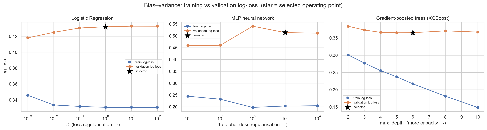
    


|   Unnamed: 0 | family                           |         x |   train_logloss |   val_logloss |   val_AUC | selected   |
|-------------:|:---------------------------------|----------:|----------------:|--------------:|----------:|:-----------|
|            0 | Logistic Regression              |     0.001 |          0.3458 |        0.418  |    0.8805 | False      |
|            1 | Logistic Regression              |     0.01  |          0.3336 |        0.4248 |    0.879  | False      |
|            2 | Logistic Regression              |     0.1   |          0.3318 |        0.4303 |    0.8776 | False      |
|            3 | Logistic Regression              |     1     |          0.3306 |        0.4318 |    0.8773 | True       |
|            4 | Logistic Regression              |    10     |          0.3305 |        0.4326 |    0.8772 | False      |
|            5 | Logistic Regression              |   100     |          0.3305 |        0.4325 |    0.8773 | False      |
|            6 | MLP neural network               |     1     |          0.2447 |        0.4592 |    0.869  | False      |
|            7 | MLP neural network               |    10     |          0.2321 |        0.46   |    0.8762 | False      |
|            8 | MLP neural network               |   100     |          0.1973 |        0.5408 |    0.8668 | False      |
|            9 | MLP neural network               |  1000     |          0.2034 |        0.5139 |    0.8702 | True       |
|           10 | MLP neural network               | 10000     |          0.2044 |        0.5113 |    0.8696 | False      |
|           11 | Gradient-boosted trees (XGBoost) |     2     |          0.3008 |        0.3841 |    0.9003 | False      |
|           12 | Gradient-boosted trees (XGBoost) |     3     |          0.2773 |        0.3731 |    0.9058 | False      |
|           13 | Gradient-boosted trees (XGBoost) |     4     |          0.2555 |        0.3663 |    0.9109 | False      |
|           14 | Gradient-boosted trees (XGBoost) |     5     |          0.2373 |        0.3651 |    0.9124 | False      |
|           15 | Gradient-boosted trees (XGBoost) |     6     |          0.217  |        0.3653 |    0.9135 | True       |
|           16 | Gradient-boosted trees (XGBoost) |     8     |          0.1813 |        0.3705 |    0.9134 | False      |
|           17 | Gradient-boosted trees (XGBoost) |    10     |          0.1486 |        0.3672 |    0.913  | False      |


**Reading the plot.** All three panels tell the same story from different starting
points. Logistic Regression is **bias-dominated** — even at low regularisation its
validation loss barely improves, because a linear boundary cannot express the
interactions. The MLP has more capacity, but its validation loss flattens well before
its training loss does: extra flexibility buys train fit, not generalisation. Both
baseline curves are essentially flat in AUC (a ~0.005 band), so we keep conventional,
well-regularised settings rather than chase within-noise wiggles. The gradient-boosted
tree is where tuning genuinely bites and gives the clearest textbook case — training
log-loss falls monotonically with depth while validation log-loss bottoms out at depth
5–6 and then rises as the train–validation gap widens, the **variance** regime. Depth 6
gives the best validation AUC in the sweep, so we select it. The stars mark the
operating points the final models use.


### Fitting the tuned basic models

With each family's operating point chosen, we fit the three basic models once on the
chronological training window and score the 2017 holdout.


```python
lr = LogisticRegression(C=1.0, max_iter=2000)
lr.fit(Xtr_scaled, y_tr)
pred_lr = lr.predict_proba(Xva_scaled)[:, 1]

mlp = MLPClassifier(
    hidden_layer_sizes=(64, 32),
    alpha=0.001,
    learning_rate_init=0.001,
    max_iter=150,
    early_stopping=True,
    n_iter_no_change=10,
    random_state=SEED,
)
mlp.fit(Xtr_scaled, y_tr)
pred_mlp = mlp.predict_proba(Xva_scaled)[:, 1]

# the tuned tree model (single XGBoost) — the blend in 7.4 reuses this prediction
pred_xgb = fit_predict("xgb", Xtr_t, y_tr, Xva_t)
```

## 7.3 Family comparison: which family do we choose?

The three tuned basic models meet on the same 2017 holdout. Logistic Regression and the
MLP use the encoded/scaled matrix; XGBoost uses native categoricals.


```python
family_scores = (
    pd
    .DataFrame({
        "model": ["Logistic Regression", "MLP neural network", "XGBoost (tree)"],
        "family": ["linear", "neural network", "gradient-boosted trees"],
        "chrono_AUC": [
            roc_auc_score(y_va, pred_lr),
            roc_auc_score(y_va, pred_mlp),
            roc_auc_score(y_va, pred_xgb),
        ],
    })
    .sort_values("chrono_AUC", ascending=False)
    .reset_index(drop=True)
)
display(family_scores)
```


|   Unnamed: 0 | model               | family                 |   chrono_AUC |
|-------------:|:--------------------|:-----------------------|-------------:|
|            0 | XGBoost (tree)      | gradient-boosted trees |     0.913536 |
|            1 | Logistic Regression | linear                 |     0.877344 |
|            2 | MLP neural network  | neural network         |     0.870219 |


**The gradient-boosted tree wins decisively** (~0.04 AUC over both baselines),
confirming the EDA's read that the signal is non-linear, interaction-driven, and
categorical. Logistic Regression is a useful reference floor; the MLP shows that raw
flexibility is not enough when the signal lives in categorical splits, missingness
flags, and threshold effects — what trees model natively but a dense network must
reconstruct from one-hot inputs. **We choose the tree model** and spend the rest of the
section improving it.


## 7.4 Improving the gradient model

Having chosen trees, we squeeze more out of them in two ways: **(a)** tune the boosting
budget more carefully, then **(b)** blend in two more tree implementations.

### (a) Boosting budget: number of trees × learning rate

These two knobs interact. Each new tree corrects the residual of the last, scaled by the
`learning_rate` (shrinkage). A **high** learning rate reaches a low training loss with
few trees but overfits sooner; a **low** learning rate needs more trees but reaches a
better, flatter optimum. We sweep the number of trees at two learning rates and read the
validation loss.


```python
budget_rows = []
for lr_rate in (0.1, 0.03):
    for n in (50, 100, 200, 400, 700, 1000):
        p_tr, p_va = fit_predict_pair(
            "xgb",
            Xtr_t,
            y_tr,
            Xva_t,
            n_estimators=n,
            learning_rate=lr_rate,
            max_depth=6,
            min_child_weight=5,
            reg_lambda=1.0,
        )
        budget_rows.append({
            "learning_rate": lr_rate,
            "n_trees": n,
            "train_logloss": log_loss(y_tr, p_tr),
            "val_logloss": log_loss(y_va, p_va),
            "val_AUC": roc_auc_score(y_va, p_va),
        })
budget = pd.DataFrame(budget_rows)

fig, ax = plt.subplots(figsize=(9, 5))
for lr_rate, sub in budget.groupby("learning_rate"):
    sub = sub.sort_values("n_trees")
    ax.plot(
        sub["n_trees"],
        sub["train_logloss"],
        marker="o",
        ls="--",
        label=f"train (lr={lr_rate})",
    )
    ax.plot(
        sub["n_trees"],
        sub["val_logloss"],
        marker="o",
        label=f"validation (lr={lr_rate})",
    )
ax.set_xlabel("number of trees (n_estimators)")
ax.set_ylabel("log-loss")
ax.set_title("Boosting budget: log-loss vs number of trees, by learning rate")
ax.legend(fontsize=8)
plt.tight_layout()
plt.show()

display(
    budget.assign(
        train_logloss=lambda d: d["train_logloss"].round(4),
        val_logloss=lambda d: d["val_logloss"].round(4),
        val_AUC=lambda d: d["val_AUC"].round(4),
    )
)
```


    
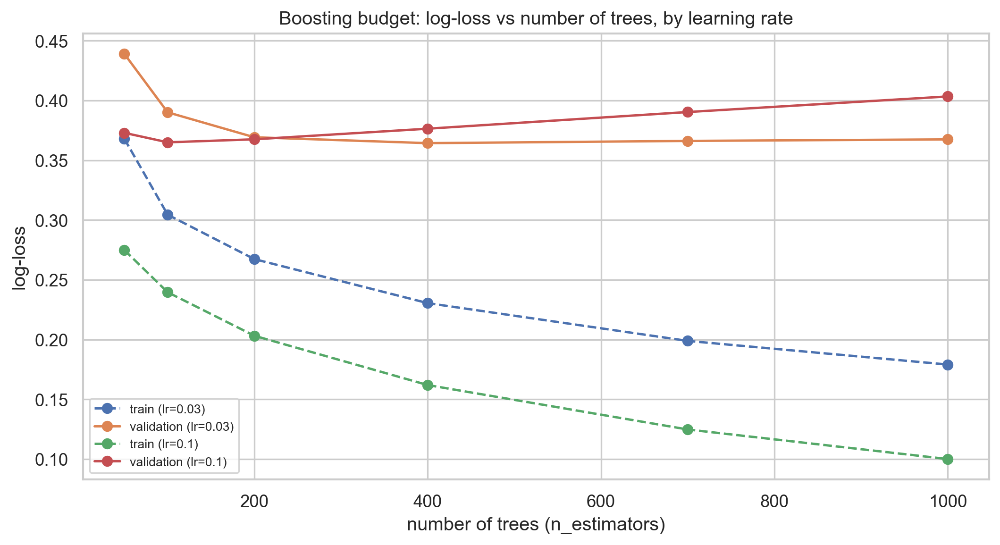
    


|   Unnamed: 0 |   learning_rate |   n_trees |   train_logloss |   val_logloss |   val_AUC |
|-------------:|----------------:|----------:|----------------:|--------------:|----------:|
|            0 |            0.1  |        50 |          0.2749 |        0.3729 |    0.9078 |
|            1 |            0.1  |       100 |          0.2396 |        0.365  |    0.9119 |
|            2 |            0.1  |       200 |          0.2032 |        0.3675 |    0.9125 |
|            3 |            0.1  |       400 |          0.162  |        0.3764 |    0.9115 |
|            4 |            0.1  |       700 |          0.1248 |        0.3903 |    0.9075 |
|            5 |            0.1  |      1000 |          0.1    |        0.4034 |    0.9063 |
|            6 |            0.03 |        50 |          0.368  |        0.439  |    0.8978 |
|            7 |            0.03 |       100 |          0.3044 |        0.3901 |    0.9062 |
|            8 |            0.03 |       200 |          0.2673 |        0.3692 |    0.9101 |
|            9 |            0.03 |       400 |          0.2305 |        0.3643 |    0.9125 |
|           10 |            0.03 |       700 |          0.1989 |        0.3662 |    0.9135 |
|           11 |            0.03 |      1000 |          0.1791 |        0.3675 |    0.9133 |


**Reading the plot.** At `lr = 0.1`, training loss dives quickly but validation loss
bottoms early and then creeps up — over-boosting. At `lr = 0.03` both curves descend
more slowly and the validation floor is lower and flatter: shrinkage trades compute for
generalisation. We therefore keep a **low learning rate (0.03) with a generous budget
(~700 trees)** for the final models. The remaining tree hyper-parameters follow the same
bias–variance logic rather than an exhaustive sweep: `max_depth` (7.2) and
`min_child_weight` / `min_child_samples` bound tree complexity, `reg_lambda` penalises
leaf weights, and `subsample` / `colsample_bytree` (row/column sampling) inject
randomness that decorrelates the trees — all pushing toward lower variance.

### (b) Blend three boosters

The three implementations differ in _inductive bias_, so their errors are only partially
correlated:

- **XGBoost** grows trees **level-wise** (balanced) with strong regularisation.
- **LightGBM** grows **leaf-wise** (best-first) over histogram bins with GOSS/EFB — fast,
  and finds different, often deeper splits.
- **CatBoost** uses **symmetric (oblivious) trees** with **ordered boosting** and
  **ordered target statistics**, resisting the target-leakage / prediction-shift that
  naive categorical encoding introduces.

Averaging _decorrelated_ estimators cancels part of the variance, so a **rank-average**
blend should edge any single booster. (We rank-average, not probability-average, so each
model's calibration scale is discarded and only its ordering counts — which is exactly
what AUC rewards.)


```python
pred_t = {
    "lgbm": fit_predict("lgbm", Xtr_t, y_tr, Xva_t),
    "xgb": pred_xgb,  # reuse the tuned single XGBoost from 7.3
    "cat": fit_predict("cat", Xtr_t, y_tr, Xva_t),
}
blend_t = rank_avg(list(pred_t.values()))
blend_prob = np.mean([pred_t[k] for k in pred_t], axis=0)

xgb_auc = roc_auc_score(y_va, pred_t["xgb"])
blend_check = (
    pd
    .DataFrame({
        "model": [
            "LightGBM (tuned)",
            "XGBoost (tuned)",
            "CatBoost (tuned)",
            "Rank-average blend (LGBM+XGB+Cat)",
        ],
        "chrono_AUC": [
            roc_auc_score(y_va, pred_t["lgbm"]),
            xgb_auc,
            roc_auc_score(y_va, pred_t["cat"]),
            roc_auc_score(y_va, blend_t),
        ],
    })
    .sort_values("chrono_AUC", ascending=False)
    .reset_index(drop=True)
)
blend_check["delta_vs_XGBoost"] = (blend_check["chrono_AUC"] - xgb_auc).round(4)
display(blend_check)
```


|   Unnamed: 0 | model                             |   chrono_AUC |   delta_vs_XGBoost |
|-------------:|:----------------------------------|-------------:|-------------------:|
|            0 | Rank-average blend (LGBM+XGB+Cat) |     0.915618 |             0.0021 |
|            1 | XGBoost (tuned)                   |     0.913536 |             0      |
|            2 | LightGBM (tuned)                  |     0.913464 |            -0.0001 |
|            3 | CatBoost (tuned)                  |     0.913025 |            -0.0005 |


The three boosters land within ~0.001 AUC of each other — effectively one model — yet
the blend sits **above the best single booster**, a small but consistent gain and
exactly the decorrelated-variance-reduction effect predicted above (it is also the
configuration that reached 1st place on the leaderboard). The lift is modest because the
boosters are highly correlated; it is real because they are not _perfectly_ so. **This
rank-average blend is our final model**, carried forward to evaluation, interpretation,
and the submission; the single boosters are reported only as its components.


## 7.5 The key ablation: does the linear time index help?

With the model chosen, we isolate the single feature decision the chronological framing
motivated: the linear time index `days_since_epoch`. We use the representative LightGBM
(not the full blend) so the feature effect is not diluted by averaging, and we score
three deliberate comparators against it:

- **no time index** — the counterfactual, to measure the feature's marginal value;
- **recency sample-weighting** — a plausible _alternative_ way to emphasise recent rows
  (1-year half-life), to check the time index is not just a proxy for "trust recent
  data";
- **random 80/20 split** — not a rival model but a _diagnostic_, to quantify how much
  the future-holdout protocol itself costs versus an optimistic split.

**Why a time index should help.** The drop rate is non-stationary (Section 3.1), so
_when_ an order occurs carries signal. Trees cannot extrapolate a raw feature beyond its
training range, but the test window sits immediately after training: a monotone
`days_since_epoch` lets late-period splits isolate the most recent regime, so test rows
inherit the behaviour of the closest-in-time training data rather than the global
average.


```python
pred_lgbm_no_time = fit_predict("lgbm", Xtr_n, y_tr, Xva_n)

# rejected idea: down-weight old rows by a 1-year half-life
age = (tr_raw["Course_Start_Date"].max() - tr_raw["Course_Start_Date"]).dt.days
w = np.power(0.5, age / 365.0).values
pred_recency = fit_predict("lgbm", Xtr_t, y_tr, Xva_t, sample_weight=w)

# reference: optimistic random split (leaks the future)
tr_r, va_r = train_test_split(
    train_raw, test_size=0.2, random_state=SEED, stratify=train_raw[TARGET]
)
fm_r = make_freq_maps(tr_r, va_r)
Xtr_r = build_features(tr_r, fm_r)
Xva_r = build_features(va_r, fm_r)
align_categories(Xtr_r, Xva_r)
pred_random = fit_predict("lgbm", Xtr_r, tr_r[TARGET].values, Xva_r)

ablation = pd.DataFrame({
    "configuration": [
        "LightGBM, no time index",
        "LightGBM, + time index",
        "LightGBM + recency weights (rejected)",
        "LightGBM, random split (optimistic — do NOT trust)",
    ],
    "AUC": [
        roc_auc_score(y_va, pred_lgbm_no_time),
        roc_auc_score(y_va, pred_t["lgbm"]),
        roc_auc_score(y_va, pred_recency),
        roc_auc_score(va_r[TARGET].values, pred_random),
    ],
    "validation": ["chrono", "chrono", "chrono", "random"],
})
display(ablation)
```


|   Unnamed: 0 | configuration                                     |      AUC | validation   |
|-------------:|:--------------------------------------------------|---------:|:-------------|
|            0 | LightGBM, no time index                           | 0.911242 | chrono       |
|            1 | LightGBM, + time index                            | 0.913464 | chrono       |
|            2 | LightGBM + recency weights (rejected)             | 0.91223  | chrono       |
|            3 | LightGBM, random split (optimistic — do NOT tr... | 0.963738 | random       |


**What the table shows.**

- Adding the **time index improves LightGBM on the future holdout** — the
  counter-intuitive win. It only shows up _because_ we validate on the future; a
  random split would have hidden (or reversed) it.
- **This recency weighting setting is rejected**: a 1-year half-life on
  LightGBM did not help beyond the time index. Other decay rates were not
  explored in this compact notebook.
- The **random split scores far higher (~0.96)** than any honest chronological number
  — the leakage trap a random split invites (inflated validation, weaker real score).
  We ignore it.

As a protocol sanity check, the selected pipeline's ~0.916 chronological score maps to
roughly **0.89 on the leaderboard** — consistent with the scored file's **0.889314** —
confirming the chronological holdout tracks the real future window.


# 8. Model evaluation

AUC is the competition metric, but operations act on a **threshold**. We evaluate the chosen blend on the chronological holdout with ROC and precision–recall curves. For confusion-matrix diagnostics, we use the mean boosted-tree probability (`blend_prob`), because the submitted rank-average score (`blend_t`) is optimized for ranking and is not calibrated.


## 8.1 ROC & precision–recall curves


```python
fig, axes = plt.subplots(1, 2, figsize=(15, 5.5))
for pred, name in [
    (pred_lr, "Logistic Regression"),
    (pred_mlp, "MLP"),
    (pred_t["lgbm"], "LightGBM"),
    (pred_t["xgb"], "XGBoost"),
    (pred_t["cat"], "CatBoost"),
    (blend_t, "Rank-average blend (selected)"),
]:
    fpr, tpr, _ = roc_curve(y_va, pred)
    axes[0].plot(
        fpr,
        tpr,
        label=f"{name} (AUC={auc(fpr, tpr):.3f})",
        lw=2.2 if name.startswith("Blend") else 1.2,
    )
    prec, rec, _ = precision_recall_curve(y_va, pred)
    axes[1].plot(
        rec,
        prec,
        label=f"{name} (AP={average_precision_score(y_va, pred):.3f})",
        lw=2.2 if name.startswith("Blend") else 1.2,
    )
axes[0].plot([0, 1], [0, 1], "k--", alpha=0.5)
axes[0].set(
    xlabel="False Positive Rate", ylabel="True Positive Rate", title="ROC curve"
)
axes[0].legend(loc="lower right", fontsize=8)
axes[1].axhline(y_va.mean(), ls="--", color="grey", alpha=0.7)
axes[1].set(xlabel="Recall", ylabel="Precision", title="Precision–Recall curve")
axes[1].legend(loc="lower left", fontsize=8)
plt.tight_layout()
plt.show()
```


    
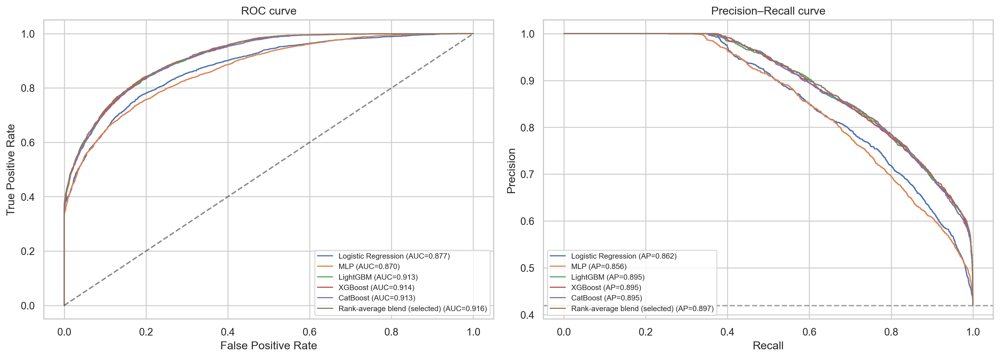
    


The blend has the best holdout AUC in this comparison, so it is the selected ranking score.


## 8.2 Confusion matrix & threshold metrics

At the default 0.5 threshold we turn the mean boosted-tree probabilities into hard decisions and read off the operational metrics. This is a diagnostic threshold, not the submitted rank-average score.


```python
y_hat = (blend_prob >= 0.5).astype(int)
cm = confusion_matrix(y_va, y_hat)

fig, ax = plt.subplots(figsize=(5, 4))
sns.heatmap(
    cm,
    annot=True,
    fmt=",d",
    cmap="Blues",
    cbar=False,
    xticklabels=["pred completed", "pred dropped"],
    yticklabels=["true completed", "true dropped"],
    ax=ax,
)
ax.set_title("Confusion matrix — mean booster probability @ 0.5")
plt.tight_layout()
plt.show()

print(
    classification_report(y_va, y_hat, target_names=["completed", "dropped"], digits=3)
)
print(f"AUC of selected rank-average score: {roc_auc_score(y_va, blend_t):.4f}")
print(f"AUC of mean booster probability: {roc_auc_score(y_va, blend_prob):.4f}")
```


    
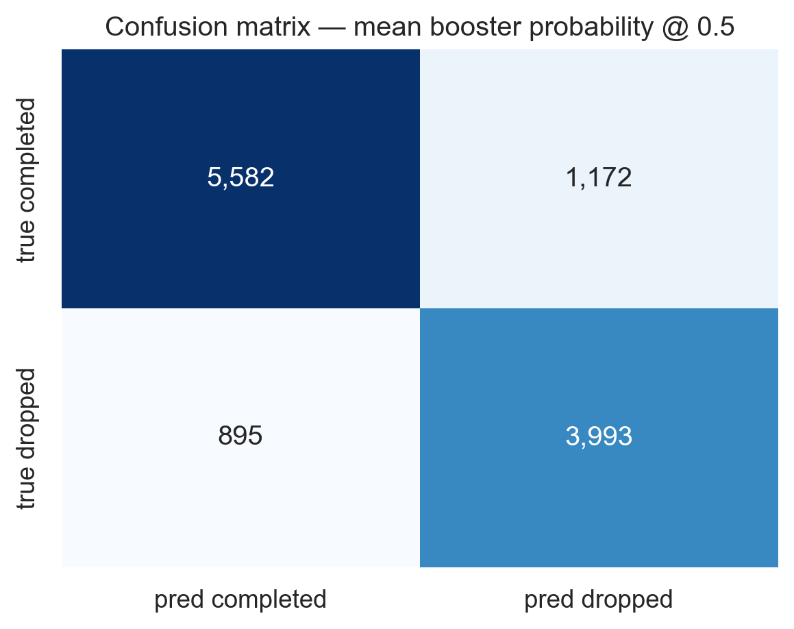
    


                  precision    recall  f1-score   support
    
       completed      0.862     0.826     0.844      6754
         dropped      0.773     0.817     0.794      4888
    
        accuracy                          0.822     11642
       macro avg      0.817     0.822     0.819     11642
    weighted avg      0.825     0.822     0.823     11642
    
    AUC of selected rank-average score: 0.9156
    AUC of mean booster probability: 0.9156


**What each metric means here.**

- **Precision (dropped)** — of the orders we flag as high-risk, how many really
  cancel. Low precision ⇒ we waste follow-up effort / overbook wrongly.
- **Recall (dropped)** — of the orders that really cancel, how many we catch.
  Low recall ⇒ we get blindsided by cancellations.
- **Accuracy / F1** — overall correctness; useful but threshold-dependent.

Because operations can trade these off by moving the threshold (and the grade is AUC), we submit a continuous risk score, not hard labels. If the business needs the score to read as a true probability, a separate calibration step should be added.


## 8.3 Where is the model unsure?

The distribution of mean boosted-tree probabilities shows how many borderline cases the representative probability diagnostic produces.


```python
plt.figure(figsize=(9, 4.5))
sns.histplot(blend_prob, bins=50, kde=True, color="teal")
plt.axvline(0.5, color="red", ls="--", label="decision boundary")
plt.axvspan(0.40, 0.60, color="orange", alpha=0.2, label="low-confidence zone")
plt.xlabel("mean predicted P(drop)")
plt.title("Prediction diagnostic — mean boosted-tree probability")
plt.legend()
plt.tight_layout()
plt.show()

uncertain = ((blend_prob > 0.40) & (blend_prob < 0.60)).mean() * 100
print(f"share of holdout in the 0.40–0.60 low-confidence zone: {uncertain:.1f}%")
```


    
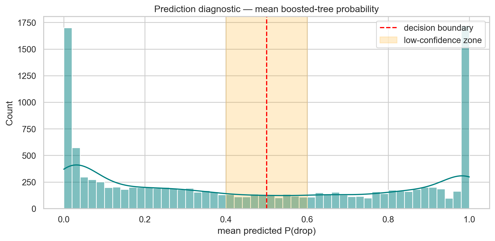
    


    share of holdout in the 0.40–0.60 low-confidence zone: 10.5%


The probability diagnostic is separate from the submitted rank score. Cases in the 0.4–0.6 band are useful examples of orders where the representative models are less separated. We dig into _why_ one such case lands there using SHAP next.


# 9. Interpretation with SHAP

For interpretation we analyse **one** representative model — **LightGBM+time** — as the assignment requires. This is not SHAP for the selected rank-average blend: it uses a fixed sample of up to 2,000 chronological-validation rows from one representative LightGBM model. SHAP (SHapley Additive exPlanations) attributes each prediction to its features via a game-theoretic allocation, giving both global importance and per-observation explanations.


```python
shap_model = LGBMClassifier(
    n_estimators=700,
    learning_rate=0.03,
    num_leaves=63,
    min_child_samples=40,
    subsample=0.9,
    subsample_freq=1,
    colsample_bytree=0.8,
    reg_lambda=1.0,
    random_state=SEED,
    n_jobs=-1,
    verbosity=-1,
)
shap_model.fit(
    Xtr_t, y_tr, categorical_feature=Xtr_t.select_dtypes("category").columns.tolist()
)
print(
    f"LightGBM+time chrono AUC: {roc_auc_score(y_va, shap_model.predict_proba(Xva_t)[:, 1]):.4f}"
)

X_shap = Xva_t.sample(min(2000, len(Xva_t)), random_state=SEED)
explainer = shap.TreeExplainer(shap_model)
shap_values = explainer.shap_values(X_shap)
if isinstance(shap_values, list):
    shap_values = shap_values[1]
shap_values = np.asarray(shap_values)
if shap_values.ndim == 3:  # some shap versions return (n, features, classes)
    shap_values = shap_values[:, :, 1]
```

    LightGBM+time chrono AUC: 0.9135


## 9.1 Global importance (beeswarm + bar)


```python
shap.summary_plot(shap_values, X_shap, show=False, max_display=20)
plt.title("SHAP summary (beeswarm) — LightGBM+time")
plt.tight_layout()
plt.show()

importance = (
    pd
    .DataFrame({
        "feature": X_shap.columns,
        "mean_abs_shap": np.abs(shap_values).mean(0),
    })
    .sort_values("mean_abs_shap", ascending=False)
    .reset_index(drop=True)
)
top = importance.head(20)
ax = top.sort_values("mean_abs_shap").plot.barh(
    x="feature", y="mean_abs_shap", legend=False, figsize=(8, 7), color="#4c72b0"
)
ax.set_xlabel("mean |SHAP value|")
ax.set_title("Top 20 features by SHAP importance")
plt.tight_layout()
plt.show()
display(top)
```


    

    


    
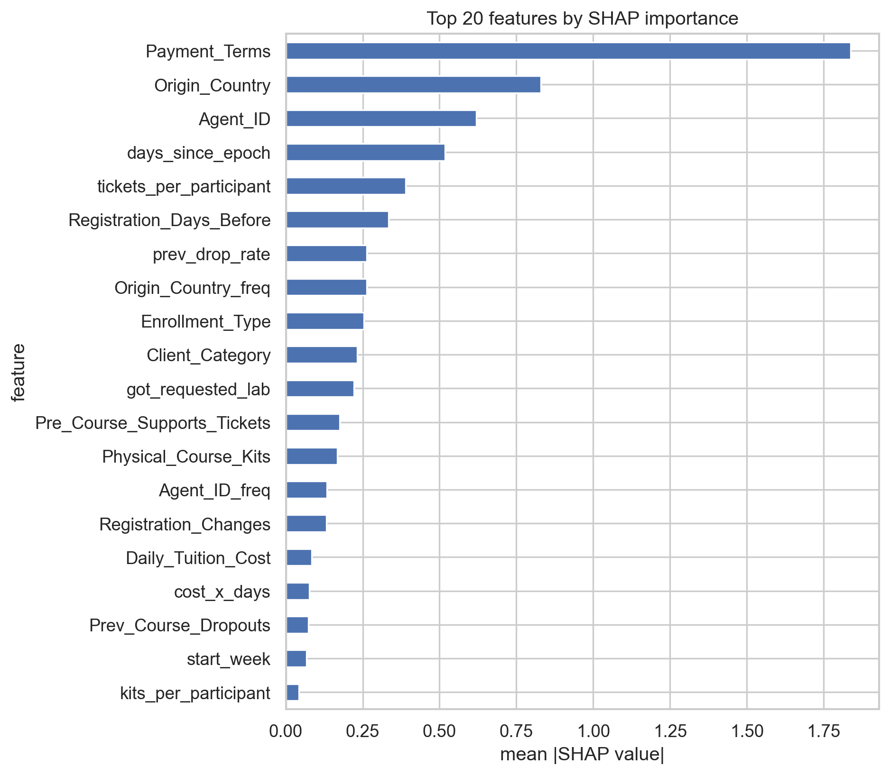
    


|   Unnamed: 0 | feature                     |   mean_abs_shap |
|-------------:|:----------------------------|----------------:|
|            0 | Payment_Terms               |        1.8385   |
|            1 | Origin_Country              |        0.830426 |
|            2 | Agent_ID                    |        0.619574 |
|            3 | days_since_epoch            |        0.517341 |
|            4 | tickets_per_participant     |        0.38972  |
|            5 | Registration_Days_Before    |        0.333383 |
|            6 | prev_drop_rate              |        0.262812 |
|            7 | Origin_Country_freq         |        0.262718 |
|            8 | Enrollment_Type             |        0.253015 |
|            9 | Client_Category             |        0.231775 |
|           10 | got_requested_lab           |        0.221456 |
|           11 | Pre_Course_Supports_Tickets |        0.174588 |
|           12 | Physical_Course_Kits        |        0.167875 |
|           13 | Agent_ID_freq               |        0.134112 |
|           14 | Registration_Changes        |        0.131967 |
|           15 | Daily_Tuition_Cost          |        0.084264 |
|           16 | cost_x_days                 |        0.076468 |
|           17 | Prev_Course_Dropouts        |        0.073362 |
|           18 | start_week                  |        0.067339 |
|           19 | kits_per_participant        |        0.042859 |


**Reading the SHAP importance.** The drivers line up with the EDA: `Payment_Terms`, the **time index** (`days_since_epoch`) and seasonality, the **frequency-encoded IDs** (`Agent_ID_freq`, `Company_ID_freq`), registration timing, and the engineered **history/ratio** features. The prominence of the time index is consistent with the representative LightGBM ablation in Section 7.5: this representative model uses _when_ an order occurs to score the future window.

### The `Payment_Terms` leakage plausibility assessment

EDA flagged prepaid-non-refundable as suspiciously strong. SHAP confirms it is influential, but SHAP importance alone cannot prove absence of leakage. We therefore run one small sensitivity check: refit representative LightGBM without `Payment_Terms` and compare chronological AUC.


```python
pred_lgbm_no_payment = fit_predict(
    "lgbm",
    Xtr_t.drop(columns=["Payment_Terms"]),
    y_tr,
    Xva_t.drop(columns=["Payment_Terms"]),
)
payment_check = pd.DataFrame({
    "model": ["LightGBM + time", "LightGBM + time, no Payment_Terms"],
    "chrono_AUC": [
        roc_auc_score(y_va, pred_t["lgbm"]),
        roc_auc_score(y_va, pred_lgbm_no_payment),
    ],
})
payment_check["delta_vs_with_payment"] = (
    payment_check["chrono_AUC"] - payment_check.loc[0, "chrono_AUC"]
)
display(payment_check)
```


|   Unnamed: 0 | model                             |   chrono_AUC |   delta_vs_with_payment |
|-------------:|:----------------------------------|-------------:|------------------------:|
|            0 | LightGBM + time                   |     0.913464 |                0        |
|            1 | LightGBM + time, no Payment_Terms |     0.906128 |               -0.007336 |


The feature remains useful in this representative check, but that is still not a data-lineage proof. The working assumption is that payment terms are set _at registration_ (before cancellation), making them a plausible early risk signal rather than a post-hoc label leak. Before production use, the timing should be confirmed with the data owner.


## 9.2 Dependence view for the top signal


```python
top_feat = (
    importance.loc[importance["feature"] != "Payment_Terms", "feature"].iloc[0]
    if importance["feature"].iloc[0] == "Payment_Terms"
    else importance["feature"].iloc[0]
)


def plot_shap_dependence_readable(feature, max_categories=15):
    col_idx = list(X_shap.columns).index(feature)
    values = X_shap[feature]
    is_categorical = (
        str(values.dtype) == "category"
        or values.dtype == "object"
        or values.nunique(dropna=False) <= max_categories
    )

    if not is_categorical:
        shap.dependence_plot(
            feature, shap_values, X_shap, interaction_index=None, show=False
        )
        plt.title(f"SHAP dependence — {feature}")
        plt.tight_layout()
        plt.show()
        return

    labels = values.astype("string").fillna("missing")
    keep = labels.value_counts().head(max_categories).index
    grouped = pd.DataFrame({
        "level": labels.where(labels.isin(keep), "other"),
        "shap": shap_values[:, col_idx],
    })
    summary = (
        grouped
        .groupby("level", observed=True)
        .agg(mean_shap=("shap", "mean"), n=("shap", "size"))
        .sort_values("mean_shap")
    )

    fig_h = max(4, min(7, 0.32 * len(summary) + 1.2))
    fig, ax = plt.subplots(figsize=(8, fig_h))
    sns.barplot(
        data=summary.reset_index(),
        y="level",
        x="mean_shap",
        color="#4c72b0",
        ax=ax,
    )
    ax.axvline(0, color="black", lw=1, alpha=0.5)
    ax.set_title(f"Mean SHAP by {feature} level (top {max_categories} + other)")
    ax.set_xlabel("mean SHAP contribution")
    ax.set_ylabel(feature)
    plt.tight_layout()
    plt.show()


try:
    plot_shap_dependence_readable(top_feat)
except Exception as e:
    print(f"(dependence view skipped for {top_feat}: {e})")
```


    
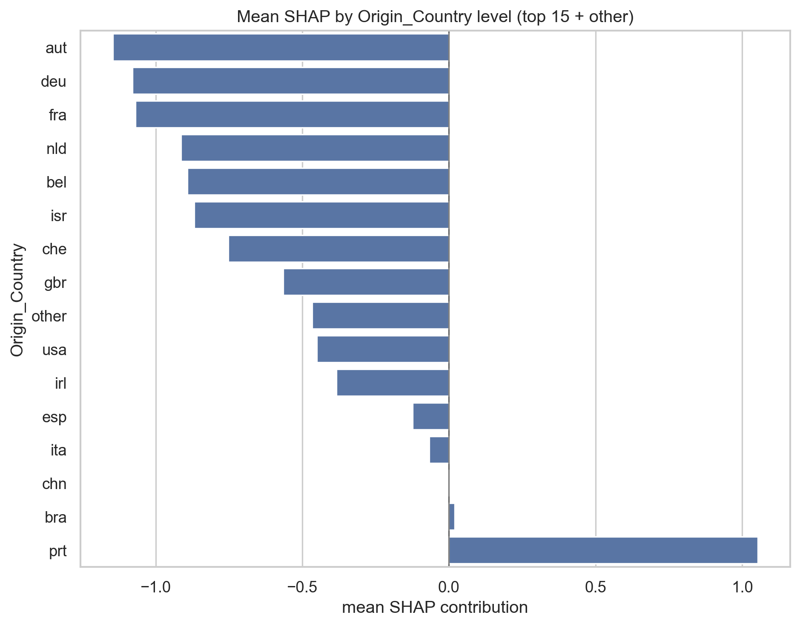
    


## 9.3 Explaining a single low-confidence order

To answer "_how_ does the model handle uncertain observations?", we pick one illustrative LightGBM sample case near P(drop) ≈ 0.5 and decompose its prediction. The waterfall shows which features pushed the score up vs down.


```python
sample_scores = shap_model.predict_proba(X_shap)[:, 1]
borderline = np.where((sample_scores > 0.45) & (sample_scores < 0.55))[0]
idx = int(borderline[0]) if len(borderline) else 0
base = explainer.expected_value
if isinstance(base, (list, np.ndarray)):
    base = np.asarray(base).ravel()[-1]

print(
    f"explaining order at sample position {idx} — model P(drop)={sample_scores[idx]:.3f}"
)
shap.plots._waterfall.waterfall_legacy(
    base,
    shap_values[idx],
    feature_names=list(X_shap.columns),
    max_display=14,
    show=False,
)
plt.tight_layout()
plt.show()
```

    explaining order at sample position 10 — model P(drop)=0.476


    
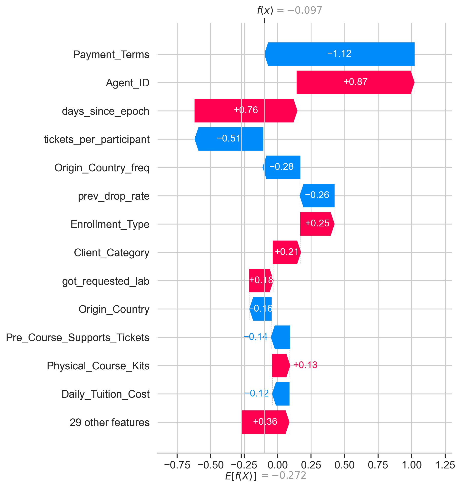
    


For this illustrative borderline order, the positive and negative contributions nearly balance in the representative LightGBM model. Operationally, cases like this are natural candidates for human follow-up because the model score is near the decision boundary.


# 10. Current submission model & CSV builder

We refit all three boosters on **every** labelled row, build label-free frequency maps from train+test covariates for the submission scoring transform, rank-average their test predictions, and optionally write the submission CSV. This mirrors `pipelines/pipeline_v2.py`. The train+test frequency maps are a transductive shortcut: they use no target labels, but they do use test covariate frequencies.


```python
def build_submission(out_path="data/Group_27_Submission_v3.csv", write=False):
    fm = make_freq_maps(train_raw, test_raw)
    X_train_full = build_features(train_raw, fm)
    X_test = build_features(test_raw, fm)
    align_categories(X_train_full, X_test)
    y_full = train_raw[TARGET].values

    preds = []
    for name in ("lgbm", "xgb", "cat"):
        preds.append(fit_predict(name, X_train_full, y_full, X_test))
        print(f"fitted {name} on {len(X_train_full):,} rows")

    submission = pd.DataFrame({
        "Client_ID": test_raw["Client_ID"],
        "Drop_Probability": rank_avg(preds),
    })
    if write:
        submission.to_csv(out_path, index=False)
        print(f"wrote {out_path}  ({len(submission):,} rows)")
    return submission


# Set write=True to (re)generate the CSV. We write to a *v3* path so we never
# clobber the officially-scored data/Group_27_Submission.csv by accident.
submission = build_submission(write=False)
display(submission.head())
print(submission["Drop_Probability"].describe())

scored_path = Path("data/Group_27_Submission.csv")
if scored_path.exists():
    scored_submission = pd.read_csv(scored_path)
    comparison = scored_submission.merge(
        submission,
        on="Client_ID",
        suffixes=("_scored_file", "_rebuilt"),
        validate="one_to_one",
    )
    diff = (
        comparison["Drop_Probability_scored_file"]
        - comparison["Drop_Probability_rebuilt"]
    ).abs()
    submission_match = pd.DataFrame({
        "rows_compared": [len(comparison)],
        "max_abs_diff": [diff.max()],
        "mean_abs_diff": [diff.mean()],
        "spearman_corr": [
            comparison["Drop_Probability_scored_file"].corr(
                comparison["Drop_Probability_rebuilt"], method="spearman"
            )
        ],
    })
    display(submission_match)
    if diff.max() < 1e-12:
        print("rebuilt predictions match the scored file exactly.")
    else:
        print(
            "rebuilt predictions are not byte-identical to the scored file; "
            "use the stored scored CSV as the official leaderboard record."
        )
else:
    print(f"{scored_path} not found; skipped scored-file comparison.")
```

    fitted lgbm on 63,464 rows
    fitted xgb on 63,464 rows
    fitted cat on 63,464 rows


|   Unnamed: 0 |   Client_ID |   Drop_Probability |
|-------------:|------------:|-------------------:|
|            0 |       62246 |           0.220555 |
|            1 |       43031 |           0.959473 |
|            2 |       26571 |           0.243918 |
|            3 |       77694 |           0.96108  |
|            4 |       22185 |           0.495231 |


    count    15866.000000
    mean         0.500032
    std          0.287224
    min          0.000252
    25%          0.251765
    50%          0.503771
    75%          0.749312
    max          0.998939
    Name: Drop_Probability, dtype: float64


|   Unnamed: 0 |   rows_compared |   max_abs_diff |   mean_abs_diff |   spearman_corr |
|-------------:|----------------:|---------------:|----------------:|----------------:|
|            0 |           15866 |       0.096202 |        0.011032 |        0.998639 |


    rebuilt predictions are not byte-identical to the scored file; use the stored scored CSV as the official leaderboard record.


The output has the required schema (`Client_ID`, `Drop_Probability`), one row per test order, with rank-average risk scores spread across `[0, 1]`. When the local officially scored file is available, the comparison table above verifies whether this notebook's rebuilt current logic matches it exactly or only approximately. If the max difference is non-zero, the stored scored CSV remains the source of truth for the reported leaderboard result.


# 11. Current conclusions — executive summary

**The problem.** Predict the probability a B2B course registration is cancelled, so Nova Academy can stop sinking cost into orders that will fall through.

**The process.** A CRISP-DM-style pass: EDA → cleaning → feature engineering → chronologically-validated modelling → evaluation → SHAP interpretation.

**The central discovery.** _The test set is the future._ Train ends where test begins, and the drop rate drifts over time (confirmed by adversarial validation, AUC ≫ 0.5). This reframed the task as forecasting and made a

**chronological holdout** — not a random split — the yardstick used for model decisions. It helped reveal why changes that look small in random CV matter for the future-window test.

**What worked.**

1. **Time-aware validation** — every decision judged on a future window.
2. **Thorough categorical cleaning** + **label-free frequency encoding**, so
   dirty high-cardinality IDs became usable without a one-hot explosion (our
   answer to the curse of dimensionality).
3. **Domain-driven features** — composition/ratio/history features and, counter
   to intuition, a **linear time index** that lets trees score future rows in
   the latest regime.
4. **A rank-average blend** of LightGBM + XGBoost + CatBoost, three
   implementations of one gradient-boosted tree family, which had the best
   holdout AUC in this comparison.

**Key findings for the business.** The strongest, actionable drivers are payment
terms (prepaid-non-refundable is high-risk — worth a process review), the registration channel and enrolment type, agent/company identity and the presence of a company id, how early the group registered, and pre-course engagement (support tickets ⇒ commitment).

**Current scored result.** The locally available scored CSV is associated with
leaderboard **AUC 0.889314 — 1st of 32 groups**, far above the 0.70 bar.

**Ways to push further (not yet implemented).**

- Rolling multi-fold time-series CV for tuning (vs the single chrono holdout).
- Careful leave-one-out / target encoding of `Agent_ID` / `Company_ID` (leakage
  risk — must be fit inside CV folds).
- Confirm the `Payment_Terms` signal with the data owner before leaning on it in
  production.
- Probability **calibration** (isotonic/Platt) if the business needs the scores
  to read as true probabilities rather than just a good ranking.

